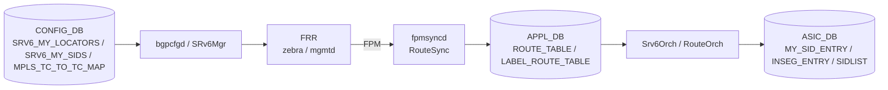

# 内部実装

ここでは [SRv6](../../reference/glossary.md#term-srv6) / [MPLS](../../reference/glossary.md#term-mpls) / Path Tracing の主要 daemon・ファイル・[SAI](../../reference/glossary.md#term-sai) 属性のうち、設計を理解する上で欠かせない部分を集約します。コード位置は元 [HLD](../../reference/glossary.md#term-hld) ページに紐付いており、verifier が裏取り済みです。

## srv6orch の構造

`sonic-swss/orchagent/srv6orch.cpp` / `srv6orch.h` が中核です。

- **end_behavior_map** — `end` / `end.dt4` / `end.dt6` / `end.dt46` / `un` / `ua` / `udt4` / `udt6` / `udt46` / `udx4` / `udx6` 等の文字列を、SAI の `SAI_MY_SID_ENTRY_ENDPOINT_BEHAVIOR_*` に対応付けます。uSID 拡張で `uN` / `uA` / `uDT*` / `uDX*` が追加されています。
- **MY_SID_ENTRY 作成** — `createUpdateMysidEntry(my_sid_string, vrf, adj, end_action)` が SAI への投入入口です。L3 隣接が必要な behavior では `adj` から nexthop を解決し、`SAI_MY_SID_ENTRY_ATTR_NEXT_HOP_ID` に渡します。
- **pending queue** — `m_pendingSRv6MySIDEntries: map<NextHopKey, set<tuple<...>>>` が Neighbor 未解決の SID を保留します。Neighbor 確定時の `updateNeighbor` 系コールバックで pending を flush します。
- **VPN** — `srv6_prefix_agg_id_table_` が Prefix を AGG_ID に集約、`createSrv6Vpn` / `deleteSrv6Vpn` が VPN encap mapper と `vpn_sid` を route nexthop に紐付けます。
- **SID list** — `SAI_OBJECT_TYPE_SRV6_SIDLIST` で SID 列を 1 オブジェクト化し、policy で参照します。

## bgpcfgd の SRv6Mgr

Static SID / Locator は `src/sonic-bgpcfgd/bgpcfgd/managers_srv6.py` の `SRv6Mgr` が処理します。

- `locators_set_handler` / `sids_set_handler` が [CONFIG_DB](../../reference/glossary.md#term-config_db) の subscribe ハンドラ。
- locator 不在のまま SID が来ても、`SRV6_MY_LOCATORS` を subscribe して deferred 解決する経路を持ちます。
- 最終的に `vtysh -c "segment-routing" -c "srv6" -c "static-sids" -c "sid {} locator {} behavior {} vrf {}"` を発行して [FRR](../../reference/glossary.md#term-frr) に流し込みます。

`frrcfgd` 側では `SRV6_MY_LOCATORS` を `zebra`、`SRV6_MY_SIDS` を `mgmtd` に向けるターゲット daemon 設定があります。CONFIG_DB → FRR の中継経路が二重化されているわけではなく、各テーブルで担当 daemon が異なる構造です。

## MPLS データパス

`sonic-swss/fpmsyncd/routesync.cpp` が MPLS netlink を APP_DB に変換する入口です。

- `APP_LABEL_ROUTE_TABLE_NAME` を `ProducerStateTable` として開きます。
- `AF_MPLS` の netlink route を受け取り、`RTA_NEWDST` から MPLS NH label stack、`LWTUNNEL_ENCAP_MPLS` から encap label を取り出して APP_DB に書きます。
- APP_DB の `LABEL_ROUTE_TABLE` を [orchagent](../../reference/glossary.md#term-orchagent) 側が消費し、SAI `INSEG_ENTRY` を bulk で programming します。

per-[RIF](../../reference/glossary.md#term-rif) の MPLS 有効化（`INTERFACE.<intf>.mpls = enable`）は `intfmgrd` / `IntfMgr` が SAI の RIF 属性として渡し、[ASIC](../../reference/glossary.md#term-asic) が MPLS フレームを受理するかどうかを切り替えます。

## QoS との接続

`sonic-swss/orchagent/qosorch.cpp` の `m_qos_handler_map` に `CFG_MPLS_TC_TO_TC_MAP_TABLE_NAME` が登録され、`mpls_tc_to_tc_field_name` が `PORT_QOS_MAP` のフィールド名として参照されます。ハンドラは `QosOrch::handleMplsTcToTcTable` です。[DSCP](../../reference/glossary.md#term-dscp) / TC / PG マップと同じ枠組みで MPLS TC が扱われるため、[QoS](../../reference/glossary.md#term-qos) 側の運用知識がそのまま使えます。

## Path Tracing の SAI 属性

Path Tracing Midpoint は SAI 側で port 属性として実装されています。

- `SAI_PORT_ATTR_PATH_TRACING_INTF` — `pt_interface_id` に対応。
- `SAI_PORT_ATTR_PATH_TRACING_TIMESTAMP_TYPE` — `pt_timestamp_template` に対応。値は `SAI_PORT_PATH_TRACING_TIMESTAMP_TYPE_12_19` のようにビット切り出し位置で命名されます。

orchagent 側の処理は port 系で、`sonic-swss/tests/test_port.py` に `test_PortPathTracing` として単体テストが存在します。

## SAI MY_SID_ENTRY の使い分け

SAI 視点では、SRv6 endpoint は `SAI_OBJECT_TYPE_MY_SID_ENTRY` 1 種類でほぼ表現されます。違いは behavior 属性と、cross-connect 系での `NEXT_HOP_ID` の有無です。uSID も SAI レベルでは behavior 値が増えただけで、データ構造の追加はありません。HLD レベルで複数に見えるものが SAI レベルで同じ object なのは、設定や運用で「同じ場所を見ればよい」という指針につながります。

## データフロー（SRv6 / MPLS）



## 主要 Orch / daemon の責務

| コンポーネント | 主実体 | 責務 |
| --- | --- | --- |
| `Srv6Orch` (`orchagent/srv6orch.cpp`) | `Srv6Orch::doTask`、`createUpdateMysidEntry`、`createSrv6Vpn` | MY_SID_ENTRY、SID list、VPN encap mapper |
| `MplsRouteOrch` (`orchagent/routeorch.cpp` 内) | label route 処理 | INSEG_ENTRY 作成、bulk programming |
| `bgpcfgd::SRv6Mgr` | python | static SID/Locator を [vtysh](../../reference/glossary.md#term-vtysh) で FRR に投入 |
| `fpmsyncd::RouteSync` | C++ | AF_MPLS netlink を LABEL_ROUTE_TABLE に変換 |
| `IntfMgr` | C++ | per-RIF MPLS 有効化 |
| `QosOrch::handleMplsTcToTcTable` | C++ | MPLS TC ↔ internal TC map |

## SAI 属性使用一覧

| object | 主属性 |
| --- | --- |
| `SAI_OBJECT_TYPE_MY_SID_ENTRY` | `SAI_MY_SID_ENTRY_ATTR_ENDPOINT_BEHAVIOR = END / END_X / END_DT4 / END_DT6 / END_DT46 / UN / UA / UDT4 / UDT6 / UDT46 / UDX4 / UDX6`、`PACKET_ACTION`、`NEXT_HOP_ID`、`VRF` |
| `SAI_OBJECT_TYPE_SRV6_SIDLIST` | `SAI_SRV6_SIDLIST_ATTR_TYPE`、`SEGMENT_LIST` |
| `SAI_OBJECT_TYPE_NEXT_HOP` | `SAI_NEXT_HOP_ATTR_TYPE = SRV6_SIDLIST`、`SRV6_SIDLIST_ID` |
| `SAI_OBJECT_TYPE_INSEG_ENTRY` | `SAI_INSEG_ENTRY_ATTR_NUM_OF_POP`、`PACKET_ACTION`、`NEXT_HOP_ID` |
| `SAI_OBJECT_TYPE_PORT` | `SAI_PORT_ATTR_PATH_TRACING_INTF`、`SAI_PORT_ATTR_PATH_TRACING_TIMESTAMP_TYPE` |
| `SAI_OBJECT_TYPE_ROUTER_INTERFACE` | `SAI_ROUTER_INTERFACE_ATTR_ADMIN_MPLS_STATE` |

## Redis テーブル参照関係

```yaml
CONFIG_DB:
  SRV6_MY_LOCATORS, SRV6_MY_SIDS,
  MPLS_TC_TO_TC_MAP, TC_TO_DSCP_MAP_MPLS,
  INTERFACE (mpls = enable)
APPL_DB:
  ROUTE_TABLE (SRv6 encap / decap route),
  LABEL_ROUTE_TABLE (MPLS),
  SRV6_MY_SID_TABLE, SRV6_SID_LIST_TABLE
STATE_DB:
  SRV6_*_STATUS (限定的)
ASIC_DB:
  MY_SID_ENTRY, SRV6_SIDLIST, INSEG_ENTRY, NEXT_HOP (TYPE=SRV6_SIDLIST)
```

## ZMQ / Redis pub/sub

- ZMQ は使わない。
- [bgpcfgd](../../reference/glossary.md#term-bgpcfgd) ↔ FRR は **vtysh execve**（プロセス起動）で config を流し込む経路。[Redis](../../reference/glossary.md#term-redis) pub/sub も間接的にしか使われない。
- [fpmsyncd](../../reference/glossary.md#term-fpmsyncd) は [FPM](../../reference/glossary.md#term-fpm) netlink を受け、[ProducerStateTable](../../reference/glossary.md#term-producerstatetable) で LABEL_ROUTE_TABLE に書く。

## 既知の実装上の制約

- SRv6 endpoint behavior の SAI mapping は **ベンダ実装で対応が分かれる**。特に `END_DT46` や `UDT*` は未実装の ASIC がある。
- SID list は SAI で 1 オブジェクト化されるが、SID 数の上限が ASIC [TCAM](../../reference/glossary.md#term-tcam) サイズに律速される。HLD 上の数字より実機が低いケースが多い。
- MPLS は [SONiC](../../reference/glossary.md#term-sonic) core では機能的に古く、`fpmsyncd` の MPLS label 解析は **限定的な netlink encoding** にしか対応していない。L3VPN（VPNv4/VPNv6 over MPLS）の完全サポートは無く、SRv6 経由を推奨。
- per-port MPLS 有効化は RIF 属性で行うが、`SAI_ROUTER_INTERFACE_ATTR_ADMIN_MPLS_STATE` 未対応の ASIC では「kernel は受理するが ASIC が drop」する silent な動作になる。
- Path Tracing Midpoint は data plane の OAM 拡張で、SONiC では `SAI_PORT_ATTR_PATH_TRACING_*` を介して port 単位設定。midpoint だけで end-to-end が完結するわけではない点に注意。
- SRv6 VPN の prefix-agg-id は orchagent の内部最適化で、SAI 側では複数 prefix が同じ nexthop （= 同じ vpn_sid）を共有する形になる。`CRM` の prefix 数とは別の集計が必要。

## 関連ページ

- [SRv6 HLD](../../routing/segment-routing-over-ipv6-srv6-hld.md)
- [SRv6 uSID](../../routing/sonic-usid.md)
- [SRv6 SID の L3 隣接](../../routing/srv6-sid-l3adj.md)
- [SRv6 VPN](../../routing/srv6-vpn-hld.md)
- [SRv6 Static SID / Locator 設定](../../routing/static-configuration-of-srv6-in-sonic-hld.md)
- [MPLS HLD](../../routing/mpls-for-sonic-high-level-design-document.md)
- [Path Tracing Midpoint](../../routing/path-tracing-midpoint.md)

<!-- glossary-links-injected: d62d2c91ba87 -->
