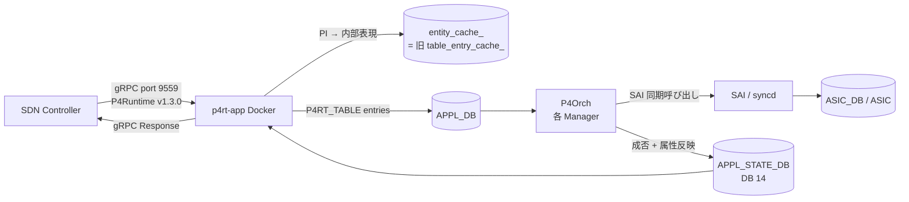

# アーキテクチャ

[PINS](../../reference/glossary.md#term-pins) の data path は「コントローラ → [P4RT](../../reference/glossary.md#term-p4rt) App → [APPL_DB](../../reference/glossary.md#term-appl_db) → P4Orch → [SAI](../../reference/glossary.md#term-sai) → [ASIC](../../reference/glossary.md#term-asic)」と、その逆方向の応答 / PacketIO の 2 系統で構成されます。ここでは controller から [orchagent](../../reference/glossary.md#term-orchagent) までの流れを通しで掴むための地図を作ります。各コンポーネントの細部は既存 [HLD](../../reference/glossary.md#term-hld) ページに移譲します。

## controller から ASIC までの流れ

- **P4RT App** は受け取った Platform Independent (PI) メッセージを APPL_DB の `P4RT_TABLE` 系エントリに翻訳します。詳細は [P4RT App HLD](../../management/p4rt-application-hld.md) を参照してください。
- **P4Orch** は `APPL_DB` を購読する orchagent 内のクラス群で、各 Manager（router_interface / neighbor / next_hop / wcmp / route / acl_table / acl_rule / mirror_session / l3_admit / gre_tunnel / tunnel_decap_group / ext_tables / tables_definition / ip_multicast / l3_multicast）が SAI 呼び出しを担当します。詳細は [P4Orch HLD](../../internals/p4-orchagent.md) を参照してください。
- **APPL_STATE_DB** は同期書き込みの結果をコントローラに返すための専用 DB（`APPL_STATE_DB=14`）です。

## Read 経路と entity_cache_

Read は AppDb ([Redis](../../reference/glossary.md#term-redis)) を毎回叩くと 16,000 フローで約 1.3 秒かかるため、PI 形式そのままを保持する **entity_cache_**（HLD では `table_entry_cache_`）を p4rt-app プロセス内に持ち、Read はキャッシュから直接返します。実測で約 40 倍（1.3s → 40ms）高速化します。Write の INSERT / MODIFY / DELETE はキャッシュも同時更新し、`VerifyState()` がキャッシュと AppDb の整合を確認します。詳細は [Read キャッシュ HLD](../../management/p4rt-read-cache-hld.md) を参照してください。

## PacketIO の経路

PacketIO は CPU と controller の間にもう一系統のチャネルを足します。

- **Receive**: controller が install した punt flow にマッチしたパケットだけが、[CoPP](../../reference/glossary.md#term-copp) の `genetlink_name` / `genetlink_mcgrp_name` を持つ trap group 経由で generic netlink に流れ、p4rt-app が受信して controller に転送します。`copporch` の `createGenetlinkHostIf()` が SAI hostif を作成する経路です。
- **Transmit (Direct)**: 送信先 port が決まっているケースで、対応する netdev のソケットへ書きます。
- **Transmit (Send to Ingress)**: ASIC の ingress pipeline に再注入し、[ECMP](../../reference/glossary.md#term-ecmp) / WCMP / queue を ASIC に判定させます。`PortsOrch::addSendToIngressHostIf()` が `APP_SEND_TO_INGRESS_PORT_TABLE_NAME` 経由で `SAI_HOSTIF_TYPE_NETDEV` 属性の hostif を作成します。

詳細は [PacketIO HLD](../../management/packetio.md) と [Send to Ingress HLD](../../management/send-to-ingress-hld.md) を参照してください。

## DB の整理

| DB | 用途 | 補足 |
|----|------|------|
| `APPL_DB` (0) | `P4RT_TABLE` 系の購読対象 | P4RT App が書く |
| `APPL_STATE_DB` (14) | P4Orch の同期応答（成否、属性反映） | P4RT App が読む |
| `ASIC_DB` (1) | sairedis 経由の SAI オブジェクト | 通常 [SONiC](../../reference/glossary.md#term-sonic) と同じ |

`P4RT_TABLE` の具体 schema や DB layout の追加点は [PINS HLD](../../management/pins-hld.md) を参照してください。

<!-- glossary-links-injected: 4b7e3e133212 -->
