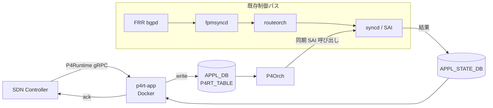
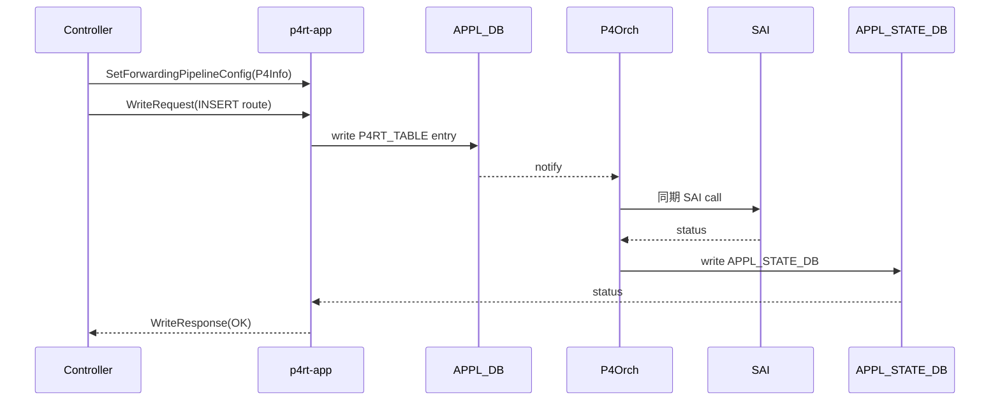

# 概念

[PINS](../../reference/glossary.md#term-pins) は [SONiC](../../reference/glossary.md#term-sonic) に「外部の SDN コントローラが **P4Runtime gRPC** を経由して forwarding を直接書く」経路を opt-in で足す仕組みです。[BGP](../../reference/glossary.md#term-bgp) や [orchagent](../../reference/glossary.md#term-orchagent) といった従来の制御パスは残ったままで、コントローラが必要なテーブルだけを上書きする設計のため、`APPL_DB` の従来テーブル群と並んで `P4RT_TABLE` 系が増えると考えると掴みやすくなります。

## この章は何のためにあるか

通常の SONiC ではコントロールプレーンは「switch 内部の daemon が [CONFIG_DB](../../reference/glossary.md#term-config_db) / [APPL_DB](../../reference/glossary.md#term-appl_db) を埋める」前提です。PINS はその前提を一部だけひっくり返し、「外部コントローラが P4Runtime で直接エントリを書く」面を opt-in で追加します。本章は、その違いがどこで効くのか、既存 SONiC とどう同居するのか、どこで責任分界線が引かれるのかを読み解くために用意しています。

読み手が最初に持つ疑問は次の 5 つです。本章はこの順で答えます。

1. P4 / P4Runtime / PINS は、それぞれ言語・API・実装のどれにあたるのか
2. PINS を入れると SONiC のどこが「変わる／変わらない」のか
3. P4Orch が同期書き込みで `APPL_STATE_DB` を使う理由は何か
4. PacketIO と Send-to-Ingress の責務はどう違うのか
5. PINS と通常 SONiC を併用するときの設計上の落とし穴は何か

## 何を解決するか

- **[SAI](../../reference/glossary.md#term-sai) 実装差の縮小**: P4 で pipeline を表現することで、ベンダ間 SAI 実装差を「P4Info に対する整合性」として明示化する。
- **コントローラ駆動の forwarding**: hyperscaler の SDN コントローラ（例: ONF SD-Fabric、Google 内部コントローラ）が SONiC を SAI [ASIC](../../reference/glossary.md#term-asic) の汎用 backend として扱えるようにする。
- **CRUD の確実性**: P4Runtime は CRUD を同期 API として規定する。orchagent の非同期書き込みでは応答に乗らなかった「ASIC に書き込まれた／失敗した」が、`APPL_STATE_DB` 経由でコントローラに正しく返る。

## SONiC 内での位置

`P4Orch` は orchagent 内に組み込まれた sub-Orch ですが、他の sub-Orch と違って **SAI の応答を待ち**、結果を `APPL_STATE_DB` に書き戻します。これにより [P4RT](../../reference/glossary.md#term-p4rt) App はコントローラへ正確な結果を返せます。

## 用語の整理

| 用語 | 意味 | 関連箇所 |
| --- | --- | --- |
| P4 | forwarding pipeline を記述するデータプレーン言語 | P4Info、`.p4` ファイル |
| P4Info | pipeline 構造（table / match / action）を protobuf にした external 表現 | `SetForwardingPipelineConfig` |
| P4Runtime | コントローラと switch 間の gRPC API（v1.3.0） | `p4rt-app` の listener |
| P4RT App | gRPC を終端する SONiC docker | `p4rt-app` |
| P4Orch | APPL_DB を読み、SAI を同期呼びする sub-Orch | orchagent の中 |
| APPL_STATE_DB | SAI 結果を書き戻す DB（DB 14） | コントローラ ack の源 |
| PacketIO | controller との packet 送受信機構（generic netlink） | hostif + punt flow |
| Send to Ingress | PacketIO Transmit のうち、ASIC ingress に再注入する経路 | `SEND_TO_INGRESS_PORT` |

## 典型シーン

通常の SONiC では「APPL_DB に書く -> 非同期で SAI に行く -> 応答は別 channel」となり、コントローラから見ると「いつ書き終わったか」が曖昧でした。PINS はこの曖昧さを解消する設計です。

## 似た機能との違い

| 比較 | 共通点 | 違い |
| --- | --- | --- |
| OpenFlow との違い | controller -> switch のフロー書き込み | OpenFlow は fixed pipeline。P4Runtime は P4Info で pipeline 自体を表現できる。 |
| [gNMI](../../reference/glossary.md#term-gnmi) / OpenConfig との違い | gRPC で switch を制御 | gNMI は **設定 / 状態 / telemetry**、P4Runtime は **forwarding テーブルそのもの**。 |
| 通常 orchagent との違い | APPL_DB を読んで SAI を呼ぶ | orchagent は非同期、P4Orch は同期で `APPL_STATE_DB` に結果を書く。 |
| sFlow / Everflow との違い | パケットを CPU に上げる | sFlow はサンプリング、PacketIO は controller との **双方向** punt/inject。 |

## P4 / P4Runtime / PINS の関係

- **P4**: forwarding pipeline を記述するデータプレーン言語。pipeline の構造（テーブル、match、action、metadata）を `P4Info` として外部化できる。
- **P4Runtime**: コントローラと switch の間で P4Info を渡し、テーブルエントリを CRUD する **gRPC API**（v1.3.0）。
- **PINS**: SONiC で P4Runtime を受けるための実装一式。`p4rt-app` Docker、`P4Orch`、`APPL_STATE_DB`、`send_to_ingress`、generic netlink PacketIO で構成される。

P4 で表現する pipeline は SAI を模した形になっており、コントローラ側からは「SAI を P4 で書いている」ように見えます。これによりベンダ間 SAI 実装差の縮小と、controller の学習コストの低減を狙います。詳細は [PINS HLD](../../management/pins-hld.md) を参照してください。

## opt-in であることの意味

PINS は SONiC の動作モードを切り替えるものではなく、**コントローラが書いたテーブルだけ ASIC に追加で反映する** 構成です。BGP route と P4 route が同じ宛先に向くケースでは、どちらを優先するかは pipeline の P4 定義と P4Orch の SAI 呼び出し順に委ねられます。「PINS を入れた = 従来 SONiC が止まる」ではないため、運用上は両系統が同居していることを意識します。

## 同期書き込みと APPL_STATE_DB

通常の orchagent は `APPL_DB` を購読して SAI を非同期に呼び、結果は内部状態としか同期しません。一方 P4Orch は **同期実行** で SAI 応答を待ち、成否を **`APPL_STATE_DB`**（schema 上 DB 14）に書き戻すことで P4RT App がコントローラに正しいステータスを返せるようにします。これが「P4Orch だけ別物」と感じる根本理由です。詳細は [P4Orch HLD](../../internals/p4-orchagent.md) を参照してください。

## Send to Ingress と PacketIO の違い

- **PacketIO**: controller が install した punt flow にマッチしたパケットを **generic netlink** 経由でコントローラに届け、また controller から ASIC への送信も受ける機構。Receive と Transmit の両方を扱う。
- **Send to Ingress**: PacketIO の Transmit のうち、**ASIC の ingress pipeline にパケットを再注入する** モード。[ECMP](../../reference/glossary.md#term-ecmp) / WCMP の判定を ASIC に任せたいケースで使う。専用の `SEND_TO_INGRESS_PORT` テーブルと SAI hostif で実現する。

詳細は [PacketIO HLD](../../management/packetio.md) と [Send to Ingress HLD](../../management/send-to-ingress-hld.md) を参照してください。

## 他章との境界

- BGP / 静的 route の通常パスは [02 BGP](../02-bgp/index.md) と [04 VRF / ECMP](../04-vrf-ecmp/index.md) で扱います。本章は同じ宛先を P4Runtime で上書きする場合の責務分界線を示すに留めます。
- [ACL](../../reference/glossary.md#term-acl) / mirror の SONiC ネイティブ実装は [07 ACL / CoPP / Mirror](../07-acl-copp-mirror/index.md) を参照してください。PINS では `ACL_TABLE_DEFINITION` を P4Info から派生させますが、本章は API 面の違いに集中します。
- gNMI / OpenConfig は [10 gNMI / OpenConfig](../10-gnmi-openconfig/index.md) の章に置きます。「PINS は forwarding テーブル」「gNMI は config/state/telemetry」と覚えると棲み分けが明確です。
- orchagent や SAI の共通設計は [20 SWSS / SAI / Redis](../20-swss-sai-redis/index.md) に集めています。`APPL_STATE_DB` の位置づけはそちらと合わせて読むと立体的になります。

## 読了後にできること

- 「PINS は SONiC を置き換えるか？」に対して「opt-in で機能追加する」と即答できる。
- P4Orch が `APPL_STATE_DB` を使う理由を、orchagent の非同期書き込みとの違いから説明できる。
- PacketIO と Send-to-Ingress の責務差を、generic netlink と SAI hostif の観点で言える。
- BGP route と P4 route の優先関係が **pipeline の P4 定義** に依存することを意識した上で運用設計に進める。
- 続く [アーキテクチャ](architecture.md) / [設定](setup.md) / [運用](operations.md) で出てくる `p4rt-app` / `P4Orch` / `APPL_STATE_DB` を、迷わず「どの層の話か」分類できる。

## 関連ページ

- [PINS HLD](../../management/pins-hld.md)
- [P4RT Application HLD](../../management/p4rt-application-hld.md)
- [P4Orch HLD](../../internals/p4-orchagent.md)
- [PacketIO HLD](../../management/packetio.md)
- [Send to Ingress HLD](../../management/send-to-ingress-hld.md)

<!-- xref-prereq -->
## この章の前提知識

この章を読み進める前に、次の章を押さえておくと迷子になりにくい。

- [SONiC 全体像と設定基盤](../01-overview/index.md)
- [SWSS / SAI / Redis 内部実装](../20-swss-sai-redis/index.md)
- [gNMI / gNOI / OpenConfig / YANG](../10-gnmi-openconfig/index.md)

<!-- glossary-links-injected: 4b7e3e133212 -->
