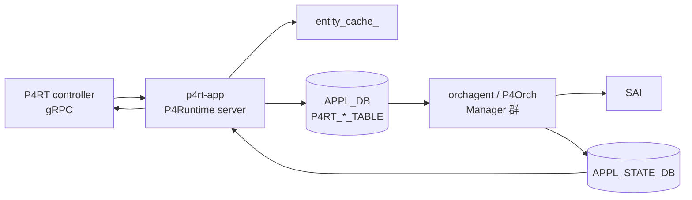

# 内部実装

[PINS](../../reference/glossary.md#term-pins) の中身を読むときに、まず押さえるのは **P4Orch の Manager 群と P4OidMapper**、次に **entity_cache_ の Write 連動更新**、最後に **APPL_STATE_DB を介した同期応答** の 3 点です。[HLD](../../reference/glossary.md#term-hld) 当初の設計から実装が拡張されているところがあるため、現行 master の構造に沿って整理します。

## P4Orch の Manager 群

P4Orch は `sonic-swss/orchagent/p4orch/` に置かれ、`p4orch.cpp` / `p4orch.h` が本体です。各 Manager が独立した [SAI](../../reference/glossary.md#term-sai) オブジェクト種別を担当します:

- `router_interface_manager`
- `neighbor_manager`
- `next_hop_manager`
- `wcmp_manager`
- `route_manager`
- `acl_table_manager`
- `acl_rule_manager`
- `mirror_session_manager`
- `l3_admit_manager`
- `gre_tunnel_manager`
- `tunnel_decap_group_manager`
- `ext_tables_manager`
- `tables_definition_manager`
- `ip_multicast_manager`
- `l3_multicast_manager`

HLD 当初は 7 Manager の構成でしたが、現行 master ではこれらにさらに拡張されています。詳細は [P4Orch HLD](../../internals/p4-orchagent.md) を参照してください。

<!-- evidence:
source: sonic-net/sonic-swss/orchagent/p4orch/p4orch.h#L17-L29 (sha: 4305596156d70e9797e8a881b3d19b46de0bce0d)
excerpt: |
  #include "p4orch/ip_multicast_manager.h"
  #include "p4orch/l3_multicast_manager.h"
  #include "p4orch/neighbor_manager.h"
  #include "p4orch/next_hop_manager.h"
  #include "p4orch/router_interface_manager.h"
  #include "p4orch/tables_definition_manager.h"
  #include "p4orch/wcmp_manager.h"
reasoning: HLD 7 Manager に対して master では ip_multicast / l3_multicast / tables_definition 等が追加されている根拠。
-->

<!-- evidence-rendered:start -->
??? note "📋 検証エビデンス: sonic-net/sonic-swss/orchagent/p4orch/p4orch.h#L17-L29 (sha: 4305596156d70e9797e8a881b3d19b46de0bce0d)"

    **出典**:

    `sonic-net/sonic-swss/orchagent/p4orch/p4orch.h#L17-L29 (sha: 4305596156d70e9797e8a881b3d19b46de0bce0d)`

    **抜粋**:

    ```text
    #include "p4orch/ip_multicast_manager.h"
    #include "p4orch/l3_multicast_manager.h"
    #include "p4orch/neighbor_manager.h"
    #include "p4orch/next_hop_manager.h"
    #include "p4orch/router_interface_manager.h"
    #include "p4orch/tables_definition_manager.h"
    #include "p4orch/wcmp_manager.h"
    ```

    **判断根拠**: HLD 7 Manager に対して master では ip_multicast / l3_multicast / tables_definition 等が追加されている根拠。

<!-- evidence-rendered:end -->

## ObjectManagerInterface の抽象

各 Manager は `object_manager_interface.h` の `enqueue` / `drain` / `drainWithNotExecuted` を実装します。`enqueue` で [APPL_DB](../../reference/glossary.md#term-appl_db) から取り出した entry を蓄え、`drain` で SAI 呼び出しを実行し、`drainWithNotExecuted` でエラーケースのリカバリを記述するという 3 つの責務分離です。

<!-- evidence:
source: sonic-net/sonic-swss/orchagent/p4orch/object_manager_interface.h#L12-L19 (sha: 4305596156d70e9797e8a881b3d19b46de0bce0d)
excerpt: |
  virtual void enqueue(const std::string &table_name, const swss::KeyOpFieldsValuesTuple &entry) = 0;
  virtual ReturnCode drain() = 0;
  virtual void drainWithNotExecuted() = 0;
reasoning: ObjectManagerInterface の 3 メソッド抽象（enqueue / drain / drainWithNotExecuted）の根拠。
-->

<!-- evidence-rendered:start -->
??? note "📋 検証エビデンス: sonic-net/sonic-swss/orchagent/p4orch/object_manager_interface.h#L12-L19 (sha: 4305596156d70e9797e8a881b3d19b46de0bce0d)"

    **出典**:

    `sonic-net/sonic-swss/orchagent/p4orch/object_manager_interface.h#L12-L19 (sha: 4305596156d70e9797e8a881b3d19b46de0bce0d)`

    **抜粋**:

    ```text
    virtual void enqueue(const std::string &table_name, const swss::KeyOpFieldsValuesTuple &entry) = 0;
    virtual ReturnCode drain() = 0;
    virtual void drainWithNotExecuted() = 0;
    ```

    **判断根拠**: ObjectManagerInterface の 3 メソッド抽象（enqueue / drain / drainWithNotExecuted）の根拠。

<!-- evidence-rendered:end -->

## P4OidMapper

`p4oidmapper.h` の `P4OidMapper` は `(sai_object_type_t, key) → (oid, ref_count)` の対応を保持します。`getRefCount` を public 公開しており、複数 Manager から参照される共有オブジェクト（next_hop が wcmp / route から参照される等）の生存管理に使います。

<!-- evidence:
source: sonic-net/sonic-swss/orchagent/p4orch/p4oidmapper.h#L44 (sha: 4305596156d70e9797e8a881b3d19b46de0bce0d)
excerpt: |
  bool getRefCount(_In_ sai_object_type_t object_type, _In_ const std::string &key, _Out_ uint32_t *ref_count) const;
reasoning: P4OidMapper が ref_count を public API として公開している根拠。
-->

<!-- evidence-rendered:start -->
??? note "📋 検証エビデンス: sonic-net/sonic-swss/orchagent/p4orch/p4oidmapper.h#L44 (sha: 4305596156d70e9797e8a881b3d19b46de0bce0d)"

    **出典**:

    `sonic-net/sonic-swss/orchagent/p4orch/p4oidmapper.h#L44 (sha: 4305596156d70e9797e8a881b3d19b46de0bce0d)`

    **抜粋**:

    ```text
    bool getRefCount(_In_ sai_object_type_t object_type, _In_ const std::string &key, _Out_ uint32_t *ref_count) const;
    ```

    **判断根拠**: P4OidMapper が ref_count を public API として公開している根拠。

<!-- evidence-rendered:end -->

## entity_cache_ の Write 連動更新

`sonic-pins/p4rt_app/p4runtime/p4runtime_impl.cc` の `UpdateCacheAndUtilizationState` が次を担当します:

- INSERT / MODIFY: PI 形式の Entity をキャッシュへ書き込み、利用率カウンタを更新
- DELETE: キャッシュから `erase`

型は HLD 記載の `table_entry_cache_` から **`entity_cache_`（`absl::flat_hash_map<pdpi::EntityKey, p4::v1::Entity>`）** へ汎化されており、TableEntry に加え PacketReplicationEngineEntry も保持します。Read は `p4runtime_read.cc` の `AppendTableEntryReads` が `entity_cache_` を走査して AppDb をスキップします。詳細は [Read キャッシュ HLD](../../management/p4rt-read-cache-hld.md) を参照してください。

## 同期書き込みと APPL_STATE_DB

通常の [orchagent](../../reference/glossary.md#term-orchagent) は SAI を非同期に呼びますが、P4Orch は **SAI 応答を待ち、結果を APPL_STATE_DB に書き戻す** ことで [P4RT](../../reference/glossary.md#term-p4rt) App が controller に成否を返せるようにします。`APPL_STATE_DB=14` は `sonic-swss-common/common/schema.h` で定義されており、PINS のために追加されたものです（[SmartSwitch](../../reference/glossary.md#term-smartswitch) 向けに `DPU_APPL_STATE_DB=16` も別途追加）。

<!-- evidence:
source: sonic-net/sonic-swss-common/common/schema.h#L27-L29 (sha: 158de8d3463ff4b841653f6d57190bb142b80d9c)
excerpt: |
  #define APPL_STATE_DB       14
  #define DPU_APPL_STATE_DB   16
reasoning: APPL_STATE_DB=14 と DPU_APPL_STATE_DB=16 の DB id 定義の根拠。
-->

<!-- evidence-rendered:start -->
??? note "📋 検証エビデンス: sonic-net/sonic-swss-common/common/schema.h#L27-L29 (sha: 158de8d3463ff4b841653f6d57190bb142b80d9c)"

    **出典**:

    `sonic-net/sonic-swss-common/common/schema.h#L27-L29 (sha: 158de8d3463ff4b841653f6d57190bb142b80d9c)`

    **抜粋**:

    ```text
    #define APPL_STATE_DB       14
    #define DPU_APPL_STATE_DB   16
    ```

    **判断根拠**: APPL_STATE_DB=14 と DPU_APPL_STATE_DB=16 の DB id 定義の根拠。

<!-- evidence-rendered:end -->

## warm boot とキャッシュの整合

`warm_boot_state_adapter_` が warm boot 時のキャッシュ復元基盤を提供しており、HLD で挙げられていた事前充填案を踏まえた骨組みになっています。整合は `P4RuntimeImpl::VerifyState()` が `VerifyP4rtTableWithCacheEntities` で確認します。

## データフロー



## 主要 Orch / daemon の責務（補足）

| コンポーネント | 主実体 | 責務 |
| --- | --- | --- |
| `p4rt-app` (`sonic-pins/p4rt_app/`) | `P4RuntimeImpl` | gRPC server。Write/Read/StreamChannel、entity_cache_ 維持 |
| `P4Orch` (`orchagent/p4orch/`) | 各 Manager | APPL_DB → SAI、APPL_STATE_DB へ ack |
| `P4OidMapper` | shared map | object oid と ref count |
| `swss-common` | `APPL_STATE_DB=14` schema 拡張 | sync ack 用 |

## SAI 属性使用一覧

P4Orch は通常の [SONiC](../../reference/glossary.md#term-sonic) SAI object をそのまま使うが、独自の table を P4 program で定義できる:

| object | 属性 |
| --- | --- |
| `SAI_OBJECT_TYPE_ROUTER_INTERFACE` | 通常と同様 |
| `SAI_OBJECT_TYPE_NEXT_HOP` | TYPE = IP / TUNNEL / GRE |
| `SAI_OBJECT_TYPE_NEXT_HOP_GROUP` (WCMP) | TYPE = DYNAMIC_ECMP / DYNAMIC_UNORDERED_ECMP |
| `SAI_OBJECT_TYPE_ROUTE_ENTRY` | 通常 |
| `SAI_OBJECT_TYPE_ACL_TABLE` / `ACL_ENTRY` | P4 controller-defined |
| `SAI_OBJECT_TYPE_MIRROR_SESSION` | local / ERSPAN |
| `SAI_OBJECT_TYPE_TUNNEL` (GRE) | encap GRE |
| `SAI_OBJECT_TYPE_TUNNEL_TERM_TABLE_ENTRY` | decap group |
| `SAI_OBJECT_TYPE_IPMC_GROUP` / `IPMC_ENTRY` | multicast |

P4 program は `tables_definition_manager` を介して動的に accept される。HLD 当初の static binding を超え、controller が table 定義を push する設計。

## Redis テーブル参照関係

```yaml
CONFIG_DB:
  なし（P4RT は controller 直結が主）
APPL_DB:
  P4RT_ROUTER_INTERFACE_TABLE, P4RT_NEIGHBOR_TABLE,
  P4RT_NEXTHOP_TABLE, P4RT_WCMP_GROUP_TABLE,
  P4RT_ROUTE_TABLE, P4RT_ACL_TABLE_TABLE / RULE_TABLE,
  P4RT_MIRROR_SESSION_TABLE, P4RT_L3_ADMIT_TABLE,
  P4RT_GRE_TUNNEL_TABLE, P4RT_TUNNEL_DECAP_GROUP_TABLE,
  P4RT_EXT_*_TABLE
APPL_STATE_DB (DB id=14):
  各 P4RT_* テーブルの ack（success / failure + reason）
ASIC_DB:
  通常の SAI object に展開
```

## ZMQ / Redis pub/sub

- p4rt-app と orchagent の間は **[Redis](../../reference/glossary.md#term-redis) pub/sub + [ProducerStateTable](../../reference/glossary.md#term-producerstatetable) / NotificationConsumer**。
- ZMQ は使わない。
- controller との sync は gRPC StreamChannel で、P4RT 上の packet I/O も gRPC stream で行う。
- APPL_STATE_DB は ack 用専用 DB で、orchagent が SAI 応答後に書き込む（通常 orchagent は APPL_STATE_DB を使わない）。

## 既知の実装上の制約

- P4Orch は SAI 応答を **同期的に待つ**ため、通常の orchagent より write latency が大きい（特に bulk write）。
- entity_cache_ は in-memory のみで、p4rt-app の restart で消える。controller 側が full reconciliation を行う前提。
- warm-boot のキャッシュ復元は実装途中の箇所があり、長期間 controller との sync が切れた状態からの復帰には full re-push が必要。
- table definition の push は P4 program の hash で識別され、program 変更時の rollback / mixed state は HLD 範囲外。
- WCMP の hash field は `SAI_NEXT_HOP_GROUP_ATTR_HASH_*` に依存し、[ASIC](../../reference/glossary.md#term-asic) で対応が分かれる。
- p4rt-app と SONiC 標準 orchagent の Manager（`RouteOrch`、`NhgOrch` 等）は同じ SAI object を競合的に作る可能性があり、PINS image では P4Orch のみが正である前提（mixed deployment は HLD 範囲外）。

## 関連ページ

- [P4Orch HLD](../../internals/p4-orchagent.md)
- [P4RT Read cache HLD](../../management/p4rt-read-cache-hld.md)
- [P4RT Application HLD](../../management/p4rt-application-hld.md)

<!-- glossary-links-injected: 4b7e3e133212 -->
