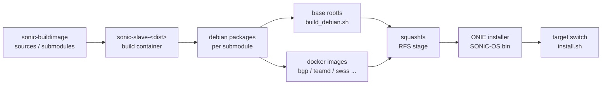

# アーキテクチャ

ビルド成果物が ONIE installer に収まり、ターゲット機材で立ち上がるまでの流れを、source から image までの順で追う。各ステップに対応する [HLD](../../reference/glossary.md#term-hld)・コードリンクは末尾に集約している。

## Build artifact flow

各箱がどの HLD で扱われているかを次に対応付ける。

- `sonic-slave-<dist>` と `PLATFORM_ARCH`、`onie-image-*.conf` の流れは [ARM architecture support](../../architecture/sonic-arm-architecture-support.md) で扱う。これは AMD64 / armhf / arm64 で同じ枠組みを使うための変数定義である。
- `build_debian.sh` の段差と squashfs 中間配備は [RFS Split build](../../architecture/rfs-split-build-improvements-hld.md) が分割対象。HLD の単一 `ENABLE_RFS_SPLIT_BUILD` は現行 master では採用されず、`RFS_SPLIT_FIRST_STAGE` / `RFS_SPLIT_LAST_STAGE` の 2 段に分かれている。
- Dockerfile レイヤ削減、`DOCKER_BUILDKIT`、並列 `dh`、`SAIREDIS_DPKG_TARGET` などビルド時間の改善は [Build system improvements](../../architecture/build-system-improvements.md) にまとまっている。BuildKit はリポジトリ既定では off で、CI / 一部スクリプトが `DOCKER_BUILDKIT=1` を立てる現状。
- container build の構造的な切り口は [Container build](../../categories/container-build.md) に整理されている。

## Build profile（提案ベース）

`make ENABLE_ZTP=y SECURE_UPGRADE_MODE=...` を毎回手で書く煩雑さを解消する目的で、`rules/profiles/<name>.mk` をインクルードするフラグセット機構が提案されている。詳細と注意点は [Build profiles](../../architecture/build-profiles.md) を読む。**現行 master には Makefile への取り込みが無い** ことに注意。

## Debian / docker / OS の世代管理

Base OS のリリース cadence と、その上に乗る docker image / package のバージョニングは別レイヤで管理されている。

- Base OS の更新リズムと旧版の廃止予定は [Debian upgrade cadence](../../system/sonic-debian-upgrade-cadence.md) を見る。`Makefile` の `NOSTRETCH` / `NOBUSTER` / `NOBULLSEYE` / `NOBOOKWORM` / `NOTRIXIE` フラグで build 系統を切り替える形が実装と一致している。
- 配布される docker 群と Base OS の互換性は semver でラベル付けする。基準は **[Redis](../../reference/glossary.md#term-redis) DB スキーマ** に置く方針で、`manifest.py` / `constraint.py` に実装がある。詳しくは [OS / docker semver](../../system/sonic-os-sonic-docker-images-versioning.md) を参照する。
- ディスク書き込み量（log、tmpfs、container 経由の I/O）の分析は [Disk writers analysis](../../system/analysis-of-disk-writers-in-sonic-devices.md) を読む。SSD 寿命の観点で base image / docker 設計に直接効く。

## Application Extension の入る位置

`sonic-package-manager`（SPM）は ONIE installer に焼かれた [SONiC](../../reference/glossary.md#term-sonic) image の上で動く CLI である。すなわち本章の前半（build flow）は終わった後の世界で、SPM は docker registry から pull した manifest 付き image を `FEATURE` テーブルに登録し、`docker_image_ctl` や systemd unit と統合する。manifest schema・依存解決・install 経路は [Application Extension Infrastructure](../../architecture/sonic-application-extension-infrastructure.md) に集約されている。

## 関連ページ

- [Build system improvements](../../architecture/build-system-improvements.md)
- [RFS Split build](../../architecture/rfs-split-build-improvements-hld.md)
- [Container build](../../categories/container-build.md)
- [Debian upgrade cadence](../../system/sonic-debian-upgrade-cadence.md)
- [OS / docker semver](../../system/sonic-os-sonic-docker-images-versioning.md)
- [Disk writers analysis](../../system/analysis-of-disk-writers-in-sonic-devices.md)
- [Application Extension Infrastructure](../../architecture/sonic-application-extension-infrastructure.md)
- [ARM architecture support](../../architecture/sonic-arm-architecture-support.md)

<!-- glossary-links-injected: 8ba32e5aa69d -->
