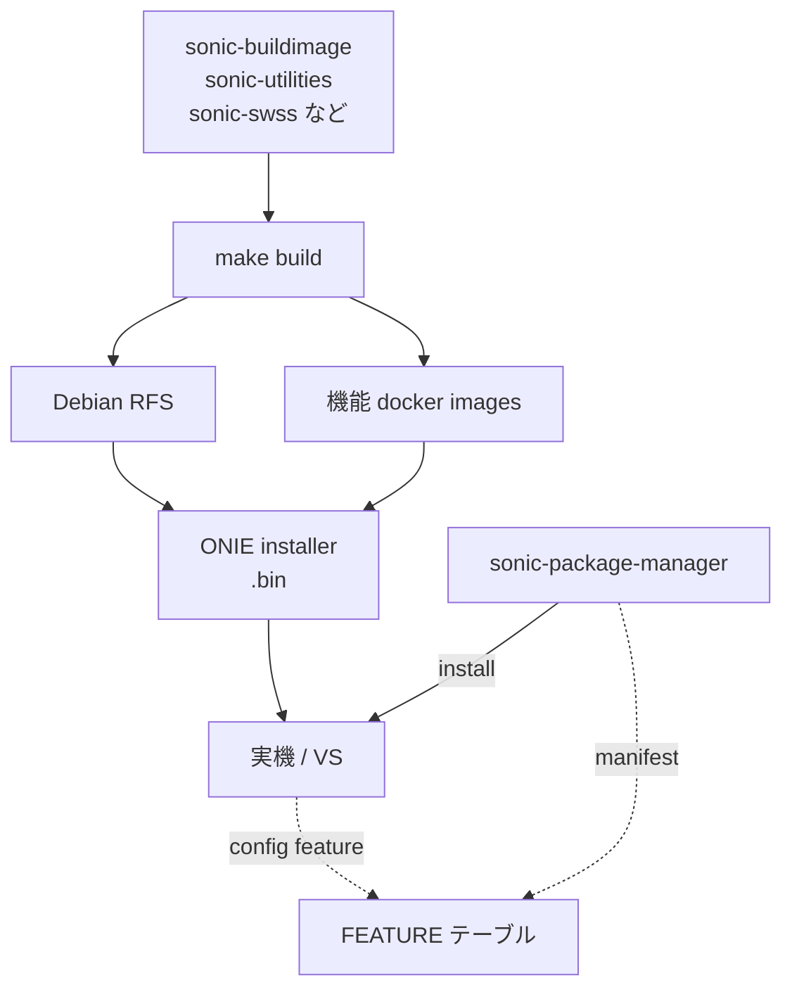
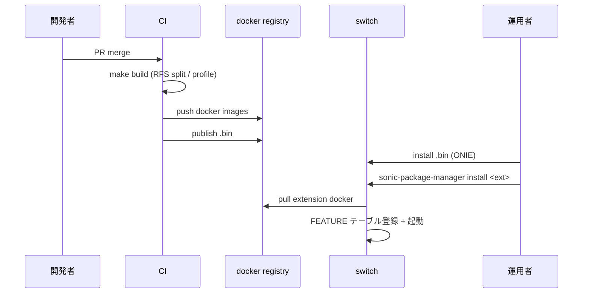

# 概要

[SONiC](../../reference/glossary.md#term-sonic) の build / packaging は、開発者向けの「ソースから ONIE installer を作る話」と、運用者向けの「機能 docker を後から足す話」が一本の鎖でつながっている。混同を避けるために、層を先に分けると読みやすい。

## この章は何のためにあるか

SONiC は「機能を動かす」「[ASIC](../../reference/glossary.md#term-asic) に書く」だけでなく、**そもそも image をどう組み立てるか／後から拡張するか** が独立した話題になる NOS である。`docs/architecture/` と `docs/system/` の中には build や packaging の [HLD](../../reference/glossary.md#term-hld) が点在しているが、それらは「開発者視点」「運用者視点」「リリース管理者視点」の混在で読みづらい。本章はそれを次の 4 つの軸で読み解く。

1. ソースから ONIE installer を作るまでの「build」
2. 出来上がった image / docker に **意味のあるバージョンを振る** ための「versioning」
3. 後から docker 機能を追加する「packaging（SPM）」
4. これらを支える ARM 対応、container 硬化、品質グレードといった「横断トピック」

## 何を解決するか

- **ビルドが遅い**: vanilla 構成では sairedis / kernel / RFS のような直列依存が長く、CI 全体が詰まる。build profile・RFS split・Dockerfile レイヤ削減はこの直列を分解する。
- **拡張機能の配布が難しい**: inbox docker は `sonic-buildimage` を再ビルドしないと差し替えられない。SPM は **install/uninstall** を単位として、`config feature` と統合する。
- **base OS の老朽化**: Debian の支援サイクルとずれると CVE 対応が苦しくなる。Debian upgrade cadence HLD はこの調整を明示化する。
- **互換性の判断が困難**: image semver と docker semver を独立に振ることで、「OS は同じだが特定 docker だけアップグレードした」ケースの互換性判定を機械可読にする。

## SONiC 内での位置

build 系 HLD は左半分（image を作る話）、packaging 系 HLD は右下（switch 上で後から足す話）、versioning HLD はその両方を貫く識別子の規約である。

## 用語の整理

| 用語 | 意味 | 関連 |
| --- | --- | --- |
| RFS | Debian Root FileSystem。`build_debian.sh` が組み立てる base | RFS split |
| build profile | `rules/profiles/<name>.mk` で flags を束ねる提案 | 提案段階 HLD |
| ONIE installer | 実機 NOS インストーラのフォーマット | `.bin` 形式 |
| SPM | sonic-package-manager。docker を install / uninstall する CLI | manifest |
| manifest | docker と SONiC の接続を記述する JSON | warm reboot、showtech 等のフック宣言 |
| Application Extension | 後から install 可能な機能 docker | inbox 機能の Extension 化を含む |
| image versioning | SONiC OS 全体の semver | docker semver と独立 |
| feature quality | feature の Alpha/Beta/GA グレード定義 | リリース判定 |

## 典型シーン

開発者の「build を速くする」工夫と、運用者の「後から足す」工夫は、registry を共有点として接続する。

## 似た機能との違い

| 比較 | 共通点 | 違い |
| --- | --- | --- |
| Vanilla Debian の deb との違い | apt で OS を更新する | SONiC は image 全体を ONIE で焼く前提。docker は SPM 経由。 |
| Linux ディストリの container との違い | container を後から足せる | SPM は **SONiC の FEATURE / warm reboot / showtech** にフックを張る点が独自。 |
| Inbox docker との違い | 機能を docker で提供する | inbox は build に焼き込まれる。Extension は registry から取得して動的 install。 |
| ベンダ NOS の RPM / IPK との違い | 機能を後付けする | SONiC は container 単位、ベンダは binary 単位が多い。 |

## まず層を分ける

| 層 | 主な責務 | 代表ドキュメント |
| --- | --- | --- |
| Build system | Dockerfile レイヤ削減・並列ビルド・sairedis 分離 | [Build system improvements](../../architecture/build-system-improvements.md) |
| Build profile | フラグセットを `rules/profiles/<name>.mk` で束ねる提案 | [Build profiles](../../architecture/build-profiles.md) |
| RFS split build | `build_debian.sh` を 2 段化して並列化する | [RFS Split build](../../architecture/rfs-split-build-improvements-hld.md) |
| Base OS lifecycle | Debian release を取り込む cadence と廃止計画 | [Debian upgrade cadence](../../system/sonic-debian-upgrade-cadence.md) |
| Versioning | OS と docker image の semver と互換境界 | [OS / docker semver](../../system/sonic-os-sonic-docker-images-versioning.md) |
| Packaging / SPM | sonic-package-manager と manifest | [Application Extension Infrastructure](../../architecture/sonic-application-extension-infrastructure.md) |
| Extension 開発 | 既存 docker の Extension 化と新規開発 | [Application Extension 開発ガイド](../../management/sonic-application-extension-guide.md) |
| Multi-arch | ARM (armhf / arm64) ビルドサポート | [ARM architecture support](../../architecture/sonic-arm-architecture-support.md) |
| Container security | capability / privileged 削減 | [Container hardening](../../system/sonic-container-hardening.md) |
| Release quality | feature の品質グレード定義 | [Feature quality definition](../../system/sonic-feature-quality-definition.md) |

build 系 HLD は「ビルドを速くする」「ビルドを再現可能にする」「ビルドを ARM へ広げる」を、packaging 系 HLD は「ビルド済み docker をどう配布・install するか」を担っている。両者の接点が **image versioning** と **manifest** である。

## なぜ Application Extension が必要か

Inbox の機能 docker（bgp、[teamd](../../reference/glossary.md#term-teamd-teamsyncd-teammgrd)、snmp 等）はすべて `sonic-buildimage` ツリーで一緒にビルドされ、ONIE installer に焼き込まれる。一方、3rd party や任意の docker を **後から** 入れて、`config feature` と同じ管理面で扱いたいケースが増えた。SPM はこれを満たすために、`sonic-package-manager install` で `FEATURE` テーブルへの登録、`docker_image_ctl` 経由の起動、warm reboot / showtech / syslog のフックを揃える設計になっている。詳細は [Application Extension Infrastructure](../../architecture/sonic-application-extension-infrastructure.md) を参照する。

## なぜ build profile / RFS split / Debian cadence が並ぶのか

build profile は「フラグ一式の再現性」、RFS split は「直列ルールの並列化」、Debian cadence は「base 入れ替えのリズム」と、それぞれ別の遅さを解消する。注意点として、build profile HLD は現行 master に取り込まれていない提案であり、RFS split は HLD の単一フラグでなく `RFS_SPLIT_FIRST_STAGE` / `RFS_SPLIT_LAST_STAGE` の 2 段フラグで実装されている。HLD と実装の差は各ページ冒頭の裏取りバナーに明記してある。

## この章での読み方

ビルド時間や CI を改善したい場合は [アーキテクチャ](architecture.md) から入る。SPM で docker を配布したい場合や `config feature` との接続を確認したい場合は [運用](operations.md) を読む。ARM 向け移植や container 硬化、リリース品質判断は [発展トピック](advanced.md) にまとめている。

## 他章との境界

- `config feature` の挙動そのものや warm reboot との連携は [11 Reboot](../11-reboot/index.md) と [運用](operations.md) を読む。本章は SPM 側のフック定義に絞る。
- container ランタイムや k8s readiness probe の話は [20 SWSS / SAI / Redis](../20-swss-sai-redis/index.md) や internals 章を参照する。本章は container 硬化の **build/packaging 側の責務** のみ扱う。
- 開発者向け lab セットアップは [21 Lab / Developer](../21-lab-vs-developer/index.md) を参照する。本章は image そのものを「作る／配布する」話に限定する。

## 読了後にできること

- 「build を速くしたい」「機能を後付けしたい」「OS と docker のバージョンを別管理したい」のどれかという質問を、対応する HLD に振り分けられる。
- build profile・RFS split・Debian cadence がそれぞれ別の遅さに対処していることを 1 行で説明できる。
- SPM が `FEATURE` テーブル・`docker_image_ctl`・warm reboot にどう接続するかの概略を持って operations 章に進める。
- container 硬化や ARM 対応など、横断トピックを「build か packaging か」の軸で分類できる。
- 各 HLD ページ冒頭の裏取りバナーを見たとき、「これは master 実装済み」「これは提案段階」を区別する目を持てる。

## 関連ページ

- [Build system improvements](../../architecture/build-system-improvements.md)
- [Build profiles](../../architecture/build-profiles.md)
- [RFS Split build](../../architecture/rfs-split-build-improvements-hld.md)
- [Application Extension Infrastructure](../../architecture/sonic-application-extension-infrastructure.md)

<!-- xref-prereq -->
## この章の前提知識

この章を読み進める前に、次の章を押さえておくと迷子になりにくい。

- [SONiC 全体像と設定基盤](../01-overview/index.md)
- [Lab / Virtual SONiC / Developer Entry](../21-lab-vs-developer/index.md)

<!-- glossary-links-injected: ec18b66e3507 -->
