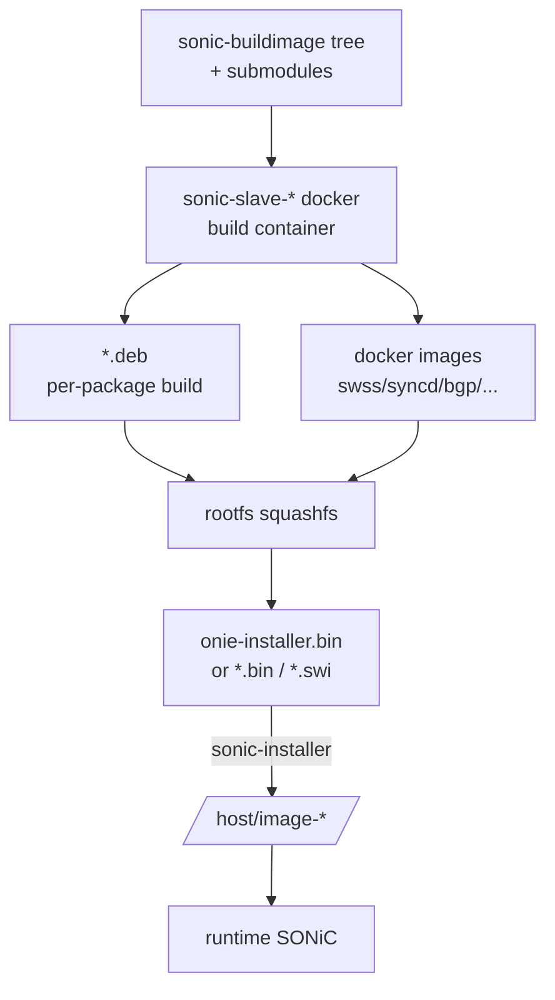
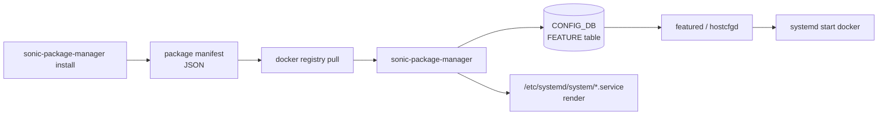

# 内部実装

build / packaging / application extension の内部実装は「[sonic-buildimage](../../reference/glossary.md#term-sonic-buildimage) は何を吐き出すか」「sonic-package-manager (SPM) はどう extension を載せるか」「image install 後にどう dockerize されるか」の三層で見る。`docker-base` / `sonic-slave` / `sonic-build-hooks` の関係を押さえると、ビルド時間とイメージサイズの分析が楽になる。

## データフロー（ビルド）



## データフロー（ランタイム / SPM）



`featured` は [sonic-host-services](../../reference/glossary.md#term-sonic-host-services) 配下の専用 daemon で、`FEATURE` テーブルを subscribe して service の enable / disable / restart を司る。汎用ホスト設定 (TACACS / SSH / syslog 等) は `hostcfgd` 側が担当する。[^featured]

## 主要コンポーネントの責務

| コンポーネント | 主実体 | 責務 |
| --- | --- | --- |
| `sonic-slave-bullseye` / `sonic-slave-bookworm` / `sonic-slave-trixie` | `sonic-slave-*/` (top-level) | ビルド用 docker。すべての `.deb` と docker image を slave 内で作る[^slave] |
| `Makefile.work` / `slave.mk` | top-level Makefile | `BLDENV` ごとの slave 切替・`SONIC_BUILD_JOBS` / `SONIC_DPKG_CACHE_METHOD` の伝搬・submodule 配下の `.deb` / docker target を解決[^makework] |
| `sonic-build-hooks` | `src/sonic-build-hooks/` | slave 内の `apt` / `dpkg` / `pip` / `curl` / `wget` / `git` を hook して、ビルド時に取得したパッケージとバイナリのバージョン / hash を記録する[^hooks] |
| `files/build_templates/` | jinja2 テンプレート | docker compose / systemd unit / supervisord conf / package manifest を生成 |
| `sonic-package-manager` (SPM) | `sonic-utilities/sonic_package_manager/` | extension package のライフサイクル管理（`install` / `upgrade` / `remove` / `list` / `show`）[^spm-loc] |
| `featured` (`sonic-host-services`) | `scripts/featured` | `FEATURE` テーブルを subscribe して systemd service を enable / disable / restart する[^featured] |
| `hostcfgd` (`sonic-host-services`) | `scripts/hostcfgd` | TACACS / RADIUS / SSH / syslog 等ホスト側設定を CONFIG_DB から反映する |
| `sonic-installer` | python CLI | image partition の install / list / set-default / set-next / cleanup |

## SPM / FEATURE table

`FEATURE` テーブルが SPM とランタイムの接続点である。SPM が新規パッケージを `install` すると、`FeatureRegistry` が CONFIG_DB に以下の既定値で行を追加する。[^feature-default]

```yaml
CONFIG_DB:FEATURE|<name>
  state: "enabled|disabled|always_enabled|always_disabled"  # default: disabled
  auto_restart: "enabled|disabled"                          # default: enabled
  high_mem_alert: "enabled|disabled"                        # default: disabled
  set_owner: "kube|local"                                   # default: local
```

`set_owner = kube` は Kubernetes 経由デプロイ（k8s based feature management）の hint で、`local` はホスト systemd 管理である。`state` の `always_enabled` / `always_disabled` は platform 既定によって上書きを禁止する設定で、`featured` 側のステートマシンで `enabled` / `disabled` とは別経路で扱われる。[^featured-states]

## SAI / Redis pub/sub の使用

ビルド・パッケージング系には [SAI](../../reference/glossary.md#term-sai) 属性も [Redis](../../reference/glossary.md#term-redis) pub/sub も基本ない（ビルド時にコードを SAI 越しに動かさない）。例外:

- ランタイムで SPM が `FEATURE` テーブルを書き、`featured` が [CONFIG_DB](../../reference/glossary.md#term-config_db) を subscribe して service を起動する経路は Redis pub/sub を使う。
- `sonic-installer` は image partition の操作のみで Redis 不要。

## Redis テーブル参照関係

```yaml
CONFIG_DB:
  FEATURE                      # SPM が書き、featured が subscribe
  AUTO_TECHSUPPORT_FEATURE     # SPM が同時に書く（per-feature の techsupport 設定）
  DEVICE_METADATA              # image_type / hwsku
STATE_DB:
  FEATURE                      # featured が runtime state を反映
```

SPM の `FeatureRegistry` は `FEATURE` 登録と同時に `AUTO_TECHSUPPORT_FEATURE` にも対応行を追加する（`AUTO_TECHSUPPORT|GLOBAL` が存在する場合）。[^auto-ts]

## 既知の実装上の制約

- ビルドは **slave docker の rebuild が高頻度で必要**で、初回 build に 1〜2 時間かかる。`make -j` 並列度（`SONIC_BUILD_JOBS`）は host のメモリと swap に強く依存する。
- submodule の SHA を上げると `make configure` の再走が必要で、incremental ではなく毎回 deb 系を作り直すケースがある（`*.flag` の依存解決が conservative）。
- SPM の extension は **公式ビルドの [SONiC](../../reference/glossary.md#term-sonic) イメージ（PR build 含む）に対してのみテスト**されており、外部派生ビルドでの互換性は保証されない。manifest の `min-version` を確認すること。
- `set_owner = kube` 系の機能は SONiC master でも実験的扱いの箇所があり、`featured` の状態遷移が Kubernetes 側の expected とずれることがある。
- `sonic-buildimage` のターゲット platform は `PLATFORM=<vendor>` 環境変数で切替えるが、複数 platform を同時にビルドする supported workflow は無いに等しく、CI 側で逐次 build している。
- application extension の docker image は SONiC の base layer に依存していると更新時にサイズが膨らみ、`/host` の空き容量に注意が必要。

## ビルドキャッシュと incremental build

`sonic-buildimage` は package ごとに `.flag` ファイルでビルド完了を記録する。submodule の HEAD SHA が変わると、その submodule 由来のすべての `.deb` と参照する docker image が rebuild 対象になる。incremental 化のために以下が用意されている。[^makework]

| 機構 | 目的 |
| --- | --- |
| `SONIC_DPKG_CACHE_METHOD={none,cache,rcache,wcache,rwcache}` | `.deb` の hash-key ベースキャッシュ（`/sonic/target/cache/`）。`r` は read、`w` は write |
| `SONIC_DPKG_CACHE_METHOD_OVERRIDE` | per-package で cache method を上書き |
| `BLDENV` の固定 | slave 側 OS バージョン（bullseye / bookworm / trixie）を固定して再利用 |
| `SONIC_BUILD_JOBS` | 並列度の制御。host CPU/RAM に応じて調整 |
| `PLATFORM=<vendor>` | 不要 platform deb のスキップ |

キャッシュは個別開発者環境では効果が大きい一方、PR build（GitHub Actions）では基本クリーンビルドであり、CI 時間の大半は slave docker の起動と deb の sequential build に費やされる。

## docker image の階層

ランタイムの SONiC docker image は階層を持つ。

```text
docker-base-<bullseye/bookworm/trixie>
  └─ docker-config-engine-<bullseye/bookworm/trixie>
       ├─ docker-orchagent  (swss)
       ├─ docker-syncd-<vendor>
       ├─ docker-fpm-frr   (bgp / FRR)
       ├─ docker-teamd
       ├─ docker-platform-monitor (pmon)
       ├─ docker-snmp
       ├─ docker-sonic-gnmi (旧 telemetry)
       ├─ docker-mux
       ├─ docker-nat
       ├─ docker-lldp
       └─ docker-dhcp-relay
```

`docker-config-engine-<os>` が共通の python / `sonic-py-common` / supervisord 設定を持ち、機能 container はそれを base にして個別バイナリと supervisord conf を足す。新規 extension は `docker-base-<os>` から派生させる選択も可能だが、サイズ削減のためには既存階層への mount が推奨される。

## 関連ページ

- [Build profiles](../../architecture/build-profiles.md)
- [Build system improvements](../../architecture/build-system-improvements.md)
- [RFS split build improvements](../../architecture/rfs-split-build-improvements-hld.md)
- [SONiC application extension infrastructure](../../architecture/sonic-application-extension-infrastructure.md)
- [SONiC application extension guide](../../management/sonic-application-extension-guide.md)
- [sonic-package-manager CLI](../../reference/cli/sonic-package-manager.md)
- [SONiC optional feature control enhancement](../../system/sonic-optional-feature-control-enhancement.md)

[^slave]: `sonic-buildimage` リポジトリ直下に `sonic-slave-bullseye/` `sonic-slave-bookworm/` `sonic-slave-trixie/` 等の slave docker 定義が並ぶ。`Makefile.work` の `BLDENV` で切り替える。
[^makework]: `sonic-buildimage/Makefile.work` で `BLDENV` `SONIC_BUILD_JOBS` `SONIC_DPKG_CACHE_METHOD` `SONIC_DPKG_CACHE_METHOD_OVERRIDE` が定義・伝搬される。
[^hooks]: `sonic-buildimage/src/sonic-build-hooks/hooks/` に `apt` `apt-get` `dpkg` `pip` `pip2` `pip3` `curl` `wget` `git` の wrapper が並ぶ。
[^spm-loc]: SPM の実装は `sonic-buildimage` ではなく `sonic-utilities/sonic_package_manager/` に存在する（`main.py` / `manager.py` / `manifest.py` / `service_creator/`）。
[^featured]: `sonic-host-services/scripts/featured` が `FEATURE` テーブル subscribe と systemd 制御を担当する独立 daemon。`hostcfgd` は TACACS / SSH 等のホスト設定担当。
[^feature-default]: `sonic-utilities/sonic_package_manager/service_creator/feature.py` の `DEFAULT_FEATURE_CONFIG = {'state': 'disabled', 'auto_restart': 'enabled', 'high_mem_alert': 'disabled', 'set_owner': 'local'}`。
[^featured-states]: `sonic-host-services/scripts/featured` の `state` 取り得る値は `['enabled', 'disabled', 'always_enabled', 'always_disabled']`。`always_*` は他の遷移を抑止する終端状態。
[^auto-ts]: `sonic-utilities/sonic_package_manager/service_creator/feature.py` の `AUTO_TS_FEATURE = "AUTO_TECHSUPPORT_FEATURE"` と `register_auto_ts_feature` 系処理で同期される。

<!-- evidence:
source: sonic-utilities/sonic_package_manager/service_creator/feature.py#L11-L17 (sha: 39732bceb8bdefe706518ab40623bbbba6ff33b9)
excerpt: |
  FEATURE = 'FEATURE'
  DEFAULT_FEATURE_CONFIG = {
      'state': 'disabled',
      'auto_restart': 'enabled',
      'high_mem_alert': 'disabled',
      'set_owner': 'local'
  }
reasoning: SPM が CONFIG_DB:FEATURE に書き込む既定値とキー一覧の根拠。
-->

<!-- evidence-rendered:start -->
??? note "📋 検証エビデンス: sonic-utilities/sonic_package_manager/service_creator/feature.py#L11-L17 (sha: 39732bceb8bdefe706518ab40623bbbba6ff33b9)"

    **出典**:

    `sonic-utilities/sonic_package_manager/service_creator/feature.py#L11-L17 (sha: 39732bceb8bdefe706518ab40623bbbba6ff33b9)`

    **抜粋**:

    ```text
    FEATURE = 'FEATURE'
    DEFAULT_FEATURE_CONFIG = {
        'state': 'disabled',
        'auto_restart': 'enabled',
        'high_mem_alert': 'disabled',
        'set_owner': 'local'
    }
    ```

    **判断根拠**: SPM が CONFIG_DB:FEATURE に書き込む既定値とキー一覧の根拠。

<!-- evidence-rendered:end -->

<!-- evidence:
source: sonic-host-services/scripts/featured#L78-L82 (sha: c5bbbe8b07b96f078fa4b761316627404b01bd04)
excerpt: |
  self.state = self._get_feature_table_key_render_value(
      feature_cfg.get('state'), device_config or {},
      ['enabled', 'disabled', 'always_enabled', 'always_disabled'])
reasoning: featured 側の state 取り得る値の根拠。always_enabled / always_disabled が enabled / disabled と並列の有効な状態である。
-->

<!-- evidence-rendered:start -->
??? note "📋 検証エビデンス: sonic-host-services/scripts/featured#L78-L82 (sha: c5bbbe8b07b96f078fa4b761316627404b01bd04)"

    **出典**:

    `sonic-host-services/scripts/featured#L78-L82 (sha: c5bbbe8b07b96f078fa4b761316627404b01bd04)`

    **抜粋**:

    ```text
    self.state = self._get_feature_table_key_render_value(
        feature_cfg.get('state'), device_config or {},
        ['enabled', 'disabled', 'always_enabled', 'always_disabled'])
    ```

    **判断根拠**: featured 側の state 取り得る値の根拠。always_enabled / always_disabled が enabled / disabled と並列の有効な状態である。

<!-- evidence-rendered:end -->

<!-- evidence:
source: sonic-buildimage/Makefile.work#L30-L46 (sha: 9ea932ec2e18f35e58268ec2e4456b1d4afd65cd)
excerpt: |
  #  * SONIC_BUILD_JOBS: Specifying number of concurrent build job(s) to run
  #  * SONIC_DPKG_CACHE_METHOD: Specifying method of obtaining the Debian packages from cache: none, cache, rcache, wcache, rwcache
  #  * SONIC_DPKG_CACHE_METHOD_OVERRIDE: Specifying whether to override the method used by SONIC_DPKG_CACHE_METHOD: none, rcache, wcache, rwcache
reasoning: build キャッシュ・並列度の Make 変数の根拠と取り得る値の一覧。
-->

<!-- evidence-rendered:start -->
??? note "📋 検証エビデンス: sonic-buildimage/Makefile.work#L30-L46 (sha: 9ea932ec2e18f35e58268ec2e4456b1d4afd65cd)"

    **出典**:

    `sonic-buildimage/Makefile.work#L30-L46 (sha: 9ea932ec2e18f35e58268ec2e4456b1d4afd65cd)`

    **抜粋**:

    ```text
    #  * SONIC_BUILD_JOBS: Specifying number of concurrent build job(s) to run
    #  * SONIC_DPKG_CACHE_METHOD: Specifying method of obtaining the Debian packages from cache: none, cache, rcache, wcache, rwcache
    #  * SONIC_DPKG_CACHE_METHOD_OVERRIDE: Specifying whether to override the method used by SONIC_DPKG_CACHE_METHOD: none, rcache, wcache, rwcache
    ```

    **判断根拠**: build キャッシュ・並列度の Make 変数の根拠と取り得る値の一覧。

<!-- evidence-rendered:end -->

<!-- glossary-links-injected: 8ba32e5aa69d -->
