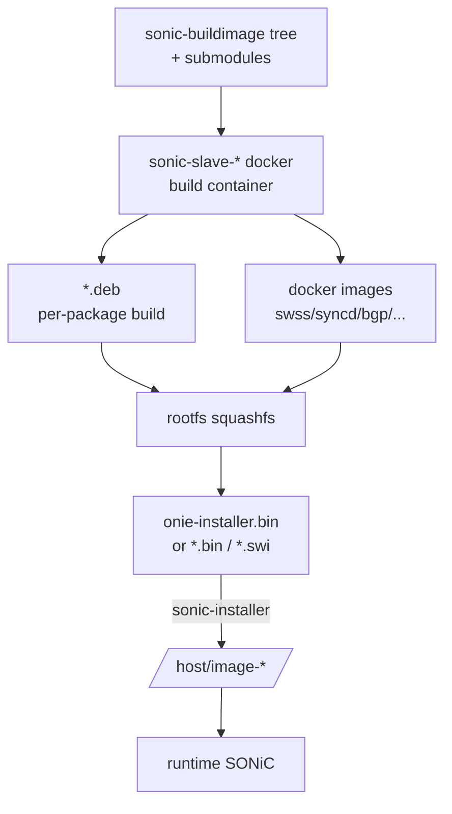

# 内部実装

build / packaging / application extension の内部実装は「sonic-buildimage は何を吐き出すか」「sonic-package-manager (SPM) はどう extension を載せるか」「image install 後にどう dockerize されるか」の三層で見ます。docker-base / sonic-slave / sonic-build-hooks の関係を押さえると、ビルド時間とイメージサイズの分析が楽になります。

## データフロー（ビルド）



## データフロー（ランタイム / SPM）

```mermaid
flowchart LR
  CLI[sonic-package-manager install] --> MANIFEST[package manifest<br/>JSON]
  MANIFEST --> REG[docker registry pull]
  REG --> SPM[sonic-package-manager]
  SPM --> FEATURE[(CONFIG_DB<br/>FEATURE table)]
  SPM --> SVC[/etc/systemd/system/*.service<br/>render]
  FEATURE --> HOSTCFGD[hostcfgd]
  HOSTCFGD --> SYSTEMD[systemd start docker]
```

## 主要コンポーネントの責務

| コンポーネント | 主実体 | 責務 |
| --- | --- | --- |
| `sonic-slave-bullseye` / `sonic-slave-bookworm` | `dockers/sonic-slave-*/` | ビルド用 docker。すべての .deb と docker image を slave 内で作る |
| `Makefile.work` / `slave.mk` | top-level Makefile | submodule 配下の .deb / docker target を解決 |
| `sonic-build-hooks` | `src/sonic-build-hooks/` | サードパーティバイナリの取得、check sums、license の hook |
| `sonic-buildimage/files/build_templates/` | jinja2 | docker compose / systemd unit / supervisord conf を生成 |
| `sonic-package-manager` (SPM) | `src/sonic-package-manager/` | extension package のライフサイクル管理（install / upgrade / remove / list） |
| `hostcfgd` (`src/sonic-host-services/`) | `hostcfgd.py` | FEATURE table を見て systemd service の enable/disable と reload |
| `fwutil` / `sonic-installer` | python CLI | image install、show / next / cleanup |

## SPM / FEATURE table

`FEATURE` テーブルが SPM とランタイムの接続点です。

```
CONFIG_DB:FEATURE|<name>
  state: "enabled|disabled|always_enabled|always_disabled"
  auto_restart: "enabled|disabled"
  high_mem_alert: "enabled|disabled"
  set_owner: "kube|local"
```

`set_owner = kube` は Kubernetes 経由デプロイ（k8s based feature management）の hint で、`local` はホスト systemd 管理です。

## SAI / Redis pub/sub の使用

ビルド・パッケージング系には SAI 属性も Redis pub/sub も基本ありません（ビルド時にコードを SAI 越しに動かさない）。例外:

- ランタイムで SPM が FEATURE table を書き、hostcfgd が CONFIG_DB を subscribe して service を起動する経路は Redis pub/sub を使います。
- `sonic-installer` は image partition の操作のみで Redis 不要。

## Redis テーブル参照関係

```
CONFIG_DB:
  FEATURE, DEVICE_METADATA (image_type / hwsku)
STATE_DB:
  FEATURE (state は CONFIG_DB、runtime state は STATE_DB)
```

## 既知の実装上の制約

- ビルドは **slave docker の rebuild が高頻度で必要**で、初回 build に 1〜2 時間かかります。`make -j` 並列度は host のメモリと swap に強く依存します。
- submodule の SHA を上げると `make configure` の再走が必要で、incremental ではなく毎回 deb 系を作り直すケースがある（`*.flag` の依存解決が conservative）。
- SPM の extension は **公式ビルドの SONiC イメージ（PR build 含む）に対してのみテスト**されており、外部派生ビルドでの互換性は保証されません。manifest の `min-version` を確認してください。
- `set_owner = kube` 系の機能は SONiC master でも実験的扱いの箇所があり、`feature` の状態遷移が Kubernetes 側の expected と zaeshigit ことがあります。
- `sonic-buildimage` のターゲット platform は `PLATFORM=<vendor>` 環境変数で切替えますが、複数 platform を同時にビルドする supported workflow は無いに等しく、CI 側で逐次 build しています。
- application extension の docker image は SONiC の base layer に依存していると更新時にサイズが膨らみ、`/host` の空き容量に注意が必要です。

## 関連ページ

- [Build profiles](../../architecture/build-profiles.md)
- [Build system improvements](../../architecture/build-system-improvements.md)
- [RFS split build improvements](../../architecture/rfs-split-build-improvements-hld.md)
- [SONiC application extension infrastructure](../../architecture/sonic-application-extension-infrastructure.md)
- [SONiC application extension guide](../../management/sonic-application-extension-guide.md)
- [sonic-package-manager CLI](../../reference/cli/sonic-package-manager.md)
- [SONiC optional feature control enhancement](../../system/sonic-optional-feature-control-enhancement.md)
