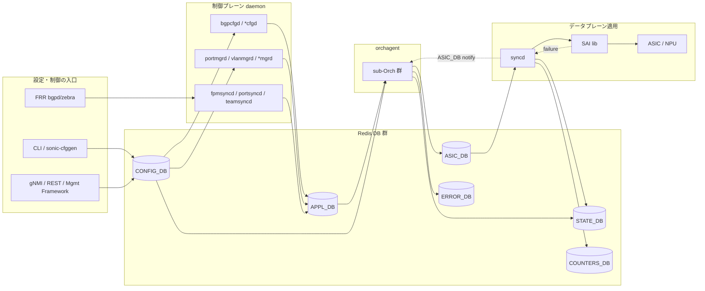

# アーキテクチャ

[SONiC](../../reference/glossary.md#term-sonic) の内部実装を 1 枚で押さえるなら、左から CLI / [gNMI](../../reference/glossary.md#term-gnmi) / 制御プレーン daemon、中央に [Redis](../../reference/glossary.md#term-redis) DB 群、右に [syncd](../../reference/glossary.md#term-syncd) と [SAI](../../reference/glossary.md#term-sai)/[ASIC](../../reference/glossary.md#term-asic) を置く絵になる。各機能章で `*Orch`、`*syncd`、`*mgrd` のように出てくる名前は、この絵のどこに座るかで役割が決まる。

## DB ごとの責務

`CONFIG_DB` は永続化された設定の唯一の source of truth である。`APPL_DB` は制御プレーンが「ASIC にこうしたい」と書く intent の場で、各機能の `*_TABLE` がここに置かれる。`STATE_DB` は実際の状態と監視ヒントで、syncd や各 daemon が書き込む。`COUNTERS_DB` は ASIC から取得した counter の集計先で、flexcounter 群が更新する。`ASIC_DB` は SAI object を Redis 表現に落としたもので、[orchagent](../../reference/glossary.md#term-orchagent) が書き、syncd が読む。`ERROR_DB` は SAI 失敗を APP 側に伝えるためのチャネルである。

スキーマの一次ソースは [swss-schema（APPL_DB / STATE_DB の中心スキーマ参照）](../../internals/swss-schema.md) を読む。

## ProducerStateTable と非同期化

[APPL_DB](../../reference/glossary.md#term-appl_db) と [ASIC_DB](../../reference/glossary.md#term-asic_db) は、書き手と読み手が別プロセスに分かれる。Redis に直に SET するのではなく、[ProducerStateTable](../../reference/glossary.md#term-producerstatetable) / [ConsumerStateTable](../../reference/glossary.md#term-consumerstatetable) を介して「key の変更通知」を queue として渡す。これにより読み手側は変更分だけを取り出して処理できる。<!-- evidence: sonic-swss-common common/producerstatetable.h:1-71 (set/del/flush API + Lua script で TABLE と _KEY_SET の両方を更新), common/consumerstatetable.cpp:1-96 (pops で _KEY_SET から差分のみ取得) -->ZMQ ベースに置き換える設計は [ZMQ ProducerStateTable / ConsumerStateTable 設計](../../internals/zmq-producer-consumer-state-table-design.md) を読む。

ASIC_DB 側は sairedis が非同期に消費し、SAI 呼び出しに変換する。SAI 呼び出しの結果は完了通知や ERROR_DB を介して orchagent に戻る。これが「orchagent が ASIC_DB に書いたら、すぐ ASIC に入っているとは限らない」根拠である。

## syncd と SAI の境界

syncd は ASIC_DB を消費し、SAI API を呼ぶ唯一の場所である。ベンダごとの SAI 実装は libsai に隠れ、syncd と orchagent はベンダ非依存に保たれる。SAI 戻り値 (`sai_status_t`) は、各 sub-Orch が `orchagent/saihelper.h` で宣言された free function `handleSaiCreateStatus` / `handleSaiSetStatus` / `handleSaiRemoveStatus` を呼んで分類する（`Orch` クラスの virtual メソッドではなく、`orchagent/saihelper.cpp` の自由関数として実装されている）。`SAI_STATUS_SUCCESS` と一部の良性ステータスは `task_success`、`INSUFFICIENT_RESOURCES` / `TABLE_FULL` / `NO_MEMORY` / `NV_STORAGE_FULL` は `task_need_retry`、それ以外は `handleSaiFailure` 経由で例外を投げる粗い実装になっており、saihelper 自身のコメントでも fine-grain failure handling は TODO と明記されている。<!-- evidence: sonic-swss orchagent/saihelper.cpp:581-720 (handleSaiCreateStatus / handleSaiSetStatus / handleSaiRemoveStatus), orchagent/saihelper.h:19-21 (宣言), orchagent/intfsorch.cpp:1301,1353,1401 (呼び出し), orchagent/dtelorch.cpp:41-70 (呼び出し) -->ASIC_DB 側の SAI failure 通知自体は sairedis の `syncd/NotificationProcessor.cpp` から ASIC_DB notification channel に流れる。`ERROR_DB` 経由で APP に伝えるパスは [HLD](../../reference/glossary.md#term-hld) 提案であり実装は未完である ([error-handling-framework-in-sonic-limitations](../../architecture/error-handling-framework-in-sonic-limitations.md))。詳細は [SAI 失敗ハンドリング](../../platform/hld-for-handling-sai-failures.md) と [Error Handling Framework](../../architecture/error-handling-framework-in-sonic.md) を読む。

## 機能章はこの絵のどこを使うか

| 機能章 | 主に使う部分 |
| --- | --- |
| [BGP](../02-bgp/index.md) | [FRR](../../reference/glossary.md#term-frr) → [fpmsyncd](../../reference/glossary.md#term-fpmsyncd) → APPL_DB（[ROUTE_TABLE](../../reference/glossary.md#term-route_table)/NHG）→ RouteOrch → ASIC_DB |
| [L2 VLAN LAG](../06-l2-vlan-lag/index.md) | [CONFIG_DB](../../reference/glossary.md#term-config_db) → [vlanmgrd](../../reference/glossary.md#term-vlanmgrd)/[portmgrd](../../reference/glossary.md#term-portmgrd) → APPL_DB → PortsOrch/VlanOrch → ASIC_DB |
| [ACL CoPP Mirror](../07-acl-copp-mirror/index.md) | CONFIG_DB → AclOrch → ASIC_DB（ACL_TABLE/ENTRY/COUNTER） |
| [VRF / ECMP](../04-vrf-ecmp/index.md) | APPL_DB（NEXT_HOP_GROUP_TABLE） → NhgOrch → ASIC_DB |

機能章での具体的な経路は各章のアーキテクチャを参照する。共通の「ProducerStateTable」「ASIC_DB」「ERROR_DB」の動きはここに戻ってくる。

## 関連ページ

- [swss-schema（APPL_DB / STATE_DB の中心スキーマ参照）](../../internals/swss-schema.md)
- [ZMQ ProducerStateTable / ConsumerStateTable 設計](../../internals/zmq-producer-consumer-state-table-design.md)
- [ProducerStateTable の view switching（warm reboot 用の差分適用）](../../switching/view-switching-in-producerstatetable.md)
- [SAI 失敗ハンドリング（handleSai*Status virtual + ERROR_DB）](../../platform/hld-for-handling-sai-failures.md)
- [Error Handling Framework（ERROR_DB / SAI 失敗の app への伝搬）](../../architecture/error-handling-framework-in-sonic.md)

<!-- glossary-links-injected: 167700005048 -->
