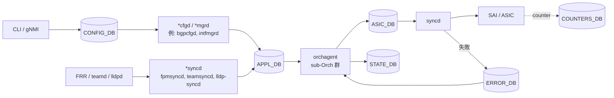
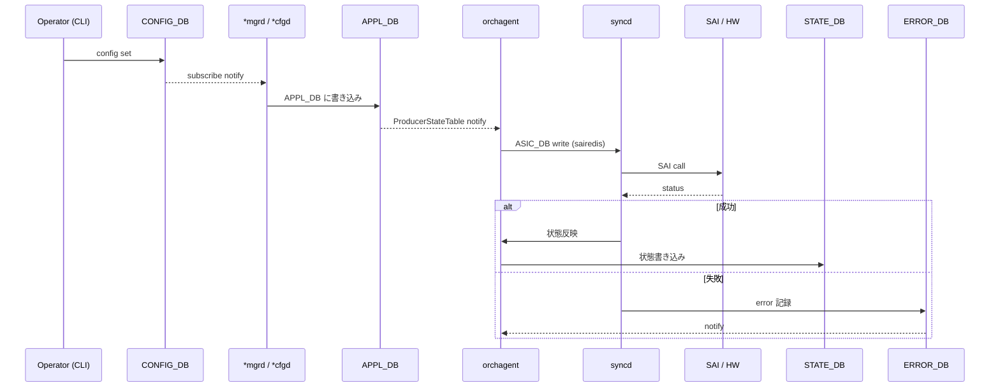

# 概要

[SONiC](../../reference/glossary.md#term-sonic) は「設定の入口」「制御プレーン daemon」「[ASIC](../../reference/glossary.md#term-asic) への橋渡し」が別プロセスで分かれており、これらを [Redis](../../reference/glossary.md#term-redis) 上の名前付き DB で結んでいる。機能章を読むときの共通語彙はこの章でまとめる。

## この章は何のためにあるか

機能章（[BGP](../../reference/glossary.md#term-bgp) / [ACL](../../reference/glossary.md#term-acl) / [VRF](../../reference/glossary.md#term-vrf) / [VXLAN](../../reference/glossary.md#term-vxlan) など）を読み進めると、必ず次の用語に出会う: `CONFIG_DB`、`APPL_DB`、`STATE_DB`、`COUNTERS_DB`、`ASIC_DB`、`ERROR_DB`、`orchagent`、`sub-Orch`、`syncd`、`sairedis`、`SAI`、`ProducerStateTable`、`bulk counter`。これらを **どの章でも同じ意味で使えるように一度地ならしする** のが本章の目的である。

具体的には、読み手の以下の疑問に章全体で答える。

1. なぜ DB がこれほど多いのか（CONFIG / APPL / STATE / ASIC / ERROR / COUNTERS の理由）
2. [APPL_DB](../../reference/glossary.md#term-appl_db) と [CONFIG_DB](../../reference/glossary.md#term-config_db) はどう違うのか（CONFIG_DB に直接書いてはいけないのか）
3. [orchagent](../../reference/glossary.md#term-orchagent) と [syncd](../../reference/glossary.md#term-syncd) の責務はどこで切れるのか
4. [SAI](../../reference/glossary.md#term-sai) の失敗（attribute not supported、status returned）はどう報告されるのか
5. counter / debug / dump の話が他の章に出てきたとき、どの仕組みを呼んでいるのか

## 何を解決するか

- **疎結合**: 機能ごとの daemon を Redis pubsub で分離することで、どれか 1 つを落としても他に波及しにくい。crash recovery が機能単位で完結する。
- **状態の見える化**: `STATE_DB` / `COUNTERS_DB` を介して、CLI / telemetry / 監視がプロセス境界を越えて状態を読める。
- **SAI 抽象化**: ASIC ベンダごとの差を syncd と SAI 実装で吸収し、orchagent から見たインタフェースを揃える。
- **再起動の選択肢**: warm / fast / cold の各種 reboot で「どの DB を残し、どの DB を再生成するか」を細かく制御できる。

## SONiC 内での位置

機能章で「APPL_DB に書く」「[STATE_DB](../../reference/glossary.md#term-state_db) を見て確認」と書かれていたら、必ずこの図のどこかの矢印を辿っているはずである。本章はこの図を、機能を持たない素の地図として扱う。

## 用語の整理

| 用語 | 意味 | 補足 |
| --- | --- | --- |
| Redis DB | 名前付きの key-value 空間。番号で識別される | `database_config.json` で定義 |
| [ProducerStateTable](../../reference/glossary.md#term-producerstatetable) | 書き手用の async API | APPL_DB の追記に使う |
| [ConsumerStateTable](../../reference/glossary.md#term-consumerstatetable) | 読み手用の async API | orchagent の sub-Orch が購読 |
| Bulk API | 複数 SAI 呼び出しをまとめる | route / neighbor の大量更新 |
| Flex counter | 周期的に SAI から counter を引く仕組み | counter group で頻度を設定 |
| sairedis | SAI 呼び出しを Redis [ASIC_DB](../../reference/glossary.md#term-asic_db) 経由で記録／再生するライブラリ | orchagent ↔ syncd 間の本体 |
| view switching | warm boot 時に古い APPL_DB から新しい APPL_DB へ切り替える操作 | warm reboot で必須 |
| handleSai\*Status | SAI 呼び出し失敗を分類するハンドラ | retriable / fatal / ignore に振り分け |

## 典型シーン

機能章の操作手順や troubleshooting は、必ずこの流れの「どこを覗いたか」を意識すると読み下しが速くなる。

## 似た機能との違い

| 比較 | 共通点 | 違い |
| --- | --- | --- |
| 一枚岩の制御プレーン NOS との違い | 経路や ACL を ASIC に書く | SONiC は機能ごとに別プロセス + Redis pubsub。crash 影響を局所化。 |
| etcd / Consul との違い | 設定 / 状態の共有 DB | Redis は **同じノード内** の IPC が中心。クラスタ共有ではない。 |
| SAI を直接叩く構成との違い | ASIC を抽象化 | sairedis を挟むことで record/replay、warm boot、async が成立。 |
| SQL DB との違い | 状態を読み書きする | スキーマは弱く、key の命名規約とテーブル定義 (`yang`/`docs`) で補強。 |

## 内部実装章のスコープ

## 内部実装章のスコープ

この章は機能（BGP、L2、ACL、VRF など）を語らない。代わりに、機能章のどこにでも出てくる次の要素を扱う。

| 要素 | 主に出てくる場面 | この章での扱い |
| --- | --- | --- |
| Redis DB 群 | 各機能章の「設定どこ」「状態どこ」 | DB の責務分担と命名規約 |
| orchagent | 機能ごとの sub-Orch（[PortsOrch](../../reference/glossary.md#term-portsorch)、RouteOrch、AclOrch、VxlanOrch 等） | APPL_DB → ASIC_DB の共通インタフェース |
| syncd / sairedis | 各機能章の「ASIC に書く」「offload する」 | ASIC_DB の async 適用と SAI 呼び出し |
| SAI | ベンダ間の差異吸収 | バージョン整合、capability 問い合わせ、失敗ハンドリング |
| Counter / Debug | telemetry、observability、ASIC 計数 | bulk/flex counter、dump、ERROR_DB |

機能章で個別に出てきた話を「内部実装側の共通テーマ」に揃え直すための章である。スキーマの全カラム表や CLI の細則は [`docs/reference/`](../../reference/index.md) が引き受け、個別 [HLD](../../reference/glossary.md#term-hld) は `docs/internals/` / `docs/architecture/` / `docs/platform/` / `docs/system/` 配下に残す。

## 機能章との重複を避けるための切り分け

機能章は「特定機能を運用するためにどの DB を見て、どの daemon を疑うか」を読み手の目的順で書く。この章は「DB と daemon そのものがどう設計されているか」を書く。

- 例: BGP route が ASIC に入るまでの経路は [BGP アーキテクチャ](../02-bgp/architecture.md) で読む。一方、[ROUTE_TABLE](../../reference/glossary.md#term-route_table) 全般がどう APPL_DB と ASIC_DB に流れるか、ProducerStateTable とは何か、view switching とは何か、はここで読む。
- 例: ACL の SAI 呼び出し失敗を切り分けるときは [ACL 運用](../07-acl-copp-mirror/operations.md) で読む。一方、SAI 失敗そのものの ERROR_DB / handleSai*Status 設計はここで読む。

## DB の責務（早見表）

| DB | 役割 | 主な書き手 | 主な読み手 |
| --- | --- | --- | --- |
| `CONFIG_DB` | 永続化された設定 | CLI、[gNMI](../../reference/glossary.md#term-gnmi)、Mgmt Framework、[bgpcfgd](../../reference/glossary.md#term-bgpcfgd) | 各 *cfgd、orchagent、起動スクリプト |
| `APPL_DB` | 制御プレーンが望む状態（intent） | bgpcfgd、[fpmsyncd](../../reference/glossary.md#term-fpmsyncd)、[portsyncd](../../reference/glossary.md#term-portsyncd)、teamsyncd、各 *mgrd | orchagent の各 sub-Orch |
| `STATE_DB` | 実際の状態と監視のヒント | 各 daemon、syncd | CLI（show）、監視 |
| `COUNTERS_DB` | ASIC からの counter 集計 | flexcounter / bulk counter | telemetry、show CLI |
| `ASIC_DB` | SAI 呼び出し直前の object 表現 | orchagent | syncd（sairedis 経由） |
| `ERROR_DB` | SAI 失敗を app に伝える | syncd（handleSai*Status） | orchagent、Error Handling Framework |
| `LOGLEVEL_DB` 他 | ログ等の補助 | 各 daemon | swssloglevel など |

スキーマの一次ソースは [swss-schema](../../internals/swss-schema.md) を読む。

## この章での読み方

DB と daemon の地図がほしい人は [アーキテクチャ](architecture.md) を先に読む。multi-namespace（[Multi-ASIC](../../reference/glossary.md#term-multi-asic)）や独自 Redis instance を構成したい人は [設定](setup.md) に進む。SAI 失敗の見方を覚えたい人は [運用](operations.md) と [内部実装](internals.md) を続けて読む。bulk/flex counter、debug、dump の設計差は [内部実装](internals.md) を読む。startup や warm reboot の view switching は [発展トピック](advanced.md) に置いた。

## 読了後にできること

- 「ROUTE_TABLE は APPL_DB と CONFIG_DB のどちらに置くべきか」のような質問に、書き手と読み手の役割で即答できる。
- orchagent が APPL_DB を読み、ASIC_DB に書き、syncd が SAI を呼ぶ流れを、矢印 4 本で説明できる。
- SAI 呼び出しが失敗したときに ERROR_DB / handleSai\*Status のどちらの仕組みを期待すべきかを判断できる。
- bulk counter と flex counter の違いを、登録単位と取得タイミングの観点で説明できる。
- 続く [アーキテクチャ](architecture.md) / [設定](setup.md) / [運用](operations.md) / [内部実装](internals.md) / [発展トピック](advanced.md) で出てくる固有名詞の 9 割を、章を行き来せずに位置付けられる。

## 関連ページ

- [swss-schema（APPL_DB / STATE_DB の中心スキーマ参照）](../../internals/swss-schema.md)
- [コンテナ health-check（k8s readiness probe）](../../internals/why-need-health-check.md)
- [ZMQ ProducerStateTable / ConsumerStateTable 設計](../../internals/zmq-producer-consumer-state-table-design.md)

<!-- xref-prereq -->
## この章の前提知識

この章を読み進める前に、次の章を押さえておくと迷子になりにくい。

- [SONiC 全体像と設定基盤](../01-overview/index.md)

<!-- glossary-links-injected: 261aa082c134 -->
