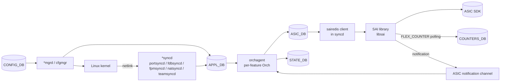

# 内部実装

ここでは「[SAI](../../reference/glossary.md#term-sai) / [syncd](../../reference/glossary.md#term-syncd) 層の整合性」「counter 系の性能改善」「debug / dump 基盤」を、改善が狙っている問題で比較する。機能章で「flex counter が…」「bulk counter が…」「[CRM](../../reference/glossary.md#term-crm) が…」と単発で出てきた話を、内部実装側で並べると棲み分けが見える。

## SWSS / SAI / Redis のデータフロー



## 主要 Orch / daemon の責務（早見表）

| 層 | 代表 | 主実体 |
| --- | --- | --- |
| cfgmgr | `vlanmgrd`、`intfmgrd`、`teammgrd`、`vrfmgrd`、`buffermgrd`、`natmgr`、`portmgrd`、`vxlanmgrd`、`tunnelmgrd` | `cfgmgr/*.cpp` |
| sync | `portsyncd`、`fdbsyncd`、`fpmsyncd`、`teamsyncd`、`natsyncd` | `<sync>/<sync>.cpp` |
| Orch ([orchagent](../../reference/glossary.md#term-orchagent) process) | `PortsOrch`、`RouteOrch`、`NhgOrch`、`NeighOrch`、`AclOrch`、`QosOrch`、`BufferOrch`、`VxlanOrch`、`VNetOrch`、`NatOrch`、`FdbOrch`、`MirrorOrch`、`PolicerOrch`、`CrmOrch`、`SwitchOrch`、`Srv6Orch`、`MuxOrch`、`MACsecOrch`、`P4Orch`、`DashOrch` 系 | `orchagent/*.cpp` |
| syncd | `syncd`、`SAIRedis`、`flexcounter`、`SaiAttributeList`、`MetaInit` | `syncd/*.cpp` |
| sairedis | `RedisClient`、`AsicView`、`SaiRedisServer` | `lib/sai_redis_*.cpp` |
| swsscommon | `ProducerStateTable`、`ConsumerStateTable`、`SubscriberStateTable`、`NotificationConsumer`、`ZmqClient/Server`、`DBConnector` | `sonic-swss-common/` |

## SAI / Redis pub/sub 概観

| 経路 | 用途 |
| --- | --- |
| `__keyspace@N__:*` | CONFIG/APPL/STATE/COUNTERS の各 key 変更通知 |
| `ASIC_STATE_CHANNEL` | orchagent → syncd への [ASIC_DB](../../reference/glossary.md#term-asic_db) write 通知 |
| `ASIC_STATE_NTF_CHANNEL` | syncd → orchagent への notification（[FDB](../../reference/glossary.md#term-fdb) / port state / [BFD](../../reference/glossary.md#term-bfd) 等） |
| ZMQ | 大量 push 経路（[VNET](../../reference/glossary.md#term-vnet) ZMQ、[DASH](../../reference/glossary.md#term-dash) SWBUS、gnmi-native-write） |

## 既知の実装上の制約（章末でも触れる）

- `redis-server` が単一スレッドで、APPL/CONFIG/STATE/COUNTERS を集約すると hot spot。複数インスタンス化が選択肢。
- sairedis async モードで「ASIC_DB write 成功」と「SAI 実反映」が分離。確認は notification か [COUNTERS_DB](../../reference/glossary.md#term-counters_db) で。
- SAI capability の問い合わせを起動時に行う設計（`sai_query_api_version` / `sai_query_attribute_capability` / `sai_query_stats_capability`）が増えており、起動時間が [ASIC](../../reference/glossary.md#term-asic) capability の数に比例して伸びる。
- 大量 route loading で `gRingBuffer` + assistant thread が入ったが、orchagent main loop の lock contention は完全には消えていない。

## SAI / syncd 整合性の三本柱

| 機能 | 改善する問題 | 主な層 | 設定面 |
| --- | --- | --- | --- |
| SAI API バージョン検査 | runtime SAI と build SAI のヘッダ不整合 | syncd / build | ビルド時 + `sai_query_api_version` |
| sai_query_stats_capability | counter のサポート差を起動ごとに探る | syncd / flexcounter | API 拡張のみ |
| Generic SAI Extension CRM | ベンダ拡張テーブルの resource 監視 | orchagent / CRM | `CRM_EXT_TABLE` |

### SAI API バージョン整合

[SONiC](../../reference/glossary.md#term-sonic) のビルドは `libsai` のヘッダに依存する。同じ syncd バイナリが古い libsai と新しいヘッダで組まれた状態で動くと、関数ポインタや enum 値のずれが silent な誤動作になりやすい。`sai_query_api_version` を起動時に呼び、ビルド時記録と突き合わせて mismatch を検知する設計が入っている。詳細は [SAI API バージョン整合チェック](../../platform/sai-api-version-check.md) を読む。

### stats capability の動的問い合わせ

counter のサポートはベンダ・ASIC・SAI バージョンで違う。すべての counter を試して失敗を拾うのは非効率なので、`sai_query_stats_capability` でサポートされる counter id 群を一括取得し、flexcounter の対象集合を起動時に決める設計である。詳細は [sai_query_stats_capability による Counter Capability 一括取得](../../platform/query-stats-capability-new-sai-api-indroduction.md) を読む。

### CRM の拡張テーブル

CRM はもともと SONiC 知識のあるリソース（route、neighbor、nexthop、[ACL](../../reference/glossary.md#term-acl) 等）を監視する。ベンダ拡張のテーブルが増えると、これに同じ仕組みで乗せたい。`CRM_EXT_TABLE` を `STATE_DB` 系に置き、ベンダから渡される resource キーを汎用に扱う設計が入っている。詳細は [Generic SAI Extension テーブルの CRM](../../system/generic-sai-extension-critical-resource-monitoring-crm.md) を読む。

## counter の改善

| 機能 | 改善する問題 | 主な層 | 設定面 |
| --- | --- | --- | --- |
| Bulk Counter | port 数 N に比例した個別 SAI 呼び出しの遅さ | syncd / sairedis | chunk size のみ |
| [FlexCounter](../../reference/glossary.md#term-flexcounter) Refactor | counter group 増加に伴うコード重複と性能ばらつき | syncd / flexcounter | 既存 API 維持 |
| Counter 初期化最適化 | 起動直後の counter 一斉登録による spike | syncd / flexcounter | 既存 API 維持 |

Bulk Counter は `sai_bulk_object_get_stats` により、1 回の SAI 呼び出しで複数 object の counter を取得し、chunk size を運用条件で調整する設計である。詳細は [Bulk Counter（sai_bulk_object_get_stats / chunk size）](../../architecture/sonic-bulk-counter-design.md) を読む。

FlexCounter Refactor は、port、queue、PG、buffer pool、ACL のように counter group ごとに肥大化していた個別実装を、`CounterContext` テンプレートに揃え直すリファクタである。詳細は [FlexCounter リファクタ（CounterContext テンプレート化）](../../internals/sonic-flexcounter-refactor.md) を読む。

Counter 初期化最適化は、`pending_sai_objects` に登録 object を一時集約してから `bulk_get_stats` で初期化する設計で、起動直後のレイテンシ spike を抑える。詳細は [flex counter 初期化最適化（pending_sai_objects + バッチ bulk_get_stats）](../../internals/sonic-counter-initialization-optimization.md) を読む。

## debug / dump の二系統

「テクサポ採取のため」と「能動的な調査のため」で、debug / dump は性格が違う。

| 機能 | 何を集めるか | 起点 |
| --- | --- | --- |
| Debug Framework | コンポーネント単位で登録された内部状態 dump、assert 拡張 | `show techsupport` / 障害時 |
| dump utility | モジュール（port、vrf 等）に紐づく複数 DB の key 集合 | オペレータの能動調査 |
| SAI failure dump | syncd の SAI 失敗時に SAI/ASIC_DB を snapshot | SAI 失敗の自動採取 |

Debug Framework と dump utility はオペレータ目線、SAI failure dump はベンダ調査目線で読むと整理しやすい。

## syncd の処理モデル

`syncd` は SAI を呼び出す唯一のプロセスで、内部で以下のスレッド構成を持つ。

| スレッド | 役割 |
| --- | --- |
| main | `ASIC_DB` の `_temp` key を読み、SAI API 呼び出しを順序通り発行 |
| notification | SAI からの notification（fdb_event、port_state_change、switch_shutdown）を [Redis](../../reference/glossary.md#term-redis) pub/sub に転送 |
| flexcounter | counter group ごとに polling し、`COUNTERS_DB` に書き込む（→ 09 章） |
| dump | `SAI_REDIS_NOTIFY_SYNCD_INVOKE_DUMP` 受信時に SAI / ASIC_DB を snapshot |

sairedis library 側で async / sync モードが選べ、SONiC master はデフォルト async（pipeline で複数 op をまとめる）を採用する。sync モードは SAI 失敗の即時検知に有用だが throughput が落ちる。

## orchagent が ASIC_DB に接続する仕組み

orchagent は `DBConnector` で [APPL_DB](../../reference/glossary.md#term-appl_db) を直接読むが、ASIC_DB には **直接書かない**。代わりに `sairedis` クライアントライブラリ（`libsairedis`）が間に入り、SAI API 呼び出しを ASIC_DB の `ASIC_STATE:*` key に変換してから publish する（issue #466 の解説より）。

```
orchagent
  └─ sairedis API (create/set/remove/get)
       └─ libsairedis (redis pipeline)
            └─ ASIC_DB (ASIC_STATE:*)
                 └─ syncd (subscribe → SAI library → ASIC)
```

orchagent から見ると「SAI 関数を呼んでいる」が、実際は libsairedis が Redis にシリアライズして syncd に渡す非同期設計になっている。[SONiC architecture](https://github.com/sonic-net/SONiC/wiki/Architecture) の sairedis の項を参照。

## SaiDiscovery と applyViewTransition の役割

**SaiDiscovery** は syncd が warm reboot 復帰時に既存の ASIC 状態を Redis (ASIC_DB) に再構築するコンポーネントである（issue #745 の解説より）：

1. `switch` オブジェクトを起点に、port・neighbor・route などの全 SAI object を再帰的に walk する。
2. 各 object の `RID`（Real ID）と `VID`（Virtual ID）の対応を `VIDTORID` / `RIDTOVID` マップに登録する。
3. `applyViewTransition`（`applyView`）がこの RID セットを「current view」として用いる。

**applyViewTransition** は：
- orchagent が送り込んだ再設定要求を「temporary view」として受け取り、
- SaiDiscovery で作った「current view」との diff を計算し、
- 差分（追加・削除・更新）だけを SAI に流す。

SaiDiscovery で列挙した RID（switch/port）は削除対象から除外されるため、これらのオブジェクトは warm reboot を跨いで保持される。

## ベンダ SAI と sai_query_attribute_capability

syncd は起動時に `sai_query_attribute_capability` を呼び、各 SAI object の attribute がそのベンダ SAI でサポートされるかを確認する。ベンダが libsai.so でこの関数を公開していない場合、syncd-vs や thirdparty syncd のビルド時にリンクエラーになる（issue #780）：

```
error: 'sai_query_attribute_capability' method is missing from libsai.so
```

対処: ベンダ SAI のヘッダ・実装が最新 SAI spec に追従していることを確認する。[VS](../../reference/glossary.md#term-vs) ビルドでは `sai_query_attribute_capability` のスタブ実装が必要な場合がある。

## 関連ページ

- [SAI API バージョン整合チェック（sai_query_api_version + ビルド時検査）](../../platform/sai-api-version-check.md)
- [sai_query_stats_capability による Counter Capability 一括取得](../../platform/query-stats-capability-new-sai-api-indroduction.md)
- [Generic SAI Extension テーブルの CRM（CRM_EXT_TABLE）](../../system/generic-sai-extension-critical-resource-monitoring-crm.md)
- [Bulk Counter（sai_bulk_object_get_stats / chunk size）](../../architecture/sonic-bulk-counter-design.md)
- [FlexCounter リファクタ（CounterContext テンプレート化）](../../internals/sonic-flexcounter-refactor.md)
- [flex counter 初期化最適化（pending_sai_objects + バッチ bulk_get_stats）](../../internals/sonic-counter-initialization-optimization.md)
- [Debug Framework（コンポーネント dump 登録 / assert 拡張）](../../architecture/debug-framework-in-sonic.md)
- [dump utility（モジュール単位で複数 DB から関連 key を集約する debug CLI）](../../internals/dump-utility-for-easy-debugging.md)
- [SAI 失敗時の dump 取得（syncd_dump.sh / SAI_REDIS_NOTIFY_SYNCD_INVOKE_DUMP）](../../platform/dump-on-sai-failure.md)

<!-- glossary-links-injected: 9fb3fca99a59 -->
