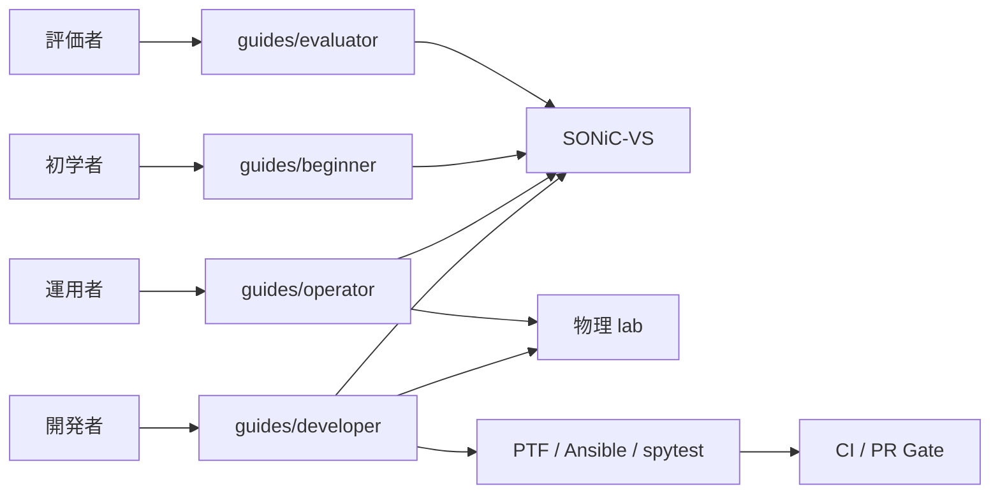
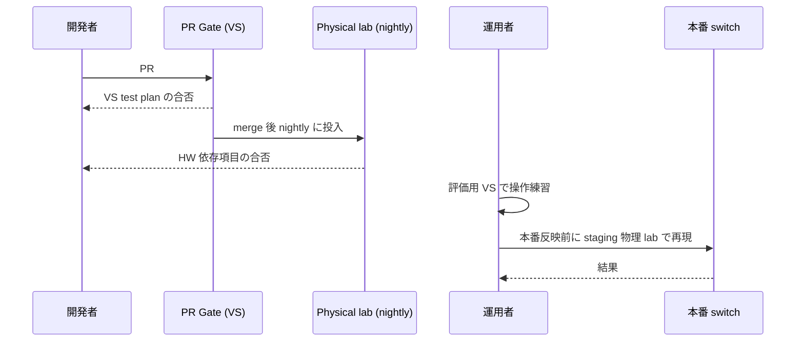

# 概念

「lab」と一口に言っても、[SONiC](../../reference/glossary.md#term-sonic) では大きく次の 3 つの面が混ざっています。読み手の役割と目的で使い分けを決めると迷いません。

## この章は何のためにあるか

SONiC コミュニティの [HLD](../../reference/glossary.md#term-hld) / test plan / guide は、書き手が想定している読者がページごとに違います。同じ「lab」でも、開発者の CI 自動化と、運用者の事前検証と、評価者の機能トライアルでは前提と粒度が異なります。本章はその違いを整理して、読み手が「自分はどのガイドのどこから入ればいいか」を即答できる地図を提供します。

読み手の最初の疑問は次の 4 つで、各節がそれに答えます。

1. 自分はどの persona なのか（評価者 / 初学者 / 運用者 / 開発者）
2. その persona ではどこまで virtual で済み、どこから physical が必要か
3. `docs/*/test plan` の文書群は誰のためのもので、運用ガイドとどう違うのか
4. CI（PR Gate）と手元 lab はどう線引きされているのか

## 何を解決するか

- **ガイドの入口を誤らない**: 評価者が developer guide から入って `make build` で詰まる、運用者が test plan を「機能仕様書」と誤読する、といった混乱を未然に防ぐ。
- **検証コストの最適化**: virtual で済む範囲を最大化し、physical lab の希少資源は HW 依存テストに集中させる。
- **CI とローカルの責務分離**: 「PR で gate するべき項目」と「ローカル / 物理 lab でしか見られない項目」を意識的に分ける。

## SONiC 内での位置

本リポジトリの章立てでは、`docs/guides/` が persona 別の入口、`docs/topics/` が機能横断的な解説、`docs/reference/` が網羅情報、`docs/*/test-*.md` が CI / 物理 lab のテスト計画になります。これらの関係を 1 つの軸で並べたのが本章です。

## 用語の整理

| 用語 | 意味 | 補足 |
| --- | --- | --- |
| SONiC-[VS](../../reference/glossary.md#term-vs) | [SAI](../../reference/glossary.md#term-sai) VS を使った仮想 SONiC | Linux bridge を [ASIC](../../reference/glossary.md#term-asic) 代わりに使う |
| SAI VS | virtual switch 実装の SAI | counter / capability は限定的 |
| PTF | Packet Test Framework | scapy ベースで packet を生成して検証 |
| spytest | 物理 / 仮想両対応のテストランナー | feature テストの主要枠 |
| Ansible test plan | Ansible を使った大規模 topology テスト | [sonic-mgmt](../../reference/glossary.md#term-sonic-mgmt) リポ配下 |
| PR Gate | PR ごとに走る必須テスト | 主に VS で構成 |
| nightly | 物理 lab で動く夜間テスト | CVE / 性能 / HW 依存項目 |
| Mgmt DUT | テスト対象 SONiC | mgmt [VRF](../../reference/glossary.md#term-vrf) や PTF と接続される |

## 典型シーン

評価者・初学者は左半分（VS）で完結し、運用者・開発者は右半分（物理 lab / nightly）にも踏み込みます。

## 似た機能との違い

| 比較 | 共通点 | 違い |
| --- | --- | --- |
| GNS3 / EVE-NG のラボ環境との違い | 仮想ネットワーク機器を組み立てる | SONiC-VS は **本物の SONiC コンテナ群** をそのまま動かす。コントロールプレーンは実機と同一バイナリ。 |
| Mininet との違い | Linux 上で仮想 switch を組む | SONiC-VS は SAI VS + sairedis を含み、[orchagent](../../reference/glossary.md#term-orchagent) も走る。Mininet は OVS や user-space switch を使う。 |
| ベンダ NOS の VM 版との違い | NOS を VM で評価できる | SONiC-VS は **OSS** で、PTF / Ansible / spytest と統合済み。CI に組み込みやすい。 |
| 単なる Docker テストとの違い | コンテナを並べる | SONiC-VS は [CONFIG_DB](../../reference/glossary.md#term-config_db) / [APPL_DB](../../reference/glossary.md#term-appl_db) / [ASIC_DB](../../reference/glossary.md#term-asic_db) を備えた状態管理ありの環境。HW を伴わない以外は本番に近い。 |

## persona と lab の対応

SONiC のガイドは目的別に 4 つに分かれており、章本文への入口もそこで決まります。

| persona | 入口 | 主な関心 |
| --- | --- | --- |
| 評価者 (evaluator) | [評価者向けガイド](../../guides/evaluator.md) | NOS としての機能と限界を短時間で把握する |
| 初学者 (beginner) | [初学者向けガイド](../../guides/beginner.md) | docker / [Redis](../../reference/glossary.md#term-redis) / orchagent などの基本構造を学ぶ |
| 運用者 (operator) | [運用者向けガイド](../../guides/operator.md) | CLI、CONFIG_DB、reboot、telemetry を実機運用で扱う |
| 開発者 (developer) | [開発者向けガイド](../../guides/developer.md) | ビルド、テスト、HLD 起票、SAI / orchagent 改修 |

評価者と初学者は仮想環境で十分に進められます。運用者と開発者は、途中から物理 lab・PTF・CI を組み合わせる必要があります。

## virtual / physical の境界

仮想 SONiC は ASIC を SAI VS（virtual switch）で置き換えた構成です。SAI VS は Linux kernel の bridge / route table を ASIC の代わりに使うため、次のような層が「実機と挙動が違う」または「再現されない」ことに注意します。

- ASIC 固有の SAI capability、buffer / queue 容量、[PFC](../../reference/glossary.md#term-pfc) / watermark のような ASIC counter
- optics（CMIS / SFP）、PHY、gearbox、retimer
- thermal、PSU、fan、LED、BMC、PCIe
- HW offload に依存する mux / [EVPN](../../reference/glossary.md#term-evpn) [VXLAN](../../reference/glossary.md#term-vxlan) encap / [DASH](../../reference/glossary.md#term-dash) の一部
- 線速で出る drop / 微小遅延 / micro-burst

逆に、CONFIG_DB / sairedis / orchagent / [FRR](../../reference/glossary.md#term-frr) / lldp / snmp / [gNMI](../../reference/glossary.md#term-gnmi) といった control plane の動作は、SONiC-VS で十分に再現できます。仕様レベルの HLD 検証は virtual で、HW capability に踏み込む検証は physical で、と切り分けるのが基本です。

## test plan を「どの persona の読み物か」で読む

`docs/routing/`、`docs/acl-qos/`、`docs/system/`、`docs/platform/` には test plan 系のページが多くあります。これらは developer / CI 担当のためのページで、運用者が日常で開く章ではありません。

- VS で完結する test plan: [VRF VS test plan](../../routing/vrf-vs-test-plan.md)、[VRF Ansible test plan](../../routing/vrf-feature-ansible-test-plan-omit-in-toc.md)、[ACL Ingress/Egress test plan](../../acl-qos/acl-ingress-egress-test-plan.md)、[Everflow test plan](../../acl-qos/everflow-test-plan.md)
- 実 ASIC または PTF + ASIC が要る test plan: [Dataplane Telemetry test plan](../../system/dataplane-telemetry-test-plan.md)、[Thermal Control test plan](../../platform/thermal-control-test-plan.md)
- 共通フレームワーク: [DIP=SIP PTF validation HLD](../../architecture/dip-sip-ptf-validation-high-level-design.md)

test plan ページは「機能章の検証可能性を読み解く参考」と捉えてください。機能仕様は機能章本文を読み、その章で何が CI に乗っているかを見るときに test plan を開きます。

## 他章との境界

- 機能ごとの「VS で再現する手順」「物理 lab で確認する手順」は、各機能章の [運用](operations.md) ノートに置きます。本章は **横断ルール** だけを示します。
- ビルドや SPM の話は [19 Build / Packaging](../19-build-packaging/index.md) に集めています。CI で何をビルドし、何を docker registry に流すかはそちらを参照します。
- ASIC capability や platform 固有挙動は [14 Platform / Port / Optics](../14-platform-port-optics/index.md) を参照します。本章はあくまで「virtual / physical のどちらで再現すべきか」を判断するためのレンズを提供します。

## 読了後にできること

- 自分（または読み手）の persona を 4 種類のいずれかに即決でき、対応する `docs/guides/` を開ける。
- 「これは VS で再現できるか？」を SAI capability 依存性の有無から判定できる。
- `test plan` ページを見たとき、「これは developer 向け CI 仕様であって運用手順ではない」と切り替えて読める。
- PR Gate と nightly の境目を意識した上で、自分の修正が「どこまで CI で守られているか」を見積もれる。
- 他章の operations / setup に進むときに、「物理が必要な前提条件」を先に切り分けるクセが付く。

<!-- xref-prereq -->
## この章の前提知識

この章を読み進める前に、次の章を押さえておくと迷子になりにくい。

- [SONiC 全体像と設定基盤](../01-overview/index.md)

<!-- glossary-links-injected: 9fb3fca99a59 -->
