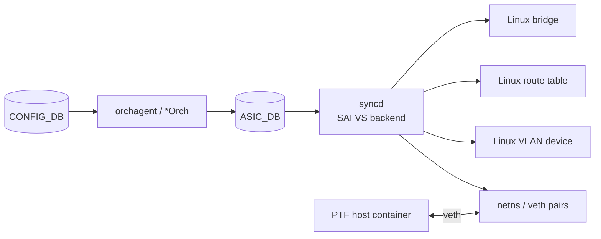

# 内部実装

仮想 lab とテストフレームワークの内部構造で、章本文を読むときに前提として知っておくと便利な点を集めます。[SAI](../../reference/glossary.md#term-sai) [VS](../../reference/glossary.md#term-vs) や PTF の中身を全部書き下すのではなく、[HLD](../../reference/glossary.md#term-hld) ページへの導線を整理する位置付けです。

## SAI VS が何を代替するか

[SONiC](../../reference/glossary.md#term-sonic)-VS の中核は SAI VS で、[syncd](../../reference/glossary.md#term-syncd) の SAI backend を Linux netdev / bridge へ写すレイヤです。

- L2 forwarding は Linux bridge
- L3 forwarding は Linux route table
- [VLAN](../../reference/glossary.md#term-vlan) は Linux VLAN device
- [ACL](../../reference/glossary.md#term-acl) / counter は SAI 側で限定的にサポート

このため「[CONFIG_DB](../../reference/glossary.md#term-config_db) と [orchagent](../../reference/glossary.md#term-orchagent) の整合性」「sairedis の object 生成」までは VS で完全に検証できますが、[ASIC](../../reference/glossary.md#term-asic) capability に依存する path は VS の境界を越えます。具体的なソースとビルド手順は [SONiC-VS のビルドと libvirt 起動手順](../../architecture/steps-to-bring-up-sonic-vs.md) を参照します。

## DIP=SIP PTF validation

PTF（Packet Test Framework）は、SONiC 機能の data plane 挙動を「スイッチを物理 PTF host で囲んで検証する」ためのフレームワークです。その派生として、特定パケットパターン（DIP=SIP のような martian / loopback 様パケット）が punt / drop されるかを検証する設計があります。

設計の枠組みは [DIP=SIP PTF validation HLD](../../architecture/dip-sip-ptf-validation-high-level-design.md) にあります。読みどころは「PTF host と SONiC の topology」「期待 packet action と [CoPP](../../reference/glossary.md#term-copp) / ACL 経路の関連」「結果判定の自動化」です。ACL / CoPP の章本文（[ACL / CoPP / Mirror / Packet Action](../07-acl-copp-mirror/index.md)）と組で読むと文脈が掴めます。

## VS test と Ansible test の役割分担

[VRF](../../reference/glossary.md#term-vrf) を例にすると test plan は 2 系統あります。

- [VRF VS test plan](../../routing/vrf-vs-test-plan.md): SONiC-VS の中で完結する unit / scenario test。CONFIG_DB 投入、[FRR](../../reference/glossary.md#term-frr) の挙動、kernel route の最終形まで。
- [VRF Ansible test plan](../../routing/vrf-feature-ansible-test-plan-omit-in-toc.md): Ansible で複数ノードを駆動する system test。実機・PTF を含む構成での検証を想定。

VS test は「実機なしで何が確認できるか」の上限を、Ansible test は「実機で必要な確認の集合」を示します。機能 HLD を読むときに、両方の test plan を見ると検証境界が分かります。

## Alpine / KNE の内部差分

ALViS / KNE は容量・依存・起動時間の都合で、Debian ベースの SONiC とは構成が異なります。Pod に同居する docker、init 順序、SAI VS の組み込み方の差は [Alpine 仮想 SONiC](../../architecture/alpine-high-level-design.md) で読みます。CI で多数ノードを並べる動機（topology テスト、KNE 連携、リソース効率）も同 HLD に整理されています。

## データフロー（SAI VS）

## 主要コンポーネントの責務

| コンポーネント | 主実体 | 責務 |
| --- | --- | --- |
| `SAI VS` | `meta/sai_vs_*.cpp`（libsai-vs） | SAI API を Linux netdev / bridge / route で代替 |
| `syncd` (VS mode) | syncd binary を `--asicType vs` で起動 | SAI VS を load |
| `sonic-vs.img` build | `sonic-buildimage` の `PLATFORM=vs` target | KVM 用 image |
| PTF | `ptf` python framework | port-level packet I/O テスト |
| `sonic-mgmt` testbed | ansible + pytest | KVM / 物理 testbed の orchestration |

## SAI 属性使用

SAI VS は実 ASIC の代替で、表面上は通常の SAI 属性をすべて受理しますが、内部処理は限定的:

- `SAI_OBJECT_TYPE_PORT`：Linux netdev を veth で表現。speed/FEC/autoneg は値を保持するのみ。
- `SAI_OBJECT_TYPE_FDB_ENTRY`：Linux bridge fdb に反映、または内部 map のみ。
- `SAI_OBJECT_TYPE_ROUTE_ENTRY`：Linux route に反映。
- `SAI_OBJECT_TYPE_ACL_TABLE / ACL_ENTRY`：内部 map のみ。packet match の効果は無い。
- `SAI_OBJECT_TYPE_BUFFER_*` / `QUEUE`：内部 map のみ。

このため counter / drop / [WRED](../../reference/glossary.md#term-wred) は VS では正しい値が出ません。

## Redis テーブル参照関係

VS は通常 SONiC と同じ DB schema を使うため、CONFIG_DB / [APPL_DB](../../reference/glossary.md#term-appl_db) / [ASIC_DB](../../reference/glossary.md#term-asic_db) / [STATE_DB](../../reference/glossary.md#term-state_db) / [COUNTERS_DB](../../reference/glossary.md#term-counters_db) の構造は完全に同じ。差は ASIC_DB 上の object が ASIC に反映されないことだけ。

## ZMQ / Redis pub/sub

VS でも [Redis](../../reference/glossary.md#term-redis) pub/sub の経路は通常運用と同じ。[FDB](../../reference/glossary.md#term-fdb) learn 等の notification は SAI VS が Linux netlink event を変換して `_NOTIFY` channel に流す実装。

## 既知の実装上の制約

- VS は **packet forwarding の datapath が Linux kernel** で、ASIC の能力（hardware tracing、bulk counter、SAI 拡張属性、[TCAM](../../reference/glossary.md#term-tcam) 上限）は再現しない。
- ACL / mirror / WRED / [PFC](../../reference/glossary.md#term-pfc) / [SRv6](../../reference/glossary.md#term-srv6) / [NAT](../../reference/glossary.md#term-nat) は VS では「設定は受理されるが効果なし」になることが多い。動作確認は実機 / SimX が必要。
- VS image は `make PLATFORM=vs` で生成され、`onie-installer-vs.bin` または `sonic-vs.img` を libvirt / qemu で起動。boot だけで 1〜2 分かかる。
- PTF は veth 経由で SONiC-VS と接続するが、veth の MTU / VLAN / offload 設定によっては想定外の動作になる。`ethtool -K` で TX/RX checksum を無効化する運用がある。
- KNE 連携は Container Networking 経由で SONiC VS を pod として起動。SAI VS の起動順序や `syncd --asicType vs` の引数が KNE config で生成される。
- VS test と Ansible test plan の二重化は意図的だが、HLD のうち「VS だけで verify 可能なもの」と「実機が要るもの」の境界が明示されていないテスト項目があり、CI 通過でも HLD と乖離するケースがある。

## sonic-mgmt testbed の構造

`sonic-mgmt` リポジトリの testbed は ansible + pytest をベースに、以下の層で構成されます。

| 層 | 役割 |
| --- | --- |
| `ansible/files/sonic_lab_devices.csv` | DUT / fanout / PTF host の物理 inventory |
| `ansible/templates/topo_*.j2` | topology（t0、t1、ptf32、ciscovs-7nodes 等） |
| `tests/common/` | pytest fixture（duthost、ptfhost、nbrhosts） |
| `tests/<feature>/test_*.py` | 機能別 test case |

`tests/common/plugins/sanity_check/` が各 test 前に DUT のヘルス（[BGP](../../reference/glossary.md#term-bgp) up、interface up、critical process）を確認し、failed なら test を skip します。

## SimX / kvm-based 自動化

KVM 上の SONiC-VS は libvirt で起動し、`testbed-cli.sh` が PTF host と組み合わせて topology を構築します。SimX（一部ベンダ提供）は packet forwarding と counter を高精度にシミュレートする商用ツールで、SONiC-VS だけでは検証できない ASIC capability path を埋めるのに使われます。OSS の範囲では SimX は外部依存で、CI 上の代替として `make PLATFORM=vs` の SAI VS が標準です。

## CI における VS と Ansible test の使い分け

`azure-pipelines.yml` 系の Azure DevOps pipeline は PR ごとに以下の順で実行します。

| stage | 実行内容 | 失敗時の扱い |
| --- | --- | --- |
| Build | `make PLATFORM=vs` で sonic-vs.img を生成 | block |
| VS smoke | KVM 起動 → critical process が up になるか | block |
| VS feature test | `tests/` の `--testbed_type vs` 対象のみ | block（一部 known-flaky は warn） |
| Ansible feature test | 物理 testbed 上で nightly のみ | warn（PR mergeable は維持） |

VS test plan に書かれているテストでも、CI 側で実行対象になっていないものがあるため、HLD と CI 実装の乖離は `tests/common/plugins/conditional_mark/` の skip 条件を見るのが早道です。

## 関連ページ

- [SONiC-VS のビルドと libvirt 起動手順](../../architecture/steps-to-bring-up-sonic-vs.md)
- [DIP=SIP PTF validation HLD](../../architecture/dip-sip-ptf-validation-high-level-design.md)
- [Alpine 仮想 SONiC](../../architecture/alpine-high-level-design.md)
- [VRF VS test plan](../../routing/vrf-vs-test-plan.md)

## verification: meta を選ぶ理由

このページが `verification: meta` なのは、lab / 開発者ワークフローは「実装の状態」ではなく「複数 HLD への横断ガイド」だからです。SAI VS / [sonic-mgmt](../../reference/glossary.md#term-sonic-mgmt) / PTF / KNE / Alpine それぞれに別途 `code-verified` ページがあり、ここで重複して裏取りする必要はありません。サブ章で言及するコンポーネント別の挙動裏取りは、リンク先の章を参照してください。

<!-- glossary-links-injected: 9fb3fca99a59 -->
