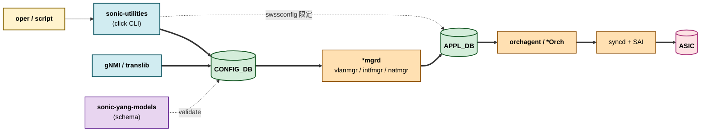

# 内部実装

22 章はリファレンス索引のメタ章ですが、ここでは「索引が指している先の内部構造」を一段下げて、CLI / [CONFIG_DB](../../reference/glossary.md#term-config_db) / [YANG](../../reference/glossary.md#term-yang) の三系統がどう実装で結ばれているかをまとめます。各リファレンスページが個別に持っている断片を一望できるようにするのが狙いです。

## データフロー（CLI → CONFIG_DB → ASIC）

## 主要コンポーネントの責務

| コンポーネント | 主実体 | 責務 |
| --- | --- | --- |
| `sonic-utilities` (`config`、`show`、`sonic-installer` 等) | python click | ユーザ操作の入口。CLI 引数 → CONFIG_DB 書き込み / 各 DB 読み出し |
| `sonic-mgmt-common` (translib) | go | YANG ↔ [Redis](../../reference/glossary.md#term-redis) テーブル変換、[gNMI](../../reference/glossary.md#term-gnmi) / RESTCONF の core |
| `sonic-yang-models` | `*.yang` | CONFIG_DB のスキーマ定義（must / when 制約） |
| `sonic-yang-mgmt` | python wrapper | CLI から YANG validation を呼ぶ層 |
| `swsscommon` (`sonic-swss-common`) | C++ / python binding | Producer/Consumer/Notification の Redis 抽象、ZMQ producer も含む |
| `*mgrd` group | `cfgmgr/*` | CONFIG_DB → kernel + [APPL_DB](../../reference/glossary.md#term-appl_db) |
| `*Orch` group | `orchagent/*` | APPL_DB → [SAI](../../reference/glossary.md#term-sai) |

## YANG とテーブルの対応

`sonic-yang-models` の `.yang` モジュールは CONFIG_DB のテーブル名と一対一対応するのが原則です。例:

| YANG モジュール | CONFIG_DB テーブル | 主な利用者 |
| --- | --- | --- |
| `sonic-port` | `PORT` | PortsOrch |
| `sonic-vlan` | `VLAN`、`VLAN_MEMBER`、`VLAN_INTERFACE` | VlanMgr / IntfMgr |
| `sonic-portchannel` | `PORTCHANNEL`、`PORTCHANNEL_MEMBER` | TeamMgr |
| `sonic-bgp-neighbor` | `BGP_NEIGHBOR`、`BGP_PEER_RANGE` | [bgpcfgd](../../reference/glossary.md#term-bgpcfgd) |
| `sonic-acl` | `ACL_TABLE`、`ACL_RULE` | AclOrch |
| `sonic-vrf` | `VRF` | VRFOrch |
| `sonic-vxlan` | `VXLAN_TUNNEL`、`VXLAN_TUNNEL_MAP`、`VXLAN_EVPN_NVO` | VxlanOrch |
| `sonic-vnet` | `VNET` | VNetOrch |
| `sonic-nat` | `NAT_*` | NatMgr / NatOrch |

OpenConfig YANG は translib transformer が間に入って [SONiC](../../reference/glossary.md#term-sonic) YANG / Redis テーブルに射影されます（→ 10 章）。

## CLI とテーブル一覧（抜粋）

| CLI | 書き込む / 読む DB |
| --- | --- |
| `config vlan add/del` | CONFIG_DB:[VLAN](../../reference/glossary.md#term-vlan) |
| `config interface ip add` | CONFIG_DB:INTERFACE / VLAN_INTERFACE |
| `config bgp shutdown` | CONFIG_DB:BGP_NEIGHBOR |
| `config qos clear / reload` | CONFIG_DB:BUFFER_* / QOS_* |
| `show interfaces counters` | [COUNTERS_DB](../../reference/glossary.md#term-counters_db):COUNTERS:<oid> |
| `show ip route` | APPL_DB / [FRR](../../reference/glossary.md#term-frr) [vtysh](../../reference/glossary.md#term-vtysh) 経由 |
| `show platform` | [STATE_DB](../../reference/glossary.md#term-state_db):PLATFORM_*、CHASSIS_STATE_DB（chassis のとき） |
| `show warm-restart` | STATE_DB:WARM_RESTART_TABLE |

## SAI 属性の入り口一覧（章間索引）

| 機能領域 | 主な SAI object | 章 |
| --- | --- | --- |
| L2 | `LAG`、`VLAN`、`FDB_ENTRY`、`BRIDGE_PORT` | 06 |
| L3 | `ROUTE_ENTRY`、`NEXT_HOP_GROUP`、`VIRTUAL_ROUTER` | 04 |
| VxLAN | `TUNNEL`、`TUNNEL_MAP`、`TUNNEL_TERM_TABLE_ENTRY` | 03 |
| [ACL](../../reference/glossary.md#term-acl) | `ACL_TABLE`、`ACL_ENTRY`、`ACL_COUNTER`、`POLICER` | 07 |
| [QoS](../../reference/glossary.md#term-qos) / buffer | `BUFFER_POOL`、`BUFFER_PROFILE`、`QUEUE`、`SCHEDULER` | 08 |
| Port / [SerDes](../../reference/glossary.md#term-serdes) | `PORT`、`PORT_SERDES`、`MACSEC` | 14 / 15 |
| [NAT](../../reference/glossary.md#term-nat) | `NAT_ENTRY` | 16 |
| [SRv6](../../reference/glossary.md#term-srv6) / [MPLS](../../reference/glossary.md#term-mpls) | `MY_SID_ENTRY`、`INSEG_ENTRY` | 17 |

## Redis pub/sub / ZMQ の概観

| 機構 | 用途 | 例 |
| --- | --- | --- |
| Redis pub/sub (`__keyspace@N__:*`) | CONFIG_DB / APPL_DB / STATE_DB 変更通知 | gNMI on_change、[ConsumerStateTable](../../reference/glossary.md#term-consumerstatetable) |
| Redis pub/sub (notification channel) | [ASIC_DB](../../reference/glossary.md#term-asic_db) のイベント通知 | [FDB](../../reference/glossary.md#term-fdb) notification、port state change |
| ZMQ | [orchagent](../../reference/glossary.md#term-orchagent) への大量 push 経路 | VNET_ROUTE_TUNNEL_TABLE（→ 03 章） |
| ZMQ | [DASH](../../reference/glossary.md#term-dash) SDN push | DASH controller → SWBUS（→ 13 章） |
| Unix DBus / socket | host service 呼び出し | [gNOI](../../reference/glossary.md#term-gnoi) Reboot（→ 10 章） |

## 既知の実装上の制約

- リファレンス索引は **[HLD](../../reference/glossary.md#term-hld) に書かれている範囲を中心**にしており、ベンダー実装由来の SAI 拡張属性（`SAI_OBJECT_TYPE_*_EXTENSION`）は網羅していません。実装で必要になったら 22 章 quality-gaps に追記する運用です。
- YANG / CONFIG_DB / CLI の三者は一対一ではない（同じ機能を複数 CLI が触る、別 CLI が同じテーブルを上書きする等）。書き込み順序による race は 22 章索引では追えないので、各機能章 internals.md を当たる必要があります。
- gNMI / [sonic-mgmt](../../reference/glossary.md#term-sonic-mgmt)-common を経由する書き込みは、`*mgrd` / `*Orch` の処理を待たずに完了応答を返すため、即時の SAI 反映を確認したい場合は別途 STATE_DB 上の対応 key を polling する設計になります。

## 索引生成パイプライン

`meta/index/*.json` は SONiC ソースリポを `.cache/sonic-sources/` 配下に shallow clone し、Indexer が走査して生成します。

| 索引 | ソース | 生成内容 |
| --- | --- | --- |
| `meta/index/hld.json` | `SONiC/doc/` `.md` ファイル | HLD タイトル / area / file path / verification target |
| `meta/index/cli.json` | `sonic-utilities/config/`、`show/` | Click のコマンドツリーを解析 |
| `meta/index/yang.json` | `sonic-yang-models/yang-models/*.yang` | module / container / leaf の階層 |
| `meta/index/repos.json` | 15 リポの clone | name / SHA / branch（master 固定） |

Indexer は AST 解析（Click は ast.parse、YANG は pyang）を使い、生成物は `meta/templates/SCHEMA.md` の frontmatter 規約に従う形で .md ページからリンクされます。

## quality-gaps の運用

`quality-gaps.md` は HLD と実装の乖離（discrepancy-found）を一覧化する meta ページです。各機能章の internals.md / runbook.md で `discrepancy-found` ステータスを付けた箇所が集約されます。Verifier が `meta/verification-queue.json`（または per-page `meta/queue/<area>-<slug>.json`）の懸念点を裏取りした結果が、quality-gaps に積み上がっていく形で、読者は「どこが信用できないか」を 1 ページで把握できます。

## 関連ページ

- [CLI index](./cli-index.md)
- [CONFIG_DB index](./config-db-index.md)
- [YANG index](./yang-index.md)
- [Quality gaps](./quality-gaps.md)
- [20 章 swss / sai / Redis 内部実装](../20-swss-sai-redis/internals.md)

<!-- glossary-links-injected: 7ac8e66e1af3 -->
