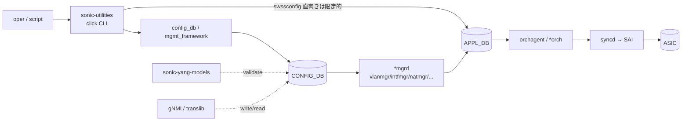

# 内部実装

22 章はリファレンス索引のメタ章ですが、ここでは「索引が指している先の内部構造」を一段下げて、CLI / CONFIG_DB / YANG の三系統がどう実装で結ばれているかをまとめます。各リファレンスページが個別に持っている断片を一望できるようにするのが狙いです。

## データフロー（CLI → CONFIG_DB → ASIC）

## 主要コンポーネントの責務

| コンポーネント | 主実体 | 責務 |
| --- | --- | --- |
| `sonic-utilities` (`config`、`show`、`sonic-installer` 等) | python click | ユーザ操作の入口。CLI 引数 → CONFIG_DB 書き込み / 各 DB 読み出し |
| `sonic-mgmt-common` (translib) | go | YANG ↔ Redis テーブル変換、gNMI / RESTCONF の core |
| `sonic-yang-models` | `*.yang` | CONFIG_DB のスキーマ定義（must / when 制約） |
| `sonic-yang-mgmt` | python wrapper | CLI から YANG validation を呼ぶ層 |
| `swsscommon` (`sonic-swss-common`) | C++ / python binding | Producer/Consumer/Notification の Redis 抽象、ZMQ producer も含む |
| `*mgrd` group | `cfgmgr/*` | CONFIG_DB → kernel + APPL_DB |
| `*Orch` group | `orchagent/*` | APPL_DB → SAI |

## YANG とテーブルの対応

`sonic-yang-models` の `.yang` モジュールは CONFIG_DB のテーブル名と一対一対応するのが原則です。例:

| YANG モジュール | CONFIG_DB テーブル | 主な利用者 |
| --- | --- | --- |
| `sonic-port` | `PORT` | PortsOrch |
| `sonic-vlan` | `VLAN`、`VLAN_MEMBER`、`VLAN_INTERFACE` | VlanMgr / IntfMgr |
| `sonic-portchannel` | `PORTCHANNEL`、`PORTCHANNEL_MEMBER` | TeamMgr |
| `sonic-bgp-neighbor` | `BGP_NEIGHBOR`、`BGP_PEER_RANGE` | bgpcfgd |
| `sonic-acl` | `ACL_TABLE`、`ACL_RULE` | AclOrch |
| `sonic-vrf` | `VRF` | VRFOrch |
| `sonic-vxlan` | `VXLAN_TUNNEL`、`VNET` | VxlanOrch / VNetOrch |
| `sonic-nat` | `NAT_*` | NatMgr / NatOrch |

OpenConfig YANG は translib transformer が間に入って SONiC YANG / Redis テーブルに射影されます（→ 10 章）。

## CLI とテーブル一覧（抜粋）

| CLI | 書き込む / 読む DB |
| --- | --- |
| `config vlan add/del` | CONFIG_DB:VLAN |
| `config interface ip add` | CONFIG_DB:INTERFACE / VLAN_INTERFACE |
| `config bgp shutdown` | CONFIG_DB:BGP_NEIGHBOR |
| `config qos clear / reload` | CONFIG_DB:BUFFER_* / QOS_* |
| `show interfaces counters` | COUNTERS_DB:COUNTERS:<oid> |
| `show ip route` | APPL_DB / FRR vtysh 経由 |
| `show platform` | STATE_DB:PLATFORM_*、CHASSIS_STATE_DB（chassis のとき） |
| `show warm-restart` | STATE_DB:WARM_RESTART_TABLE |

## SAI 属性の入り口一覧（章間索引）

| 機能領域 | 主な SAI object | 章 |
| --- | --- | --- |
| L2 | `LAG`、`VLAN`、`FDB_ENTRY`、`BRIDGE_PORT` | 06 |
| L3 | `ROUTE_ENTRY`、`NEXT_HOP_GROUP`、`VIRTUAL_ROUTER` | 04 |
| VxLAN | `TUNNEL`、`TUNNEL_MAP`、`TUNNEL_TERM_TABLE_ENTRY` | 03 |
| ACL | `ACL_TABLE`、`ACL_ENTRY`、`ACL_COUNTER`、`POLICER` | 07 |
| QoS / buffer | `BUFFER_POOL`、`BUFFER_PROFILE`、`QUEUE`、`SCHEDULER` | 08 |
| Port / SerDes | `PORT`、`PORT_SERDES`、`MACSEC` | 14 / 15 |
| NAT | `NAT_ENTRY` | 16 |
| SRv6 / MPLS | `MY_SID_ENTRY`、`INSEG_ENTRY` | 17 |

## Redis pub/sub / ZMQ の概観

| 機構 | 用途 | 例 |
| --- | --- | --- |
| Redis pub/sub (`__keyspace@N__:*`) | CONFIG_DB / APPL_DB / STATE_DB 変更通知 | gNMI on_change、ConsumerStateTable |
| Redis pub/sub (notification channel) | ASIC_DB のイベント通知 | FDB notification、port state change |
| ZMQ | orchagent への大量 push 経路 | VNET_ROUTE_TUNNEL_TABLE（→ 03 章） |
| ZMQ | DASH SDN push | DASH controller → SWBUS（→ 13 章） |
| Unix DBus / socket | host service 呼び出し | gNOI Reboot（→ 10 章） |

## 既知の実装上の制約

- リファレンス索引は **HLD に書かれている範囲を中心**にしており、ベンダー実装由来の SAI 拡張属性（`SAI_OBJECT_TYPE_*_EXTENSION`）は網羅していません。実装で必要になったら 22 章 quality-gaps に追記する運用です。
- YANG / CONFIG_DB / CLI の三者は一対一ではない（同じ機能を複数 CLI が触る、別 CLI が同じテーブルを上書きする等）。書き込み順序による race は 22 章索引では追えないので、各機能章 internals.md を当たる必要があります。
- gNMI / sonic-mgmt-common を経由する書き込みは、`*mgrd` / `*Orch` の処理を待たずに完了応答を返すため、即時の SAI 反映を確認したい場合は別途 STATE_DB 上の対応 key を polling する設計になります。

## 関連ページ

- [CLI index](./cli-index.md)
- [CONFIG_DB index](./config-db-index.md)
- [YANG index](./yang-index.md)
- [Quality gaps](./quality-gaps.md)
- [20 章 swss / sai / Redis 内部実装](../20-swss-sai-redis/internals.md)
