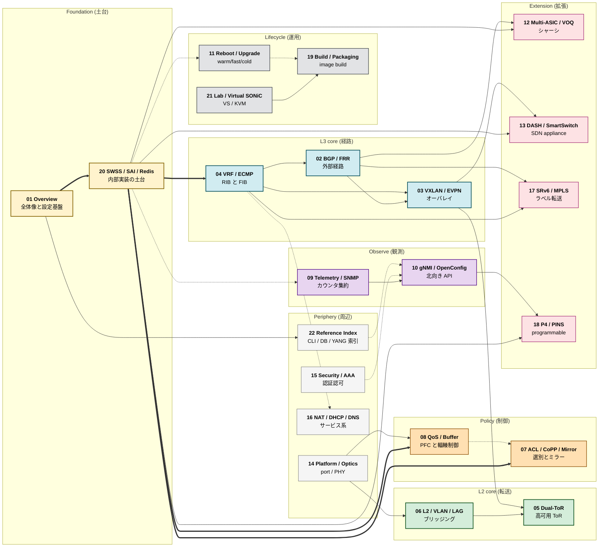

# 読み物（章立て駆動）

機能ドメイン単位で複数の [HLD](../reference/glossary.md#term-hld)・実コードを横断統合した「読み物」章群。HLD 1 件 = 1 ページの reference（`docs/<area>/`）に対し、こちらは **読み手の質問順** に章立てから書き直したもの。

## 章一覧

順次拡充中。詳細な章設計は `meta/topics-plan-feature.md` を参照。

主要章へのリンク:

- Foundation: [01 Overview](01-overview/index.md) / [20 SWSS / SAI / Redis](20-swss-sai-redis/index.md)
- L3: [02 BGP](02-bgp/index.md) / [03 VXLAN / EVPN](03-vxlan-evpn/index.md) / [04 VRF / ECMP](04-vrf-ecmp/index.md)
- L2: [05 Dual-ToR](05-dual-tor/index.md) / [06 L2 / VLAN / LAG](06-l2-vlan-lag/index.md)
- Policy: [07 ACL / CoPP / Mirror](07-acl-copp-mirror/index.md) / [08 QoS / Buffer](08-qos-buffer/index.md)
- Observe: [09 Telemetry / SNMP](09-telemetry-snmp/index.md) / [10 gNMI / OpenConfig](10-gnmi-openconfig/index.md)
- Lifecycle: [11 Reboot](11-reboot/index.md) / [19 Build / Packaging](19-build-packaging/index.md) / [21 Lab / VS](21-lab-vs-developer/index.md)
- Extension: [12 Multi-ASIC / VOQ](12-multi-asic-voq/index.md) / [13 DASH / SmartSwitch](13-dash-smartswitch/index.md) / [17 SRv6 / MPLS](17-srv6-mpls/index.md) / [18 P4 / PINS](18-p4-pins/index.md)
- Periphery: [14 Platform / Optics](14-platform-port-optics/index.md) / [15 Security / AAA](15-security-aaa/index.md) / [16 NAT / DHCP / DNS](16-nat-dhcp-dns/index.md) / [22 Reference Index](22-reference-index/index.md)

## 読み進め方マップ

22 章の依存関係を、カテゴリ別の色分けと **前提 (実線)** / **派生・補完 (点線)** の 2 種類のエッジで示す。読み方の指針は次のとおり。

- **Foundation (黄)**: `01-overview` と `20-swss-sai-redis` は他章のほぼ全ての前提となる土台。
- **L3 core (青)**: `02-bgp` / `03-vxlan-evpn` / `04-vrf-ecmp` は L3 の中核。
- **L2 core (緑)**: `05-dual-tor` / `06-l2-vlan-lag` は L2 の中核。
- **Policy (橙)**: `07-acl-copp-mirror` / `08-qos-buffer` は転送ポリシー。
- **Observe (紫)**: `09-telemetry-snmp` / `10-gnmi-openconfig` は観測と北向き API。
- **Lifecycle (灰)**: `11-reboot` / `19-build-packaging` / `21-lab` はビルドからリブートまでのライフサイクル。
- **Extension (桃)**: `12-multi-asic-voq` / `13-dash-smartswitch` / `17-srv6-mpls` / `18-p4-pins` は拡張トポロジと programmability。
- **Periphery (薄灰)**: `14-platform-port-optics` / `15-security-aaa` / `16-nat-dhcp-dns` / `22-reference-index` は周辺基盤と索引。

向きは左→右、上→下に統一し、Foundation → core → Policy/Observe → Extension の順に層を積む。

各章の `index.md` 末尾「関連する章」と `concept.md` 末尾「この章の前提知識」も合わせて参照すること。

<!-- glossary-links-injected: 167700005048 -->
