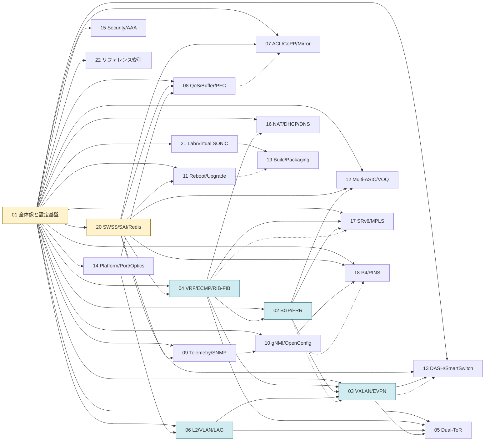

# 読み物（章立て駆動）

機能ドメイン単位で複数の HLD・実コードを横断統合した「読み物」章群。HLD 1 件 = 1 ページの reference（`docs/<area>/`）に対し、こちらは **読み手の質問順** に章立てから書き直したもの。

## 章一覧

順次拡充中。詳細な章設計は `meta/topics-plan-feature.md` を参照。

## 読み進め方マップ

22 章の依存関係を、**前提（実線）** と **派生（点線）** の 2 種類で示す。`01-overview` と `20-swss-sai-redis` は他章のほぼ全ての前提となる土台。`02-bgp` / `03-vxlan-evpn` / `04-vrf-ecmp` は L3 系の中核、`06-l2-vlan-lag` / `05-dual-tor` は L2 系の中核、`07-08` は転送ポリシー、`09-10` は観測、`11/19/21` はライフサイクル、`12-13-17-18` は拡張トポロジと programmability、`14-15-16-22` は周辺基盤と索引である。

各章の `index.md` 末尾「関連する章」と `concept.md` 末尾「この章の前提知識」も合わせて参照すること。

