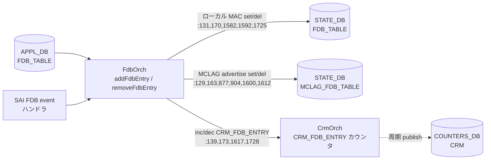

# appl-fdb 副次 DB 書込 (Task F Phase F)

ソース: `sonic-swss/orchagent/fdborch.cpp` (master)

`FdbOrch` が APPL_DB `FDB_TABLE` を購読して SAI FDB を作成・削除する過程で、
他 DB へ書込まれる**副次的な状態**を全行精読で抽出した。

## 副次書込み一覧

### 1. STATE_DB `FDB_TABLE` (`m_fdbStateTable`)

- **コネクタ**: `fdborch.cpp:31` `m_fdbStateTable(stateDbFdbConnector.first, stateDbFdbConnector.second)`
- **DB 名**: STATE_DB, テーブル名 `FDB_TABLE` (`STATE_FDB_TABLE_NAME`, `orchdaemon.cpp:233`)
- **key 形式**: `<VlanName>:<MAC>` (APPL_DB と同じキー文字列)
- **書込みポイント**:
  - SAI FDB event ハンドラ (`fdborch.cpp:131-135`) — ローカル学習発生時に `port` / `type` を set
  - SAI FDB event ハンドラ (`fdborch.cpp:170`) — `FDB_ORIGIN_LEARN` / `FDB_ORIGIN_PROVISIONED` 由来の MAC 削除時に del
  - `addFdbEntry()` (`fdborch.cpp:1576-1582`) — APPL_DB SET 経路でローカル MAC を set
    (`dynamic_local` は `type` を `"dynamic"` に書き換えて記録)
  - `addFdbEntry()` (`fdborch.cpp:1592`) — 既存 MAC が advertised origin に書き換わったとき del
  - `removeFdbEntry()` (`fdborch.cpp:1725`) — MAC 削除時に del
- **意味**: `show mac` / `fdbshow` CLI が参照する読み取り用ビュー。MCLAG/VXLAN advertise の remote MAC は除外され、**ローカルに実在する MAC のみ**が書かれる。

### 2. STATE_DB `MCLAG_FDB_TABLE` (`m_mclagFdbStateTable`)

- **コネクタ**: `fdborch.cpp:32` `m_mclagFdbStateTable(stateDbMclagFdbConnector.first, stateDbMclagFdbConnector.second)`
- **DB 名**: STATE_DB, テーブル名 `MCLAG_FDB_TABLE`
- **key 形式**: `<VlanName>:<MAC>`
- **書込みポイント**:
  - SAI FDB event (`fdborch.cpp:129`) — MCLAG remote→local move のとき del
  - SAI FDB event (`fdborch.cpp:163`) — MCLAG_ADVERTIZED MAC 削除時に del
  - `addFdbEntry()` (`fdborch.cpp:877`) — MCLAG ピアポート oper-down 等で del
  - `addFdbEntry()` (`fdborch.cpp:904`) — 同上 (別パス) del
  - `addFdbEntry()` (`fdborch.cpp:1600`) — MCLAG_ADVERTIZED かつ `type != "dynamic_local"` で set
  - `addFdbEntry()` (`fdborch.cpp:1612`) — 既存 MCLAG MAC が non-MCLAG origin に置換されたとき del
- **意味**: `mclagsyncd` がピア間で同期する advertise 対象 MAC のリスト。
  `dynamic_local` に格上げされたタイミング (= ローカルでも学習された) で削除し、ピアへの broadcast 対象から外す。

### 3. COUNTERS_DB / CRM resource counter (`gCrmOrch->{inc,dec}CrmResUsedCounter`)

- **書込みポイント**:
  - SAI FDB event (`fdborch.cpp:139`) — 新規 MAC 追加で `CRM_FDB_ENTRY` を +1
  - SAI FDB event (`fdborch.cpp:173`) — MAC 削除で -1
  - `addFdbEntry()` (`fdborch.cpp:1617`) — APPL_DB SET 経路で新規追加時に +1 (`macUpdate == false` のみ)
  - `removeFdbEntry()` (`fdborch.cpp:1728`) — APPL_DB DEL 経路で -1
- **DB 反映**: `CrmOrch` が `COUNTERS_DB` の `CRM` テーブルへ周期的に publish する間接書込み (直接 set ではない)。
  `show crm resources fdb_entry` で参照される。
- **意味**: FDB エントリ数の resource utilization 追跡。閾値超過で `SWSS_LOG_WARN` および
  CONFIG_DB `CRM` threshold によるアラート判定に使われる。

## 副次書込みフロー (mermaid)

## 結論

`FDB_TABLE` の APPL_DB 書込は以下 3 系統の**副次書込み**を発生させる:

1. STATE_DB `FDB_TABLE` — ローカル MAC のみ反映 (CLI 読み取り用)
2. STATE_DB `MCLAG_FDB_TABLE` — MCLAG_ADVERTIZED 起源のみ反映 (`mclagsyncd` 同期用)
3. COUNTERS_DB `CRM` — `gCrmOrch` 経由で `CRM_FDB_ENTRY` 利用数を増減 (直接書込みではなく `CrmOrch` の周期 publish)

VXLAN_ADVERTIZED 起源の remote MAC は **STATE_DB に一切反映されない**点に注意。
