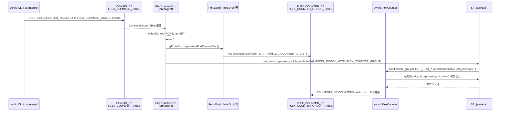

# FLEX_COUNTER_TABLE — 通信メカニズム (Phase G) 解析メモ

対象: `CONFIG_DB` の `FLEX_COUNTER_TABLE` テーブル。
ソース: `sonic-swss/orchagent/flexcounterorch.cpp`, `orchdaemon.cpp`, `saihelper.cpp`

## 1. CONFIG_DB Consumer — `FlexCounterOrch`

`FlexCounterOrch` は `Orch` 基底クラスを継承し、`swsscommon` の **`ConsumerStateTable`** (SubscriberStateTable ラッパ) で `FLEX_COUNTER_TABLE` を購読する。

```cpp
// orchdaemon.cpp:620-625
vector<string> flex_counter_tables = {
    CFG_FLEX_COUNTER_TABLE_NAME,        // "FLEX_COUNTER_TABLE"
    CFG_DEVICE_METADATA_TABLE_NAME,
};
auto* flexCounterOrch = new FlexCounterOrch(m_configDb, flex_counter_tables);
```

コンストラクタ `FlexCounterOrch(DBConnector *db, vector<string> &tableNames)` が `Orch(db, tableNames)` を呼び出し、各テーブル名に対して `ConsumerStateTable` が自動生成・`Select` へ登録される。

購読チャネルは Redis の **keyspace 通知ではなく** `swsscommon` の `ProducerStateTable`/`ConsumerStateTable` ペア（lpush による keyset + hset による hash 更新）。`config CLI` / `sonic-cfggen` は `swsscommon` ラッパ経由で CONFIG_DB へ直接 HSET し、`ConsumerStateTable` の内部 channel (`__keyspace@<dbId>__` ではなく `CONFIG_DB_CHANNEL@<tableName>`) を通じて orchagent へ通知する。

## 2. `doTask(Consumer &consumer)` — ハンドラ分岐

`OrchDaemon` の `Select::select()` が通知を受け取ると `FlexCounterOrch::doTask(Consumer &consumer)` を呼ぶ。

```cpp
// flexcounterorch.cpp:145-420
void FlexCounterOrch::doTask(Consumer &consumer)
{
    // DEVICE_METADATA は別ハンドラへ転送
    if (consumer.getTableName() == CFG_DEVICE_METADATA_TABLE_NAME)
    {
        handleDeviceMetadataTable(consumer);
        return;
    }
    // warm-reboot 遅延中は全 SET を蓄積
    if (!m_delayTimerExpired) { return; }

    // allPortsReady() を待つ（false なら doTask を早期 return）
    if (gPortsOrch && !gPortsOrch->allPortsReady()) { return; }

    auto it = consumer.m_toSync.begin();
    while (it != consumer.m_toSync.end())
    {
        string key = kfvKey(t);   // グループ名 (PORT / QUEUE / ...)
        string op  = kfvOp(t);   // SET / DEL

        if (!flexCounterGroupMap.count(key)) { /* SWSS_LOG_NOTICE + skip */ }

        if (op == SET_COMMAND)
        {
            // POLL_INTERVAL_FIELD     → setFlexCounterGroupPollInterval()
            // FLEX_COUNTER_STATUS_FIELD → setFlexCounterGroupOperation() + 各 Orch へ通知
            // BULK_CHUNK_SIZE_FIELD   → setFlexCounterGroupBulkChunkSize()
        }
        else if (op == DEL_COMMAND)
        {
            // delFlexCounterGroup()
        }
    }
}
```

### グループ名 → SAI カウンタグループ名マッピング

```cpp
// flexcounterorch.cpp:68-99
unordered_map<string, string> flexCounterGroupMap = {
    {"PORT",              PORT_STAT_COUNTER_FLEX_COUNTER_GROUP},
    {"QUEUE",             QUEUE_STAT_COUNTER_FLEX_COUNTER_GROUP},
    {"PG_DROP",           PG_DROP_STAT_COUNTER_FLEX_COUNTER_GROUP},
    {"BUFFER_POOL_WATERMARK", BUFFER_POOL_WATERMARK_STAT_COUNTER_FLEX_COUNTER_GROUP},
    {"RIF",               RIF_STAT_COUNTER_FLEX_COUNTER_GROUP},
    {"ACL",               ACL_COUNTER_FLEX_COUNTER_GROUP},
    {"TUNNEL",            TUNNEL_STAT_COUNTER_FLEX_COUNTER_GROUP},
    {"FLOW_CNT_TRAP",     HOSTIF_TRAP_COUNTER_FLEX_COUNTER_GROUP},
    {"FLOW_CNT_ROUTE",    ROUTE_FLOW_COUNTER_FLEX_COUNTER_GROUP},
    {"ENI",               ENI_STAT_COUNTER_FLEX_COUNTER_GROUP},
    // ... 計 28 グループ
};
```

## 3. FLEX_COUNTER_DB 書き込み — `ProducerTable` (saihelper.cpp)

`setFlexCounterGroupOperation()` / `setFlexCounterGroupPollInterval()` / `setFlexCounterGroupBulkChunkSize()` は 2 つの経路を持つ:

### 経路 A: Traditional FlexCounter (gTraditionalFlexCounter == true)

```cpp
// saihelper.cpp:868-885
static inline void operateFlexCounterGroupDatabase(...)
{
    auto &flexCounterGroupTable = is_gearbox
        ? gGearBoxFlexCounterGroupTable   // ProducerTable → GB_FLEX_COUNTER_DB
        : gFlexCounterGroupTable;         // ProducerTable → FLEX_COUNTER_DB
    flexCounterGroupTable->set(group, fvTuples);
}
```

`gFlexCounterGroupTable` は `ProducerTable(gFlexCounterDb.get(), FLEX_COUNTER_GROUP_TABLE)` として初期化 (saihelper.cpp:325)。`FLEX_COUNTER_DB` の `FLEX_COUNTER_GROUP_TABLE|<group>` へ `POLL_INTERVAL`, `STATS_MODE`, `FLEX_COUNTER_STATUS` を書き込む。`syncd` の `FlexCounter` スレッドがこの ProducerTable を `ConsumerTable` で購読し、SAI counter group を更新する。

### 経路 B: 新 SAI Redis API (gTraditionalFlexCounter == false、現在の主流)

```cpp
// saihelper.cpp:837-854
static inline void notifySyncdCounterOperation(bool is_gearbox, const sai_attribute_t &attr)
{
    sai_switch_api->set_switch_attribute(gSwitchId, &attr);
    // attr.id == SAI_REDIS_SWITCH_ATTR_FLEX_COUNTER_GROUP
    // attr.value.ptr == &flex_counter_group_param (group_name, poll_interval, operation, ...)
}
```

`sai_redis` の sairedis が `SAI_REDIS_SWITCH_ATTR_FLEX_COUNTER_GROUP` を受け取り、内部で `syncd` への Notification を生成。直接 Redis DB を操作せず、SAI API 層を通じてカウンタグループパラメータを渡す。

## 4. SAI Counter API — 各 Orch → FLEX_COUNTER_DB への COUNTER_ID_LIST 書き込み

`FLEX_COUNTER_STATUS = enable` を受け取ったとき、`FlexCounterOrch` は各サブ Orch に通知し、それらが `FlexCounterTable`（`ProducerTable → FLEX_COUNTER_DB`）へ `COUNTER_ID_LIST` を書き込む:

| グループ | 呼び出し先 | SAI API |
|---------|-----------|---------|
| `PORT` | `gPortsOrch->generatePortCounterMap()` | `sai_port_api->get_port_stats()` |
| `QUEUE` | `gPortsOrch->generateQueueMap()` → `addQueueFlexCounters()` | `sai_queue_api->get_queue_stats()` |
| `PG_DROP` | `gPortsOrch->generatePriorityGroupMap()` | `sai_buffer_api->get_ingress_priority_group_stats()` |
| `RIF` | `gIntfsOrch->generateInterfaceMap()` | `sai_router_interface_api->get_router_interface_stats()` |
| `BUFFER_POOL_WATERMARK` | `gBufferOrch->generateBufferPoolWatermarkCounterIdList()` | `sai_buffer_api->get_buffer_pool_stats()` |
| `TUNNEL` | `vxlan_tunnel_orch->generateTunnelCounterMap()` | `sai_tunnel_api->get_tunnel_stats()` |
| `FLOW_CNT_TRAP` | `gCoppOrch->generateHostIfTrapCounterIdList()` | `sai_hostif_api->get_hostif_trap_stats()` |
| `FLOW_CNT_ROUTE` | `gFlowCounterRouteOrch->generateRouteFlowStats()` | `sai_counter_api->get_counter_stats()` |
| `ENI` | `dash_orch->handleFCStatusUpdate(true)` | DASH SAI ENI stats |

## 5. シーケンス図（mermaid）



## 6. 購読者まとめ

| コンポーネント | 購読先 | API 種別 |
|--------------|--------|---------|
| `FlexCounterOrch` (orchagent) | CONFIG_DB `FLEX_COUNTER_TABLE` | `ConsumerStateTable` (swsscommon) |
| `syncd` FlexCounter スレッド | FLEX_COUNTER_DB `FLEX_COUNTER_GROUP_TABLE` | `ConsumerTable` (Traditional) / SAI Notification (新) |
| `syncd` FlexCounter スレッド | FLEX_COUNTER_DB `FLEX_COUNTER_TABLE|<group>|<oid>` `COUNTER_ID_LIST` | `ConsumerTable` |

## 7. 非使用パス

- CONFIG_DB `FLEX_COUNTER_TABLE` に対する `NotificationProducer` / `NotificationConsumer` は使用なし。
- `APPL_DB` への中継なし（orchagent が直接 FLEX_COUNTER_DB へ書く）。
- keyspace 通知 (`__keyspace@N__:FLEX_COUNTER_TABLE|*`) は不使用。`swsscommon` の `ConsumerStateTable` 専用チャネルを利用。

## 8. 参考行番号

- `sonic-swss/orchagent/flexcounterorch.cpp`
  - 68-99: `flexCounterGroupMap` 定義
  - 102-138: `FlexCounterOrch` コンストラクタ（warm-reboot delay timer）
  - 145-420: `doTask(Consumer &consumer)`
  - 230-336: `FLEX_COUNTER_STATUS_FIELD` ハンドラ（各 Orch 通知）
- `sonic-swss/orchagent/orchdaemon.cpp`
  - 620-625: `FlexCounterOrch` インスタンス化
- `sonic-swss/orchagent/saihelper.cpp`
  - 117-121: `gFlexCounterTable` / `gFlexCounterGroupTable` (`ProducerTable`) 宣言
  - 323-329: `FLEX_COUNTER_DB` 接続初期化
  - 837-854: `notifySyncdCounterOperation` (SAI API 経路)
  - 868-885: `operateFlexCounterGroupDatabase` (Traditional 経路)
  - 918-1004: `setFlexCounterGroupOperation/PollInterval/BulkChunkSize`
