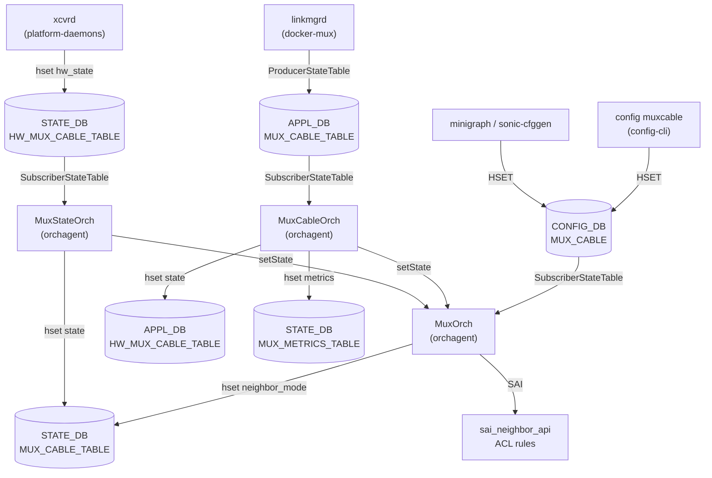

# MUX_CABLE テーブル — 通信メカニズム (Phase G) 解析メモ

対象: `CONFIG_DB` の `MUX_CABLE` テーブル。購読者は `orchagent` の `MuxOrch`、`MuxCableOrch`、`MuxStateOrch`。

## 1. CONFIG_DB 購読 API — `SubscriberStateTable` (ConsumerOrch パターン)

`orchagent` は `swsscommon` の C++ `SubscriberStateTable` ベースのコンシューマを使用する。
`orchdaemon.cpp` が起動時に `MuxOrch`、`MuxCableOrch`、`MuxStateOrch` の 3 つのオーケストレータを構築し、
それぞれが対応テーブルの SELECT-loop で変更を受け取る。

```cpp
// sonic-swss/orchagent/orchdaemon.cpp:467-478
vector<string> mux_tables = {
    CFG_MUX_CABLE_TABLE_NAME,     // "MUX_CABLE"
    CFG_PEER_SWITCH_TABLE_NAME    // "PEER_SWITCH"
};
gMuxOrch = new MuxOrch(m_configDb, mux_tables, gTunneldecapOrch, gNeighOrch, gFdbOrch);

MuxCableOrch *mux_cb_orch = new MuxCableOrch(m_applDb, m_stateDb, APP_MUX_CABLE_TABLE_NAME);
// → APPL_DB "MUX_CABLE_TABLE" を購読

MuxStateOrch *mux_st_orch = new MuxStateOrch(m_stateDb, STATE_HW_MUX_CABLE_TABLE_NAME);
// → STATE_DB "HW_MUX_CABLE_TABLE" を購読 (xcvrd 書き込み経路)
```

- `Orch2` 基底クラスが内部で `SubscriberStateTable` を構築し、Redis `SUBSCRIBE` ではなく `XREAD` (Streams) または keyspace notification ポーリングで変更を受け取る。
- CONFIG_DB への `HSET` / `DEL` が発生すると、orchagent の select-loop が `doTask()` を呼び出す。

## 2. MuxOrch — CONFIG_DB → SAI フロー

```
CONFIG_DB::MUX_CABLE  (HSET by config-cli / minigraph)
        ↓  SubscriberStateTable
MuxOrch::doTask()
        ↓  handler_map_[CFG_MUX_CABLE_TABLE_NAME]
MuxOrch::handleMuxCfg()
        ├─ state_mux_cable_table_->hset(port, "neighbor_mode", ...)
        │   → STATE_DB::MUX_CABLE_TABLE (neighbor_mode 書き込み)
        └─ MuxCable::stateInitXxx() / stateActive() / stateStandby()
                ├─ SAI: sai_neighbor_api (nexthop 切替)
                ├─ SAI: ACL drop rule 追加 / 削除
                └─ MuxCableOrch::updateMuxState() / updateMuxMetricState()
                        ├─ APPL_DB::HW_MUX_CABLE_TABLE (state 書き込み)
                        └─ STATE_DB::MUX_METRICS_TABLE (タイムスタンプ)
```

**証跡**:
- `muxorch.cpp:2189`: `handler_map_.insert(handler_pair(CFG_MUX_CABLE_TABLE_NAME, &MuxOrch::handleMuxCfg))`
- `muxorch.cpp:2198-2199`: `state_mux_cable_table_` を `STATE_DB::MUX_CABLE_TABLE_NAME` で初期化
- `muxorch.cpp:2285`: `state_mux_cable_table_->hset(port_name, "neighbor_mode", neighbor_mode_str)`
- `muxorch.cpp:2508-2513`: `MuxCableOrch::updateMuxState()` が `APPL_DB::APP_HW_MUX_CABLE_TABLE_NAME` に `state` を書き込む
- `muxorch.cpp:2544`: `mux_metric_table_.hset(portName, msg, time)` → `STATE_DB::MUX_METRICS_TABLE`

## 3. STATE_DB MUX_CABLE notify — xcvrd 経路

`xcvrd` (platform-daemons) は物理 MUX ハードウェアの状態変化を検出すると
`STATE_DB::HW_MUX_CABLE_TABLE` に hw_state を書き込む。
`MuxStateOrch` がこのテーブルを購読しており、hw_state を受け取ると `MuxCable::setState()` を呼んで
orchagent 内のステートマシンを駆動する。

```
xcvrd (platform-daemons)
        ↓  hset STATE_DB::HW_MUX_CABLE_TABLE[port]["state"] = hw_state
MuxStateOrch::addOperation()  (STATE_HW_MUX_CABLE_TABLE_NAME 購読)
        ↓
MuxOrch::getMuxCable(port)->setState(hw_state)
        ↓
MuxStateOrch::updateMuxState(port, mux_state)
        ↓  hset STATE_DB::MUX_CABLE_TABLE[port]["state"] = mux_state
```

**証跡**:
- `orchdaemon.cpp:477`: `MuxStateOrch *mux_st_orch = new MuxStateOrch(m_stateDb, STATE_HW_MUX_CABLE_TABLE_NAME)`
- `muxorch.cpp:2638-2640`: `MuxStateOrch::updateMuxState()` → `mux_state_table_.hset(portName, "state", muxState)`
- `muxorch.cpp:2691`: `updateMuxState(port_name, mux_state)` が `addOperation()` 末尾で呼ばれる
- `muxorch.cpp:1094-1096`: xcvrd (gRPC) 経路は `isSkipNeighbor()` で kernel route 再プログラムを回避

## 4. MuxCableOrch — APPL_DB::MUX_CABLE_TABLE 購読

`MuxCableOrch` は `APPL_DB::MUX_CABLE_TABLE` (linkmgrd が書き込む) を購読する。
linkmgrd が ICMP prober 結果に基づいて state を書き込むと `MuxCableOrch::addOperation()` が呼ばれ、
`MuxCable::setState()` を経由してステートマシンが遷移する。

```
linkmgrd (docker-mux)
        ↓  ProducerStateTable → APPL_DB::MUX_CABLE_TABLE[port]["state"]
MuxCableOrch::addOperation()
        ↓
MuxOrch::getMuxCable(port)->setState(state)
        ↓
MuxCable::stateActive() / stateStandby()
        ├─ SAI: nexthop 切替
        ├─ SAI: ACL rule 操作
        └─ updateMuxState() → APPL_DB::HW_MUX_CABLE_TABLE + STATE_DB::MUX_METRICS_TABLE
```

**証跡**:
- `orchdaemon.cpp:474`: `MuxCableOrch(m_applDb, m_stateDb, APP_MUX_CABLE_TABLE_NAME)`
- `muxorch.cpp:2500-2505`: `MuxCableOrch` コンストラクタ
- `muxorch.cpp:2591`: `mux_obj->setState(state)`

## 5. 全体通信フロー図 (Mermaid)



## 6. チャネル種別まとめ

| 経路 | Publisher | Subscriber | チャネル種別 |
|------|-----------|------------|-------------|
| CONFIG_DB → MuxOrch | config-cli / minigraph | MuxOrch | SubscriberStateTable (keyspace) |
| APPL_DB → MuxCableOrch | linkmgrd | MuxCableOrch | SubscriberStateTable |
| STATE_DB → MuxStateOrch | xcvrd | MuxStateOrch | SubscriberStateTable |
| MuxOrch / MuxCableOrch → STATE_DB | orchagent | (consumers downstream) | Table::hset (direct write) |
| MuxCableOrch → APPL_DB | orchagent | (consumers downstream) | Table::set (direct write) |

## ソース証跡

- `sonic-swss/orchagent/muxorch.cpp`: 2189, 2198-2199, 2285, 2500-2513, 2544, 2631-2640, 2691
- `sonic-swss/orchagent/orchdaemon.cpp`: 467-478
- `muxorch.cpp:1094-1096`: xcvrd gRPC 経路の kernel route skip コメント
