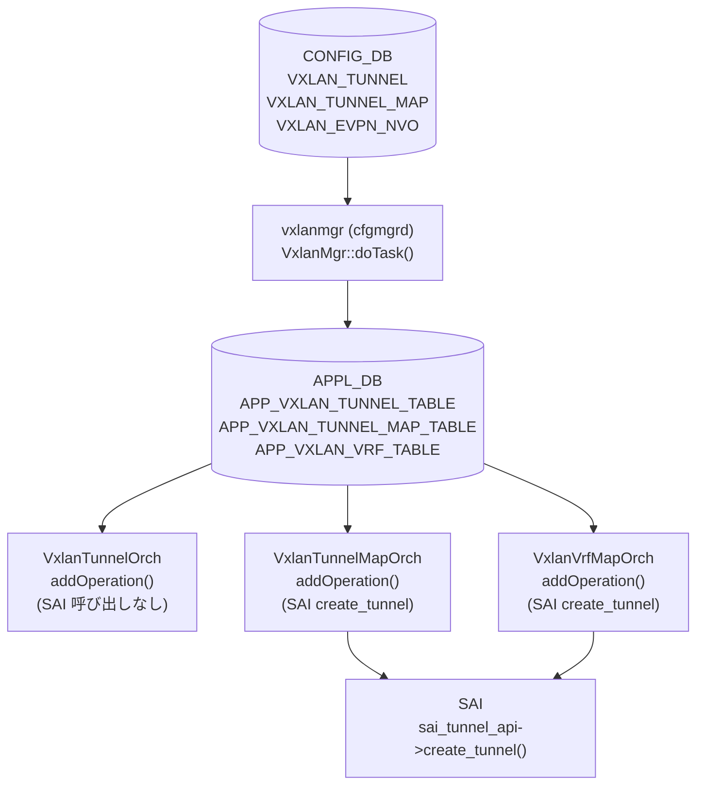

# tunnel-encap-orch — Phase: ordering

## 調査対象

slug: tunnel-encap-orch
phase: ordering (処理順序・依存関係)
調査日: 2026-05-17

## ソース

- `orchagent/orchdaemon.cpp` (4305596156d70e9797e8a881b3d19b46de0bce0d)
- `orchagent/vxlanorch.cpp` (4305596156d70e9797e8a881b3d19b46de0bce0d)
- `cfgmgr/vxlanmgr.cpp` (同リポジトリ)
- `orchagent/main.cpp` (同リポジトリ)

## 調査結果

### 全体パイプライン

```
CONFIG_DB (VXLAN_TUNNEL / VXLAN_TUNNEL_MAP / VXLAN_EVPN_NVO)
  │
  ▼
vxlanmgr (cfgmgrd) — VxlanMgr::doTask()
  │ CFG_VXLAN_TUNNEL_TABLE_NAME → m_appVxlanTunnelTable
  │ CFG_VXLAN_TUNNEL_MAP_TABLE_NAME → m_appVxlanTunnelMapTable
  │ CFG_VXLAN_EVPN_NVO_TABLE_NAME → m_appEvpnNvoTable
  ▼
APPL_DB (APP_VXLAN_TUNNEL_TABLE / APP_VXLAN_TUNNEL_MAP_TABLE / APP_VXLAN_VRF_TABLE)
  │
  ├─ VxlanTunnelOrch::addOperation() — VXLAN_TUNNEL エントリ登録のみ (SAI 呼び出しなし)
  ├─ VxlanTunnelMapOrch::addOperation() — SAI トンネル遅延生成 + mapper エントリ作成
  └─ VxlanVrfMapOrch::addOperation() — L3VNI VRF mapping + SAI トンネル遅延生成
  │
  ▼
SAI sai_tunnel_api->create_tunnel()
```

### orchdaemon 初期化順序 (orchdaemon.cpp)

gDirectory 登録順:
1. `vrf_orch` (VrfOrch) — line 284
2. `gTunneldecapOrch` — line 348
3. `vxlan_tunnel_orch` (VxlanTunnelOrch) — line 351
4. `vxlan_tunnel_map_orch` (VxlanTunnelMapOrch) — line 353
5. `vxlan_vrf_orch` (VxlanVrfMapOrch) — line 355
6. `evpn_nvo_orch` (EvpnNvoOrch) — line 359

m_orchList 処理順 (orchdaemon.cpp:567-592):
- vxlan_tunnel_orch: line 573
- evpn_nvo_orch: line 574
- vxlan_tunnel_map_orch: line 575
- vxlan_vrf_orch: line 590

VxlanTunnelMapOrch / VxlanVrfMapOrch が `gDirectory.get<VxlanTunnelOrch*>()` で VxlanTunnelOrch を参照するため、VxlanTunnelOrch が先に登録されていなければならない。

### gUnderlayIfId 依存

SAI トンネル生成 `VxlanTunnel::createTunnelHw()` は `gUnderlayIfId` をアンダーレイ RIF として使用する (vxlanorch.cpp:907)。
`gUnderlayIfId` は `main.cpp:967` の SAI 初期化フェーズ (`sai_router_intfs_api->create_router_interface()`) で設定される。
これは VxlanTunnelOrch が初期化される前に完了しているため、ランタイム競合は発生しない。

### 遅延 SAI 生成の順序

1. `VXLAN_TUNNEL` 追加: VxlanTunnelOrch::addOperation → `VxlanTunnel` オブジェクトをメモリに作成。SAI 呼び出しなし。
2. `VXLAN_TUNNEL_MAP` 追加: VxlanTunnelMapOrch::addOperation → `createTunnelHw()` + `createVxlanTunnelMap()` → SAI create_tunnel() 実行。
3. `VXLAN_VRF_MAP` 追加: VxlanVrfMapOrch::addOperation → L3VNI 用 `createTunnelHw()` → SAI create_tunnel() 実行。

したがって、`VXLAN_TUNNEL` エントリが先に存在しないと `VXLAN_TUNNEL_MAP` 処理時に tunnel オブジェクトが見つからず失敗する (vxlanorch.cpp:2030 `getVlanByVlanId` / 2069 `findTunnel`)。

### STATE_DB 書き込み

VxlanTunnelOrch は SAI トンネル作成後に `STATE_VXLAN_TUNNEL_TABLE` へステータスを書き込む (vxlanorch.cpp:1913 `addRemoveStateTableEntry`)。
VxlanMgr は `m_stateVxlanTunnelTable` で vxlanmgrd の reconcile 状態を確認する (vxlanmgr.cpp:557)。

## ブロック案

```markdown
<!-- ordering -->
## 処理順序・依存関係

VXLAN_TUNNEL エントリは CONFIG_DB → cfgmgr (vxlanmgr) → APPL_DB → orchagent の順に処理される[^ord1]。



**処理の前提条件**:

| 依存 | 理由 |
|-----|------|
| `VXLAN_TUNNEL` が先に存在すること | `VXLAN_TUNNEL_MAP` 追加時に `findTunnel()` を呼ぶ。存在しなければ処理失敗 (vxlanorch.cpp:2030) |
| `gUnderlayIfId` が初期化済みであること | SAI `create_tunnel()` でアンダーレイ RIF として参照 (main.cpp:967, vxlanorch.cpp:907) |
| `VxlanTunnelOrch` が gDirectory に登録済みであること | `VxlanTunnelMapOrch` / `VxlanVrfMapOrch` が `gDirectory.get<VxlanTunnelOrch*>()` で参照 (orchdaemon.cpp:351,353,355) |

**SAI トンネル生成は遅延**: `VXLAN_TUNNEL` エントリ追加の時点では SAI 呼び出しは行われない。
実際の `sai_tunnel_api->create_tunnel()` は `VXLAN_TUNNEL_MAP` または `VRF_MAP` の追加時に初めて実行される[^ord1]。

<!-- /ordering -->
```

## 引用

[^ord1]: orchdaemon.cpp 初期化順序 (line 350-590), vxlanorch.cpp VxlanTunnelMapOrch::addOperation (line 2012-2088), VxlanVrfMapOrch::addOperation (line 2252-2350). <https://github.com/sonic-net/sonic-swss/blob/4305596156d70e9797e8a881b3d19b46de0bce0d/orchagent/orchdaemon.cpp>
