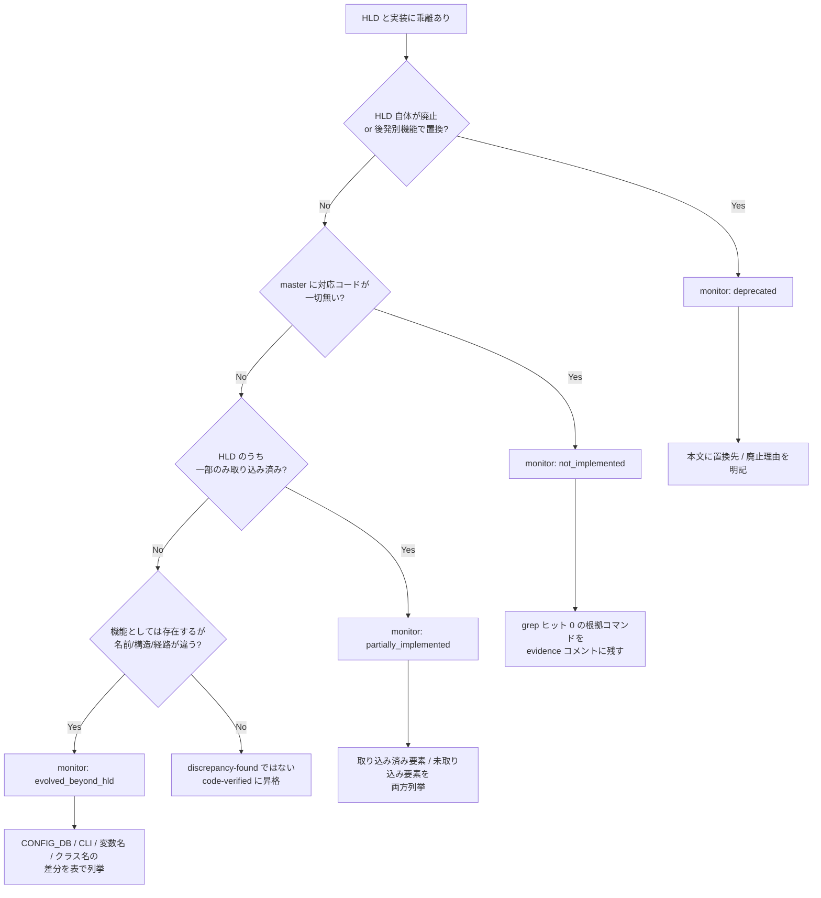

# discrepancy-found ページ運用ガイド

`verification: discrepancy-found` が付いたページは、HLD と SONiC コミュニティ master の実装に乖離があると確認されたページである。HLD は分散・古い・実装と乖離している前提のリポジトリでは、これらのページは **「動的なメタデータ」** として継続的なメンテナンスが必要になる。本ドキュメントはその運用方針を定める。

対象読者: Verifier ロール（および同等の裏取りを行う運用者）。

---

## 1. 定期見直しサイクル

`discrepancy-found` ページは **四半期ごと（quarterly）** に再裏取りする。

| 周期 | 対象 | 担当 | 成果物 |
|------|------|------|--------|
| 四半期（quarterly） | `monitor` が `not_implemented` / `partially_implemented` / `evolved_beyond_hld` のページ全件 | Verifier バッチ | 昇格 PR / `last_verified` 更新 PR |
| 半年（biannual） | `monitor: deprecated` のページ | Verifier | 廃止状態の維持確認、必要なら本文の置換先リンク更新 |
| 随時（on-demand） | 該当 HLD に新規 PR / issue が立った旨を観測した場合 | 観測者（main エージェントを含む） | per-page queue 復活 + Verifier 再走 |

判定根拠:

- SONiC コミュニティ master は概ね **2〜3 ヶ月の cadence でリリースブランチが切られる**。四半期で再裏取りすれば、リリース 1 サイクルに最低 1 回はチェックが入る
- `deprecated` は方針自体が廃止されたものなので、頻度を落としてよい（再採用は稀）
- 急ぎの場合は per-page queue の `priority: high` で個別投入する

### サイクル実行手順

1. `meta/queue/` 配下に `verification-recheck/<area>-<slug>.json` を生成する（最終 `last_verified` から 90 日以上経過した `discrepancy-found` ページを自動列挙）
2. Verifier バッチを走らせて再裏取り（後述「昇格手順」「monitor 変更」を参照）
3. `.venv/bin/python3 meta/scripts/aggregate_queue.py` で集約ビューを再生成し、`docs/reference/verification/discrepancy-index.md` を `meta/scripts/gen_discrepancy_index.py` で再生成
4. 変更分を 1 PR にまとめて squash merge

---

## 2. 新規 monitor タグ判定フロー

`verification: discrepancy-found` を付けるとき、または既存ページの monitor タグを見直すときに使う判定フロー。

判定優先順位は `deprecated` > `not_implemented` > `partially_implemented` > `evolved_beyond_hld`（SCHEMA.md と同一）。迷ったら上から順に「該当するか?」を当てはめる。

---

## 3. HLD と実装の差分が解消された場合の昇格手順

`discrepancy-found` → `code-verified` に昇格させる手順。新しい SONiC commit で HLD と実装が一致するようになったケース（後発 PR で機能が追加された等）を想定する。

### 3.1 前提チェック

- 該当ページの `sources[].ref` を最新の master SHA に更新できるか?（最新 commit で実コードを確認できること）
- HLD 側に変更があった可能性も確認する。HLD と実装の **両方** を最新で照合する

### 3.2 手順

1. **frontmatter 更新**:
   - `verification: discrepancy-found` → `verification: code-verified`
   - `monitor:` フィールドを **削除**（`code-verified` には monitor タグは不要）
   - `last_verified` を当日に更新
   - `sources[].ref` を最新 SHA に更新
2. **本文更新**:
   - 「HLD と実装の差分」セクションを「HLD と実装の一致確認（YYYY-MM-DD 時点）」に書き換え、解消された経緯（取り込まれた PR 番号など）を簡潔に追記
   - `<!-- evidence: ... -->` コメントを更新して新しい行番号 / SHA を反映
3. **discrepancy-index 再生成**: `meta/scripts/gen_discrepancy_index.py` を走らせて `docs/reference/verification/discrepancy-index.md` を更新（該当ページは消える）
4. **frontmatter lint**: `.venv/bin/python3 meta/scripts/frontmatter_lint.py`
5. **PR**: ブランチ名 `verify/promote-<area>-<slug>`、タイトル `[verify] <ページタイトル> を code-verified に昇格`

### 3.3 部分的に解消された場合

「3 件の差分のうち 1 件だけ解消された」ような中間状態では、`verification: discrepancy-found` は維持しつつ:

- `monitor` の見直し（`not_implemented` → `partially_implemented` 等）
- 本文の差分リストから解消済み項目を **削除ではなく「解消済み（YYYY-MM-DD）」と注記** して保存

履歴を本文に残すのは、四半期サイクルで「前回からの変化」を追えるようにするため。

---

## 4. 廃止された機能（`monitor: deprecated`）の取り扱い

`monitor: deprecated` は **HLD の方針自体が廃止された** ケース。例: BGP Route Install Error Handling は BGP Suppress FIB Pending に置き換えられた。

### 4.1 保持の意義

deprecated ページを **削除はしない**。理由:

- SONiC の歴史的経緯を辿る読み手（古いブログ記事から流入したユーザ）が「なぜこれが無いのか」を理解できる
- 後発機能との比較で設計判断を学べる

### 4.2 本文要件

deprecated ページの本文先頭には次の要素を必ず含める:

1. **置換先へのリンク**: 「本 HLD は採用されず、`<置換先機能名>` ([リンク](../...md)) に置き換えられている」
2. **廃止が確認された時点**: `verified at: YYYY-MM-DD, <repo> @ <sha>`
3. **どの commit / PR で方針転換されたか**（追跡できる範囲で）

### 4.3 再採用の可能性

稀に廃止された HLD が再採用されるケースがある（例: 初期に却下された設計が別チームによって再提案される）。この場合は:

- monitor を `not_implemented` または `partially_implemented` に **巻き戻し**
- 本文の「廃止された」記述を「再採用検討中（PR #xxx）」に書き換え
- 半年サイクルではなく四半期サイクルに戻す

---

## 5. GitHub Issue / PR 紐づけのメンテナンス方針

`discrepancy-found` ページが参照する GitHub issue / PR は、時間経過で状態が変わる（merge / close / 別 issue に統合）。これに対する方針:

### 5.1 ページ本文での参照ルール

- **永続リンク（commit / PR の永続 URL）を優先**して引用する。issue 番号だけの記載は `sonic-net/SONiC#1234` 形式で残し、本文 URL は `https://github.com/sonic-net/SONiC/issues/1234` をフル表記
- 引用する issue / PR は本文中で **状態（open / closed / merged）と引用時の日付** を併記。例: `(2026-05-09 時点 open)`
- **issue 番号と PR 番号を混同しない**。`sonic-net/SONiC#1234` と `sonic-net/sonic-buildimage#5678` のように **リポも明記**

### 5.2 メンテナンス時のチェック

四半期サイクルの裏取り時に、ページが参照する issue / PR を以下で確認:

1. open のまま放置されていないか?（半年以上動きが無ければ「stale (YYYY-MM-DD 確認)」と注記）
2. closed not merged の場合、別 PR に統合されていないか?（GitHub 上の参照リンクを辿る）
3. merged の場合、本文の「未実装」記述を見直す必要があるか?（monitor 変更 or 昇格の検討）

### 5.3 frontmatter `sources` との関係

frontmatter `sources` は **コードや HLD のスナップショット** を指す。issue / PR は `sources` には載せない（コミット SHA で固定できないため）。本文 + evidence コメントの中だけで参照する。

---

## 6. 関連ファイル

| パス | 役割 |
|------|------|
| `meta/prompts/verifier.md` | Verifier ロール定義。本ガイドの定期見直しセクションを参照 |
| `meta/templates/SCHEMA.md` | monitor / verification の enum 定義 |
| `meta/scripts/gen_discrepancy_index.py` | `docs/reference/verification/discrepancy-index.md` 自動生成 |
| `meta/scripts/aggregate_queue.py` | per-page queue → `meta/verification-queue.json` 集約 |
| `meta/scripts/frontmatter_lint.py` | frontmatter enum / 必須フィールド検査 |
| `docs/reference/verification/discrepancy-index.md` | 読み手向け discrepancy 一覧 |
| `docs/reference/verification/index.md` | 裏取り運用方針サマリ（本ガイドの読み手向け要約） |
