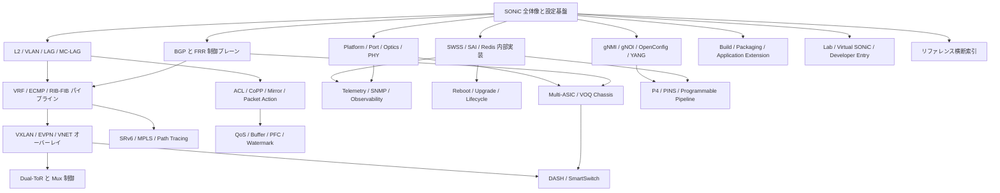

# 読み物章立て案（機能軸視点）

- 作成日: 2026-05-10
- 対象 worktree: `chore/topics-feature`
- 対象ページ: `rg --files docs -g '*.md' | rg -v '/index\.md$' | sort` で 498 件
- 参照した既存整理: `meta/restructure-plan.md`
- 方針: 既存の HLD 1 件 1 ページを維持したまま、Phase B で新設する `topics/` 配下の読み物章を機能ファミリー単位に設計する。

## 調査メモ

ユーザー指定の `find docs -name "*.md" -not -name "index.md"` は、この実行環境では `find` が存在しないため実行できなかった。既存の `meta/restructure-plan.md` と同じ代替手段として `rg --files docs -g '*.md' | rg -v '/index\.md$' | sort` を使い、通常ページ 498 件を確認した。

各ページは frontmatter の `title` / `area` / `verification` / `sources` を確認した。`meta/restructure-plan.md` は 455 ページ時点の area 別タイトル一覧を持つため、章の初期クラスタリングにはこれを使い、現在追加されている `docs/categories/*`、`docs/guides/*`、追加 CLI / CONFIG_DB / YANG リファレンスも読み物章の参照素材として扱う。

`sources` は多くのページで `sonic-net/SONiC/doc/...` の移植元 HLD / spec / test plan を指している。章ページでは既存ページごとの `sources` を正にし、章本文側で元 HLD を直接再解釈しない。本文の責務は「複数 HLD の関係、運用導線、設定と内部実装の読み順」を提供することに限定する。

## 章設計の原則

- 章は「読者が知りたい機能ファミリー」を入口にする。
- 1 章は 4〜8 ページを目安にし、概要、アーキテクチャ、設定、運用、内部実装、発展トピックのどれかへ既存 HLD を束ねる。
- CLI / CONFIG_DB / YANG リファレンスは独立章に隔離せず、各機能章の「設定」ページから参照する。
- テストプラン、実装メモ、discrepancy ページは章本文に埋め込まず、運用または内部実装ページの根拠として扱う。
- Phase B では新規章ページから既存ページへリンクし、既存ページ本文・frontmatter は触らない。

## 章一覧

1. SONiC 全体像と設定基盤
2. BGP と FRR 制御プレーン
3. VXLAN / EVPN / VNET オーバーレイ
4. VRF / ECMP / RIB-FIB パイプライン
5. Dual-ToR と Mux 制御
6. L2 / VLAN / LAG / MC-LAG
7. ACL / CoPP / Mirror / Packet Action
8. QoS / Buffer / PFC / Watermark
9. Telemetry / SNMP / Observability
10. gNMI / gNOI / OpenConfig / YANG
11. Reboot / Upgrade / Lifecycle
12. Multi-ASIC / VOQ Chassis
13. DASH / SmartSwitch
14. Platform / Port / Optics / PHY
15. Security / AAA / FIPS / Hardening
16. NAT / DHCP Relay / Time-DNS Services
17. SRv6 / MPLS / Path Tracing
18. P4 / PINS / Programmable Pipeline
19. Build / Packaging / Application Extension
20. SWSS / SAI / Redis 内部実装
21. Lab / Virtual SONiC / Developer Entry
22. リファレンス横断索引

## 章間の関係図

## 01. SONiC 全体像と設定基盤

### 想定読み手の質問

- SONiC の設定は CLI、ConfigDB、YANG、GCU のどれを入口に読めばよいか。
- `CONFIG_DB`、`APPL_DB`、`STATE_DB`、`ASIC_DB` はどの章の前提知識になるか。
- config reload / replace / rollback / ZTP はどこまで安全に使えるか。
- 既存の guides / categories / reference は読み物章からどう参照するか。

### ページ案

- 概要: SONiC の設定・状態・運用入口。統合する既存ページは `docs/guides/*.md`、`docs/management/sonic-user-manual.md`、`docs/management/sonic-nos-configuration-methods.md`、`docs/categories/*.md`。新規執筆は「読者別の最短導線」と「機能章への分岐」。想定ボリューム: 中。
- アーキテクチャ: ConfigDB から daemon / orchagent / SAI へ流れるデータフロー。統合する既存ページは `docs/internals/swss-schema.md`、`docs/internals/zmq-producer-consumer-state-table-design.md`、`docs/management/redis-client-manager-rcm-hld.md`、`docs/reference/config-db/device-metadata.md`、`docs/reference/config-db/feature.md`。新規執筆は mermaid の DB / daemon / ASIC 関係図。想定ボリューム: 中。
- 設定: GCU、JSON patch、config reload、sonic-cfggen の典型例。統合する既存ページは `docs/architecture/sonic-generic-configuration-update-and-rollback.md`、`docs/architecture/json-change-application.md`、`docs/management/json-patch-ordering-using-yang-models.md`、`docs/management/config-reload-enhancement.md`、`docs/reference/cli/config-mgmt-trio.md`、`docs/reference/cli/sonic-cfggen.md`。新規執筆はロールバック前提の運用例。想定ボリューム: 大。
- 運用: feature enable / system defaults / reset factory / troubleshooting。統合する既存ページは `docs/system/sonic-optional-feature-control-enhancement.md`、`docs/switching/control-sonic-behaviors-with-system-defaults-table.md`、`docs/architecture/reset-factory-design.md`、`docs/reference/cli/show-feature.md`、`docs/reference/config-db/system-defaults.md`。新規執筆は安全な変更手順。想定ボリューム: 中。
- 内部実装: Config setup、DB schema、複数 Redis。統合する既存ページは `docs/system/sonic-configuration-setup-service.md`、`docs/internals/support-multiple-user-defined-redis-database-instances.md`、`docs/internals/support-redis-databases-in-multiple-namespaces.md`。新規執筆は DB 選択の考え方。想定ボリューム: 中。

## 02. BGP と FRR 制御プレーン

### 想定読み手の質問

- SONiC で BGP neighbor / peer group / AF はどこで設定され、FRR へどう渡るか。
- BGP loading optimization、PIC、Suppress FIB pending は何を改善する機能か。
- BMP、CiscoBgp4MIB、dynamic peer は運用上どこで使うか。
- FRR upgrade や SONiC-FRR 通信チャネルの変更はどの層に効くか。

### ページ案

- 概要: SONiC における BGP の役割。統合する既存ページは `docs/routing/bgp-router-id-explicitly-configured.md`、`docs/routing/sonic-frr-bgp-extended-unified-configuration-management-framework.md`、`docs/routing/detailed-steps-to-upgrade-frr-in-sonic.md`。新規執筆は FRR と SONiC daemon の責務分界。想定ボリューム: 中。
- アーキテクチャ: bgpcfgd、fpmsyncd、zebra、orchagent の経路フロー。統合する既存ページは `docs/routing/new-frr-sonic-communication-channel.md`、`docs/routing/fpmsyncd-nexthop-group-enhancement-high-level-design-document.md`、`docs/routing/routing-and-next-hop-table-enhancement.md`。新規執筆は mermaid の経路伝搬図。想定ボリューム: 大。
- 設定: neighbor、peer group、route-map、aggregate address。統合する既存ページは `docs/reference/cli/config-bgp.md`、`docs/reference/config-db/bgp-*.md`、`docs/reference/config-db/route-map.md`、`docs/reference/config-db/prefix-list.md`、`docs/reference/config-db/prefix-set.md`、`docs/reference/yang/sonic-bgp-*.md`、`docs/reference/yang/sonic-route-map.md`。新規執筆は設定例と参照表。想定ボリューム: 中。
- 運用: BMP、MIB、show bgp、route install failure。統合する既存ページは `docs/routing/bmp-for-monitoring-sonic-bgp-info.md`、`docs/routing/ciscobgp4mib-implementation-changes.md`、`docs/routing/bgp-route-install-error-handling.md`、`docs/reference/cli/show-bgp.md`、`docs/reference/cli/show-route-map.md`。新規執筆は FIB 未導入時の切り分け。想定ボリューム: 中。
- 内部実装: convergence / scale optimization。統合する既存ページは `docs/routing/bgp-loading-optimization-for-sonic.md`、`docs/routing/bgp-prefix-independent-convergence-architecture-document.md`、`docs/routing/bgp-suppress-announcements-of-routes-not-installed-in-hw.md`、`docs/routing/bgp-route-aggregation-with-bbr-awareness.md`、`docs/routing/bgpcfgd-dynamic-peer-modification-support.md`。新規執筆は性能改善機能の比較表。想定ボリューム: 大。
- 発展トピック: VoQ BGP、BFD for BGP、EVPN への接続。統合する既存ページは `docs/routing/bgp-setup-for-voq-chassis.md`、`docs/routing/bfd-hw-offload-for-bgp-session.md`、`docs/routing/evpn-vxlan-hld.md`。新規執筆は派生章へのリンク。想定ボリューム: 小。

## 03. VXLAN / EVPN / VNET オーバーレイ

### 想定読み手の質問

- VXLAN、VNET、EVPN は SONiC 内で同じ機能なのか、どこが違うのか。
- EVPN Type-2 / Type-5、VTEP、VRF、VNetOrch はどうつながるか。
- VNET route、Overlay ECMP、DSCP remap はどう運用するか。
- NVGRE や subnet decap は VXLAN と同じ読み物章で扱うべきか。

### ページ案

- 概要: Overlay の用途と全体像。統合する既存ページは `docs/overlay/vxlan-sonic.md`、`docs/routing/evpn-vxlan-hld.md`、`docs/overlay/nvgre-tunnel-in-sonic.md`、`docs/platform/subnet-decapsulation-with-sonic.md`。新規執筆は VXLAN / VNET / EVPN / NVGRE の用語整理。想定ボリューム: 中。
- アーキテクチャ: VxlanOrch、VnetOrch、FRR EVPN、ASIC tunnel object。統合する既存ページは `docs/routing/evpn-vxlan-multihoming.md`、`docs/overlay/vnet-local-endpoint-forwarding.md`、`docs/routing/overlay-ecmp-with-bfd-monitoring.md`、`docs/routing/overlay-ecmp-enhancements.md`。新規執筆は Type-2 / Type-5 と VNET route の mermaid 図。想定ボリューム: 大。
- 設定: VXLAN tunnel、VNET、VRF、tunnel decap、PBH inner hash。統合する既存ページは `docs/reference/cli/config-vxlan.md`、`docs/reference/cli/config-vnet.md`、`docs/reference/config-db/vxlan-tunnel.md`、`docs/reference/config-db/vxlan-tunnel-map.md`、`docs/reference/config-db/vnet.md`、`docs/reference/config-db/tunnel.md`、`docs/reference/config-db/tunnel-decap-table.md`、`docs/reference/yang/sonic-vxlan.md`、`docs/reference/yang/sonic-vnet.md`、`docs/architecture/sonic-policy-based-hashing.md`。新規執筆は最小構成例。想定ボリューム: 中。
- 運用: Overlay ECMP、BFD monitoring、DSCP remap。統合する既存ページは `docs/overlay/dscp-remapping-for-tunnel-traffic.md`、`docs/routing/test-plan-for-inner-packet-hashing-in-ecmp.md`、`docs/routing/local-ars-hld.md`。新規執筆はトラブルシュートの確認順。想定ボリューム: 中。
- 発展トピック: EVPN multihoming、DASH / SmartSwitch 連携。統合する既存ページは `docs/routing/evpn-vxlan-multihoming.md`、`docs/overlay/smartswitch-eni-based-forwarding.md`。新規執筆は派生章への境界説明。想定ボリューム: 小。

## 04. VRF / ECMP / RIB-FIB パイプライン

### 想定読み手の質問

- VRF、interface、static route、next hop group はどの順番で理解すればよいか。
- ECMP / WCMP / Fine Grained ECMP / Ordered ECMP は何が違うか。
- APP_DB の route と ASIC_DB の route object はどこで変換されるか。
- route counter、RIF counter、flow counter はどの章で読むか。

### ページ案

- 概要: L3 基盤と VRF。統合する既存ページは `docs/routing/sonic-vrf-support-design-spec-draft.md`、`docs/routing/static-ip-route-configuration.md`、`docs/routing/ipv6-link-local-enhancements.md`、`docs/routing/sonic-management-vrf-design-document-201911-release.md`。新規執筆は L3 読み順。想定ボリューム: 中。
- アーキテクチャ: RIB-FIB、NHG、RIF、kernel / FRR / orchagent。統合する既存ページは `docs/routing/routing-and-next-hop-table-enhancement.md`、`docs/routing/fpmsyncd-nexthop-group-enhancement-high-level-design-document.md`、`docs/routing/new-frr-sonic-communication-channel.md`、`docs/internals/l3-scaling-and-performance-enhancements.md`。新規執筆は route object 生成の mermaid 図。想定ボリューム: 大。
- 設定: VRF、interface、static route、FG_NHG、route common。統合する既存ページは `docs/reference/cli/config-vrf.md`、`docs/reference/cli/config-route.md`、`docs/reference/config-db/vrf.md`、`docs/reference/config-db/interface.md`、`docs/reference/config-db/loopback-interface.md`、`docs/reference/config-db/static-route.md`、`docs/reference/config-db/fg-nhg.md`、`docs/reference/yang/sonic-vrf.md`、`docs/reference/yang/sonic-interface.md`、`docs/reference/yang/sonic-static-route.md`、`docs/reference/yang/sonic-route-common.md`。新規執筆は VRF 付き route 設定例。想定ボリューム: 中。
- 運用: route / interface / counter の確認。統合する既存ページは `docs/reference/cli/show-ip.md`、`docs/reference/cli/show-interfaces.md`、`docs/routing/router-interface-counters-in-sonic.md`、`docs/routing/sonic-route-flow-counter-design.md`、`docs/architecture/sonic-ip-interface-loopback-action.md`。新規執筆は確認コマンド表。想定ボリューム: 中。
- 内部実装: ECMP family。統合する既存ページは `docs/routing/sonic-fine-grained-ecmp.md`、`docs/routing/sonic-weighted-ecmp.md`、`docs/routing/high-level-design-document.md`、`docs/architecture/sonic-generic-hash.md`、`docs/routing/class-based-forwarding-enhancement.md`。新規執筆は ECMP 方式比較。想定ボリューム: 大。
- 発展トピック: VRRP、SAG、TSA、path tracing への橋渡し。統合する既存ページは `docs/routing/virtual-router-redundancy-protocol-adaptation-hld.md`、`docs/architecture/sag-high-level-design-for-sonic.md`、`docs/routing/reliable-tsa.md`。新規執筆は関連章リンク。想定ボリューム: 小。

## 05. Dual-ToR と Mux 制御

### 想定読み手の質問

- Active-Active と Active-Standby Dual-ToR は何が違うか。
- linkmgrd、MuxOrch、ycabled、gRPC client はどの状態を管理するか。
- mux state、prefix-based neighbor、default route 連動はどの障害を避けるか。
- ICMP hardware offload、BFD、DSCP remap は Dual-ToR でどう効くか。

### ページ案

- 概要: Dual-ToR の問題設定。統合する既存ページは `docs/overlay/active-active-dual-tor.md`、`docs/overlay/active-standby-dual-tor.md`、`docs/categories/dual-tor.md`。新規執筆は AA / AS のユースケース比較。想定ボリューム: 中。
- アーキテクチャ: mux state machine と制御面。統合する既存ページは `docs/management/design-doc.md`、`docs/routing/default-route.md`、`docs/routing/prefix-based-mux-neighbors.md`、`docs/routing/multiple-nexthop-route-hld.md`。新規執筆は linkmgrd / MuxOrch / gRPC の mermaid 図。想定ボリューム: 大。
- 設定: MUX_CABLE、muxcable CLI、peer switch。統合する既存ページは `docs/reference/cli/config-muxcable.md`、`docs/reference/cli/show-muxcable.md`、`docs/reference/config-db/mux-cable.md`、`docs/reference/config-db/peer-switch.md`。新規執筆は最小設定例。想定ボリューム: 中。
- 運用: 状態確認、障害時のループ回避、プローブ。統合する既存ページは `docs/platform/icmp-hardware-offload.md`、`docs/routing/bfd-hw-offload.md`、`docs/routing/bfd-hw-offload-for-bgp-session.md`。新規執筆はフェイルオーバー確認順。想定ボリューム: 中。
- 発展トピック: tunnel DSCP remap、DHCPv6 dual ToR loopback。統合する既存ページは `docs/overlay/dscp-remapping-for-tunnel-traffic.md`、`docs/architecture/dhcpv6-relay-agent.md`。新規執筆は QoS / DHCP 章との境界。想定ボリューム: 小。

## 06. L2 / VLAN / LAG / MC-LAG

### 想定読み手の質問

- VLAN、VLAN interface、switchport、sub-port、LAG はどの順番で読むべきか。
- MC-LAG / ICCP と distributed VOQ LAG は同じ章で扱うべきか。
- MSTP、FDB、storm control、link event damping はどこに入るか。
- OpenConfig PortChannel / VLAN は管理章と L2 章のどちらから読むか。

### ページ案

- 概要: L2 forwarding と port grouping。統合する既存ページは `docs/switching/layer-2-forwarding-enhancements.md`、`docs/switching/sonic-basic-l2-mode-test-plan.md`、`docs/switching/switch-port-modes-and-vlan-cli-enhancement.md`。新規執筆は L2 機能地図。想定ボリューム: 中。
- アーキテクチャ: VLAN、FDB、LAG、MC-LAG、STP。統合する既存ページは `docs/switching/mclag-enhancements.md`、`docs/switching/brief-introduction-of-iccp-code.md`、`docs/switching/multiple-spanning-tree-protocol.md`、`docs/switching/sonic-ip-lag-incremental-update.md`。新規執筆はデータフローと制御面の分離図。想定ボリューム: 大。
- 設定: VLAN / PortChannel / interface / sub-port / TPID。統合する既存ページは `docs/reference/cli/config-vlan.md`、`docs/reference/cli/config-portchannel.md`、`docs/reference/cli/config-interface.md`、`docs/reference/config-db/vlan*.md`、`docs/reference/config-db/portchannel*.md`、`docs/reference/config-db/port.md`、`docs/reference/config-db/interface.md`、`docs/reference/config-db/vlan-sub-interface.md`、`docs/reference/yang/sonic-vlan*.md`、`docs/reference/yang/sonic-portchannel.md`、`docs/reference/yang/sonic-port.md`、`docs/architecture/sonic-sub-port-interface-high-level-design.md`、`docs/platform/sonictpidsettinghld1.md`。新規執筆は L2 設定の代表パターン。想定ボリューム: 大。
- 運用: show vlan / show mclag / link damping / storm control。統合する既存ページは `docs/reference/cli/show-vlan.md`、`docs/reference/cli/show-mclag.md`、`docs/switching/sonic-bum-storm-control.md`、`docs/switching/link-event-damping-hld.md`。新規執筆はトラブル別の確認順。想定ボリューム: 中。
- 発展トピック: OpenConfig L2、distributed VOQ LAG、Wake-on-LAN。統合する既存ページは `docs/switching/openconfig-support-for-portchannel-aggregate-interface.md`、`docs/switching/add-support-for-vlan-interface-using-openconfig-yang.md`、`docs/switching/lag-on-distributed-voq-system.md`、`docs/switching/wake-on-lan-in-sonic.md`。新規執筆は管理章 / VOQ 章への誘導。想定ボリューム: 小。

## 07. ACL / CoPP / Mirror / Packet Action

### 想定読み手の質問

- ACL table type、match、action、counter はどの階層で理解するか。
- CoPP、policer、trap、mirror は ACL とどう関係するか。
- Debug counter、drop counter、trap flow counter は運用でどう使うか。
- P4 / DASH ACL は通常 ACL と同じ章に置くか。

### ページ案

- 概要: Packet classification と action。統合する既存ページは `docs/acl-qos/acl-in-sonic.md`、`docs/acl-qos/acl-support-in-sonic.md`、`docs/categories/sai-extensions.md`。新規執筆は ACL / CoPP / mirror の範囲整理。想定ボリューム: 中。
- アーキテクチャ: ACL Orch、SAI ACL、counter、trap。統合する既存ページは `docs/acl-qos/acl-user-defined-table-type-support.md`、`docs/acl-qos/support-a-new-acl-table-type-that-combines-l3-acl-and-l3v6-acl-tables.md`、`docs/acl-qos/acl-flex-counters-support.md`、`docs/architecture/sonic-trap-flow-counter-design.md`。新規執筆は table / rule / counter の mermaid 図。想定ボリューム: 大。
- 設定: ACL_TABLE / ACL_RULE / policer / mirror / CoPP。統合する既存ページは `docs/reference/cli/config-acl.md`、`docs/reference/cli/show-acl.md`、`docs/reference/config-db/acl-table.md`、`docs/reference/config-db/acl-rule.md`、`docs/reference/config-db/policer.md`、`docs/reference/config-db/mirror-session.md`、`docs/reference/config-db/copp-group.md`、`docs/reference/config-db/copp-trap.md`、`docs/reference/yang/sonic-copp.md`、`docs/reference/yang/sonic-mirror-session.md`。新規執筆は ACL の最小設定例。想定ボリューム: 中。
- 運用: show acl、counter、mirror、drop counter。統合する既存ページは `docs/acl-qos/enhancements-on-show-acl-commands.md`、`docs/acl-qos/sonic-port-mirroring-hld.md`、`docs/acl-qos/everflow-test-plan.md`、`docs/acl-qos/configurable-drop-counters-in-sonic.md`、`docs/acl-qos/sonic-test-ingress-discards-hld.md`、`docs/architecture/port-illegal-packets-drop-design.md`。新規執筆は packet drop 調査の手順。想定ボリューム: 中。
- 内部実装: SAI action capability、egress mirror、outer DSCP、packet trimming。統合する既存ページは `docs/acl-qos/egress-mirroring-support-and-acl-action-capability-check.md`、`docs/acl-qos/egress-outer-dscp-change-table.md`、`docs/architecture/sonic-packet-trimming.md`。新規執筆は ACL action の能力問い合わせ。想定ボリューム: 中。
- 発展トピック: CoPP redesign、DASH ACL、PAC、DHCP DoS。統合する既存ページは `docs/acl-qos/copp-manager-redesign-test-plan.md`、`docs/acl-qos/copp-neighbor-miss-trap-and-enhancements.md`、`docs/acl-qos/dash-acl-tags.md`、`docs/acl-qos/port-access-control-in-sonic.md`、`docs/acl-qos/dhcp-dos-mitigation-in-sonic.md`。新規執筆は派生章へのリンク。想定ボリューム: 小。

## 08. QoS / Buffer / PFC / Watermark

### 想定読み手の質問

- Buffer pool / profile / PG / queue はどのテーブルから読むか。
- WRED / ECN、scheduler / shaper、PFC、watermark はどうつながるか。
- Reclaim reserved buffer と dynamic headroom はどんな問題を解決するか。
- show buffer / queue / priority-group / pfc は何を見るコマンドか。

### ページ案

- 概要: QoS と buffer の関係。統合する既存ページは `docs/acl-qos/sonic-qos-scheduler-and-shaping.md`、`docs/acl-qos/wred-and-ecn-statistics.md`、`docs/acl-qos/asymmetric-pfc-test-plan.md`。新規執筆は QoS 機能地図。想定ボリューム: 中。
- アーキテクチャ: buffer model、queue、PG、PFCWD、watermark。統合する既存ページは `docs/acl-qos/watermark-counters-in-sonic.md`、`docs/acl-qos/align-watermark-flow-with-port-configuration-hld.md`、`docs/acl-qos/test-plan-for-align-watermark-flow-with-port-configuration.md`、`docs/acl-qos/pfc-historical-statistics.md`。新規執筆は queue / PG / counter の mermaid 図。想定ボリューム: 大。
- 設定: buffer、scheduler、queue、DSCP/TC maps、PFCWD。統合する既存ページは `docs/reference/cli/config-buffer.md`、`docs/reference/cli/config-qos.md`、`docs/reference/cli/config-pfcwd.md`、`docs/reference/config-db/buffer-*.md`、`docs/reference/config-db/queue.md`、`docs/reference/config-db/scheduler.md`、`docs/reference/config-db/wred-profile.md`、`docs/reference/config-db/dscp-to-tc-map.md`、`docs/reference/config-db/tc-to-queue-map.md`、`docs/reference/config-db/port-qos-map.md`、`docs/reference/config-db/pfc-*.md`、`docs/reference/yang/sonic-buffer-*.md`、`docs/reference/yang/sonic-queue.md`、`docs/reference/yang/sonic-scheduler.md`、`docs/reference/yang/sonic-pfcwd.md`、`docs/reference/yang/sonic-port-qos-map.md`。新規執筆は lossless / lossy の代表設定。想定ボリューム: 大。
- 運用: show buffer / queue / PFC / priority-group。統合する既存ページは `docs/reference/cli/show-buffer.md`、`docs/reference/cli/show-queue.md`、`docs/reference/cli/show-pfc.md`、`docs/reference/cli/show-priority-group.md`、`docs/acl-qos/port-buffer-drop-counters-in-sonic.md`、`docs/routing/mpls-tc-to-tc-map.md`。新規執筆は輻輳時の確認順。想定ボリューム: 中。
- 内部実装: reclaim、dynamic headroom、dynamic port add/delete。統合する既存ページは `docs/acl-qos/reclaim-reserved-buffer.md`、`docs/acl-qos/reclaim-reserved-buffer-sequence-flow.md`、`docs/acl-qos/dynamically-headroom-calculation.md`、`docs/acl-qos/enhancements-to-add-or-del-ports-dynamically.md`。新規執筆は buffer 再計算の境界条件。想定ボリューム: 中。

## 09. Telemetry / SNMP / Observability

### 想定読み手の質問

- SONiC の状態監視は counters、telemetry、SNMP、techsupport のどれで見るか。
- FlexCounter、CRM、DTel、sFlow、watermark はどう棲み分けるか。
- system health、logging、kdump、dump utility は障害調査でどう使うか。
- SNMP MIB と gNMI telemetry は同じ情報を出すのか。

### ページ案

- 概要: Observability の入口。統合する既存ページは `docs/system/sonic-logging-system-dumps-arch-spec.md`、`docs/system/show-techsupport.md`、`docs/internals/dump-utility-for-easy-debugging.md`、`docs/system/system-ready-hld.md`。新規執筆は監視カテゴリの分類。想定ボリューム: 中。
- アーキテクチャ: FlexCounter / CRM / telemetry / SNMP。統合する既存ページは `docs/internals/sonic-flexcounter-refactor.md`、`docs/internals/sonic-counter-initialization-optimization.md`、`docs/system/critical-resource-monitoring.md`、`docs/system/critical-resource-monitoring-in-sonic.md`、`docs/system/generic-sai-extension-critical-resource-monitoring-crm.md`、`docs/reference/config-db/crm.md`、`docs/reference/config-db/flex-counter-table.md`。新規執筆は counter collection の mermaid 図。想定ボリューム: 大。
- 設定: SNMP、sFlow、syslog、telemetry、auto-techsupport。統合する既存ページは `docs/reference/cli/config-snmp.md`、`docs/reference/cli/config-sflow.md`、`docs/reference/cli/config-syslog.md`、`docs/reference/config-db/sflow.md`、`docs/reference/config-db/syslog-server.md`、`docs/reference/config-db/telemetry.md`、`docs/reference/config-db/auto-techsupport.md`、`docs/reference/yang/sonic-syslog.md`。新規執筆は監視先の設定例。想定ボリューム: 中。
- 運用: show techsupport、system-health、platform、counters。統合する既存ページは `docs/reference/cli/show-system-health.md`、`docs/reference/cli/show-techsupport.md`、`docs/reference/cli/show-platform.md`、`docs/system/event-driven-techsupport-invocation-coredump-mgmt.md`、`docs/system/dump-sfp-eeprom-page-data-in-show-techsupport-command.md`、`docs/system/kdump.md`、`docs/system/kdump-remote-ssh.md`。新規執筆は障害調査時系列。想定ボリューム: 中。
- 発展トピック: DTel、sFlow、SNMP MIB、process stats、memory stats、reboot cause。統合する既存ページは `docs/system/dataplane-telemetry-in-sonic.md`、`docs/system/dataplane-telemetry-test-plan.md`、`docs/architecture/sflow-high-level-design.md`、`docs/architecture/sflow-test-plan.md`、`docs/system/sonic-entity-mib-and-entity-sensor-mib-extension.md`、`docs/system/snmp-*.md`、`docs/system/process-and-docker-stats-availability-via-telemetry-agent.md`、`docs/system/memory-statistics-feature-in-sonic.md`、`docs/system/reboot-cause-information-via-telemetry-agent.md`、`docs/internals/byte-packet-rates-port-utilization-in-sonic.md`。新規執筆は監視方式比較。想定ボリューム: 大。

## 10. gNMI / gNOI / OpenConfig / YANG

### 想定読み手の質問

- REST / gNMI / Translib / Transformer はどの層で ConfigDB に到達するか。
- OpenConfig と SONiC native YANG はどう使い分けるか。
- gNOI System / OS / File / Healthz はどの SONiC サービスを呼ぶか。
- gNSI、master arbitration、save-on-set は運用上どこで効くか。

### ページ案

- 概要: Management Framework とモデル駆動管理。統合する既存ページは `docs/management/sonic-management-framework.md`、`docs/management/sonic-gnmi-server-interface-design.md`、`docs/categories/gnmi-openconfig.md`。新規執筆は gNMI / REST / CLI の位置付け。想定ボリューム: 中。
- アーキテクチャ: Translib、Transformer、YANG validation、GCU。統合する既存ページは `docs/management/model-based-replace-delete-in-mgmt-framework-transformer.md`、`docs/management/sonic-config-update-validation-via-yang.md`、`docs/management/sonic-yang-model-guidelines.md`、`docs/management/sonic-cli-auto-generation-tool.md`。新規執筆は request から ConfigDB までの mermaid 図。想定ボリューム: 大。
- 設定: gNMI Set/Get、OpenConfig interface / VLAN / PortChannel / BGP。統合する既存ページは `docs/management/gnmi-usage.md`、`docs/management/openconfig-support-for-ethernet-interfaces.md`、`docs/switching/openconfig-support-for-portchannel-aggregate-interface.md`、`docs/switching/add-support-for-vlan-interface-using-openconfig-yang.md`、`docs/routing/sonic-frr-bgp-extended-unified-configuration-management-framework.md`、`docs/routing/gnmi-subscription-for-yang-data.md`。新規執筆は Get / Set / Subscribe の典型例。想定ボリューム: 中。
- 運用: master arbitration、save-on-set、dial-out、subscription。統合する既存ページは `docs/management/gnmi-master-arbitration-hld.md`、`docs/management/save-on-set-hld.md`、`docs/system/sonic-telemetry-in-dial-out-mode.md`、`docs/system/sonic-telemetry-in-dial-out-mode-2.md`、`docs/routing/gnmi-subscription-for-yang-data.md`。新規執筆は競合制御と永続化の注意点。想定ボリューム: 中。
- gNOI / gNSI: system, OS, file, healthz, security。統合する既存ページは `docs/management/gnoi-hld-for-system-apis.md`、`docs/management/gnoi-hld-for-os-apis.md`、`docs/management/gnoi-hld-for-file-and-factory-reset-apis.md`、`docs/management/gnoi-hld-for-healthz-api.md`、`docs/management/gnsi-hld.md`。新規執筆は API とローカル service の対応表。想定ボリューム: 中。
- リファレンス: YANG 一覧の読み方。統合する既存ページは `docs/reference/yang/*.md`。新規執筆は機能章別 YANG 参照表。想定ボリューム: 小。

## 11. Reboot / Upgrade / Lifecycle

### 想定読み手の質問

- warm reboot、fast reboot、express reboot、SWSS warm restart は何が違うか。
- reboot 中に FDB / route / SAI object はどこまで保持されるか。
- OS upgrade、secure upgrade、DPU independent upgrade はどの章と関係するか。
- reboot の失敗や原因履歴はどう調べるか。

### ページ案

- 概要: reboot family の分類。統合する既存ページは `docs/system/sonic-warm-reboot.md`、`docs/system/fast-reboot-flow-improvements-hld.md`、`docs/system/sonic-express-reboot-hld-spec.md`、`docs/categories/reboot.md`。新規執筆は reboot 種別比較。想定ボリューム: 中。
- アーキテクチャ: SAI object、view switching、libsairedis idempotence。統合する既存ページは `docs/switching/view-switching-in-producerstatetable.md`、`docs/system/sonic-libsairedis-api-idempotence-support.md`、`docs/system/system-wide-warmboot.md`、`docs/system/what-are-the-development-phases-and-scope-for-warm-reboot.md`。新規執筆は shutdown / startup の mermaid 図。想定ボリューム: 大。
- 設定: warm restart / reboot CLI / blocking mode。統合する既存ページは `docs/reference/cli/reboot-fast-warm.md`、`docs/reference/cli/config-warm_restart.md`、`docs/system/reboot-support-blockingmode-in-sonic.md`。新規執筆はオペレーション例。想定ボリューム: 中。
- 運用: reboot cause、LACP timeout、multi-ASIC warm reboot。統合する既存ページは `docs/system/reboot-cause-information-via-telemetry-agent.md`、`docs/switching/increasing-lacp-pdu-timeout-during-warm-reboot.md`、`docs/system/multi-asic-warm-reboot.md`、`docs/system/warmboot-manager-hld.md`、`docs/system/sonic-swss-docker-warm-restart.md`、`docs/system/swss-docker-warm-restart-code-reference.md`。新規執筆は失敗時の確認順。想定ボリューム: 大。
- Upgrade: sonic-installer、secure upgrade、Debian cadence、versioning。統合する既存ページは `docs/reference/cli/sonic-installer.md`、`docs/system/secure-upgrade.md`、`docs/system/sonic-debian-upgrade-cadence.md`、`docs/system/sonic-os-sonic-docker-images-versioning.md`、`docs/system/independent-dpu-upgrade.md`。新規執筆は upgrade と reboot の境界。想定ボリューム: 中。

## 12. Multi-ASIC / VOQ Chassis

### 想定読み手の質問

- Multi-ASIC namespace と VOQ chassis は同じ概念か。
- Chassis DB、system port、fabric port、line card provisioning はどうつながるか。
- VOQ の BGP、LAG、Everflow、counter はどこで読むか。
- single-ASIC fixed VOQ はどんな移行用途か。

### ページ案

- 概要: Multi-ASIC と VOQ chassis の全体像。統合する既存ページは `docs/platform/1-sonic-on-multi-asic-platforms.md`、`docs/platform/voq-sonic.md`、`docs/categories/multi-asic.md`。新規執筆は namespace / chassis / fabric の用語整理。想定ボリューム: 中。
- アーキテクチャ: distributed forwarding、Chassis DB、system port、fabric。統合する既存ページは `docs/acl-qos/distributed-forwarding-in-a-virtual-output-queue-voq-architecture.md`、`docs/platform/fabric-port-support-on-sonic.md`、`docs/platform/recirculation-port-support-on-voq-chassis.md`、`docs/internals/support-redis-databases-in-multiple-namespaces.md`。新規執筆は VOQ forwarding の mermaid 図。想定ボリューム: 大。
- 設定: single JSON、Golden Config、module provisioning。統合する既存ページは `docs/platform/multi-asic-single-json-configuration-design.md`、`docs/platform/db-design-for-multi-asic-scenarios.md`、`docs/platform/automatic-module-provisioning-for-chassis.md`、`docs/platform/single-asic-voq-fixed-system-sonic.md`。新規執筆は config namespace の見取り図。想定ボリューム: 中。
- 運用: counters、PMON、Entity MIB、platform monitor。統合する既存ページは `docs/internals/aggregate-voq-counters-in-sonic.md`、`docs/system/platform-monitor-design-for-multi-asic-platforms.md`、`docs/system/platform-monitor-requirement-for-chassis-subsystem.md`、`docs/system/sonic-entity-mib-and-entity-sensor-mib-extension.md`。新規執筆は supervisor / linecard 観点の確認順。想定ボリューム: 中。
- 発展トピック: VOQ BGP、LAG、Everflow、TSA、warm reboot。統合する既存ページは `docs/routing/bgp-setup-for-voq-chassis.md`、`docs/switching/lag-on-distributed-voq-system.md`、`docs/platform/everflow-support-on-voq-chassis.md`、`docs/routing/reliable-tsa.md`、`docs/system/multi-asic-warm-reboot.md`。新規執筆は関連章へのリンク。想定ボリューム: 中。

## 13. DASH / SmartSwitch

### 想定読み手の質問

- DASH、DPU、SmartSwitch、ENI forwarding はどの関係か。
- NPU 側 DB と DPU overlay DB はどう同期されるか。
- SmartSwitch HA、HAMgrD、DPU reboot / upgrade / shutdown はどう運用するか。
- SmartSwitch gNMI feedback と DASH ACL はどこに入るか。

### ページ案

- 概要: DASH と SmartSwitch の位置付け。統合する既存ページは `docs/overlay/sonic-dash-hld.md`、`docs/overlay/dash-sonic-kvm.md`、`docs/categories/dash.md`、`docs/categories/smartswitch.md`。新規執筆は DASH / SmartSwitch / DPU の用語整理。想定ボリューム: 中。
- アーキテクチャ: NPU / DPU DB、ENI forwarding、DASH ACL。統合する既存ページは `docs/architecture/smart-switch-database-design.md`、`docs/overlay/smartswitch-eni-based-forwarding.md`、`docs/acl-qos/dash-acl-tags.md`、`docs/system/smart-switch-ip-address-assignment.md`。新規執筆は NPU-DPU DB flow の mermaid 図。想定ボリューム: 大。
- 設定: gNMI feedback、DPU address、DASH KVM 検証。統合する既存ページは `docs/management/smart-switch-gnmi-feedback-design-omit-in-toc.md`、`docs/system/smart-switch-ip-address-assignment.md`、`docs/overlay/dash-sonic-kvm.md`。新規執筆は lab / production の設定差分。想定ボリューム: 中。
- 運用: HA、HAMgrD、PMON、reboot、shutdown、upgrade。統合する既存ページは `docs/architecture/smartswitch-high-availability-high-level-design-dpu-scope-dpu-driven-setup.md`、`docs/architecture/smartswitch-high-availability-manager-daemon-hamgrd-design.md`、`docs/platform/smartswitch-pmon-high-level-design.md`、`docs/system/smart-switch-reboot-high-level-design.md`、`docs/platform/smartswitch-dpu-graceful-shutdown.md`、`docs/system/independent-dpu-upgrade.md`。新規執筆は障害ドメイン別の手順。想定ボリューム: 大。
- 発展トピック: VOQ / gNOI / telemetry 連携。統合する既存ページは `docs/management/gnoi-hld-for-system-apis.md`、`docs/management/gnoi-hld-for-os-apis.md`。新規執筆は管理章との境界。想定ボリューム: 小。

## 14. Platform / Port / Optics / PHY

### 想定読み手の質問

- PORT テーブル、port_config.ini、dynamic breakout、auto-neg、FEC はどう関係するか。
- CMIS / C-CMIS / SFP / Gearbox / MDIO はどの層の話か。
- Thermal / PSU / BMC / PCIe / storage health は platform 章でどう束ねるか。
- port add/delete と buffer / QoS の依存はどこで読むか。

### ページ案

- 概要: Platform abstraction と port lifecycle。統合する既存ページは `docs/platform/global-platform-specific-psuutil-class-instance.md`、`docs/architecture/sonic-port-configuration-refactor-design.md`、`docs/reference/config-db/port.md`、`docs/reference/yang/sonic-port.md`。新規執筆は platform API / port config / PMON の関係。想定ボリューム: 中。
- アーキテクチャ: port init、breakout、auto-neg、link training、FEC。統合する既存ページは `docs/architecture/port-profile-init-hld.md`、`docs/system/sonic-dynamic-port-breakout-feature-high-level-design.md`、`docs/architecture/sonic-port-auto-negotiation-design.md`、`docs/architecture/sonic-port-link-training-design.md`、`docs/architecture/sonic-port-auto-fec-design.md`、`docs/platform/sonic-port-fec-ber.md`、`docs/platform/fec-flr-support-in-sonic.md`、`docs/platform/sonic-fast-link-up.md`。新規執筆は port bring-up の mermaid 図。想定ボリューム: 大。
- 設定: interface、platform firmware、dynamic settings。統合する既存ページは `docs/reference/cli/config-interface.md`、`docs/reference/cli/config-platform-firmware.md`、`docs/reference/cli/show-platform.md`、`docs/platform/sonic-fw-utility.md`、`docs/platform/platform-capability-file-enhancement.md`。新規執筆は port / firmware / capability の設定例。想定ボリューム: 中。
- 運用: optics、CMIS、SFP EEPROM、thermal、PSU、SSD、PCIe。統合する既存ページは `docs/platform/sonic-sfp-refactoring.md`、`docs/management/enhancement-of-cmis-module-management.md`、`docs/platform/cmis-and-c-cmis-support-for-zr.md`、`docs/platform/custom-si-settings-for-cmis-modules.md`、`docs/platform/sfputil-*.md`、`docs/system/transceiver-and-sensor-monitoring-hld.md`、`docs/platform/sonic-thermal-control-design.md`、`docs/platform/thermal-control-test-plan.md`、`docs/platform/liquid-cooling-leakage-detection-in-sonic.md`、`docs/platform/sonic-psu-daemon-design.md`、`docs/architecture/ssdhealth-design.md`、`docs/system/sonic-storage-monitoring-daemon-design.md`、`docs/platform/pcieinfo-design.md`、`docs/system/sonic-pcie-monitoring-services-hld.md`。新規執筆は show platform の読み方。想定ボリューム: 大。
- 内部実装: Gearbox、MDIO、media settings、S3IP sysfs、BMC / Redfish。統合する既存ページは `docs/platform/media-based-port-settings-in-sonic.md`、`docs/platform/sonic-dynamic-gearbox-tuning-design-plan.md`、`docs/platform/sonic-npu-mdio-access-support-and-gbsyncd-docker-enhancement-hld.md`、`docs/platform/enhanced-lpo-debug-registers-hld.md`、`docs/platform/s3ip-sysfs-specification.md`、`docs/architecture/s3ip-sysfs-specification-and-s3ip-sysfs-framework-hld.md`、`docs/platform/support-bmc-flows-in-sonic.md`、`docs/system/sonic-bmc-platform-management-monitoring.md`。新規執筆は platform driver boundary。想定ボリューム: 大。
- 発展トピック: 1.6T、port naming、dynamic add/delete。統合する既存ページは `docs/platform/1-6t-support-in-sonic.md`、`docs/platform/sonic-port-naming-convention-change.md`、`docs/acl-qos/enhancements-to-add-or-del-ports-dynamically.md`。新規執筆は将来ポート設計の注意点。想定ボリューム: 小。

## 15. Security / AAA / FIPS / Hardening

### 想定読み手の質問

- AAA、TACACS+、RADIUS、LDAP、local user はどの順番で読むか。
- FIPS、MACsec、MKA、secure boot、secure upgrade は同じ章で扱うか。
- password hardening、default credential、SSH / serial console policy はどの設定に入るか。
- container hardening、OpenSSL FIPS、SAI POST はどの層の保護か。

### ページ案

- 概要: SONiC security surface。統合する既存ページは `docs/management/aaa-improvements.md`、`docs/architecture/pw-hardening-design.md`、`docs/system/sonic-container-hardening.md`。新規執筆は control plane / data plane / platform security の分類。想定ボリューム: 中。
- 認証認可: TACACS+、RADIUS、LDAP、AAA、default credential。統合する既存ページは `docs/management/tacacs-authentication.md`、`docs/management/sonic-tacacs-improvement.md`、`docs/management/tacacs-test-plan.md`、`docs/management/tacacs-passkey-encryption.md`、`docs/management/radius-management-user-authentication.md`、`docs/management/hld-ldap.md`、`docs/management/default-credential-management-for-california-sb-327-conformance.md`、`docs/reference/cli/config-aaa.md`、`docs/reference/config-db/tacplus-server.md`、`docs/reference/config-db/ldap-server.md`、`docs/reference/yang/sonic-system-aaa.md`。新規執筆は login flow の mermaid 図。想定ボリューム: 大。
- 管理面保護: SSH、serial console、banner、password reset。統合する既存ページは `docs/management/ssh-server-global-config-hld.md`、`docs/management/serial-console-global-config-hld.md`、`docs/system/banner-messages-hld.md`、`docs/system/reset-local-users-passwords-during-init-hld.md`。新規執筆は運用ポリシー例。想定ボリューム: 中。
- Data plane security: MACsec、MKA、Gearbox backend、SAI POST。統合する既存ページは `docs/switching/macsec-sonic-high-level-design-document.md`、`docs/switching/sonic-hld-deterministic-macsec-backend-selection-for-gearbox-ports.md`、`docs/switching/sonic-sai-post-support-for-macsec.md`。新規執筆は MACsec control/data plane の境界。想定ボリューム: 中。
- FIPS / secure boot: OpenSSL FIPS、deployment、secure boot、secure upgrade。統合する既存ページは `docs/system/sonic-openssl-fips-140-3-hld.md`、`docs/system/sonic-fips-deployment.md`、`docs/system/hld-secure-boot.md`、`docs/system/secure-upgrade.md`。新規執筆は boot / runtime / upgrade の信頼チェーン。想定ボリューム: 中。

## 16. NAT / DHCP Relay / Time-DNS Services

### 想定読み手の質問

- NAT、DHCP relay、DHCP server は SONiC のどの container / daemon が処理するか。
- DHCPv4、DHCPv6、per-interface counter、Option 82 はどう設定・監視するか。
- NTP / chrony / static DNS は management VRF とどう関係するか。
- TWAMP Light や terminal server はサービス系としてどこに置くか。

### ページ案

- 概要: Edge services の範囲。統合する既存ページは `docs/architecture/nat-in-sonic.md`、`docs/architecture/dhcpv4-relay-agent.md`、`docs/architecture/dhcpv6-relay-agent.md`、`docs/routing/dhcp-relay-for-ipv6-hld.md`。新規執筆は L3 forwarding 章との境界。想定ボリューム: 中。
- アーキテクチャ: NAT orch、dhcrelay、dhcpmon、kea。統合する既存ページは `docs/routing/dhcp-relay-per-interface-counter.md`、`docs/management/ipv4-port-based-dhcp-server-in-sonic.md`、`docs/management/dhcp-relay-v4-specify-gaaddr-as-primary-interface-s-gateway-explicitly.md`。新規執筆は packet flow の mermaid 図。想定ボリューム: 大。
- 設定: NAT / DHCP relay / DHCP server。統合する既存ページは `docs/reference/cli/config-nat.md`、`docs/reference/cli/show-nat.md`、`docs/reference/cli/config-dhcp-relay.md`、`docs/reference/config-db/nat.md`、`docs/reference/config-db/dhcpv4-relay.md`、`docs/reference/config-db/dhcp-server-ipv4.md`、`docs/reference/yang/sonic-nat.md`、`docs/reference/yang/sonic-dhcp-server.md`。新規執筆は典型設定例。想定ボリューム: 中。
- 運用: counter、DoS mitigation、service health。統合する既存ページは `docs/acl-qos/dhcp-dos-mitigation-in-sonic.md`、`docs/reference/cli/show-nat.md`。新規執筆は障害時の確認順。想定ボリューム: 小。
- 発展トピック: NTP / DNS / TWAMP / terminal server。統合する既存ページは `docs/system/sonic-network-time-protocol-ntp-client-configuration.md`、`docs/system/sonic-migration-to-chrony.md`、`docs/system/static-dns-configuration.md`、`docs/reference/config-db/ntp-global.md`、`docs/reference/config-db/ntp-server.md`、`docs/reference/yang/sonic-ntp.md`、`docs/reference/yang/sonic-dns.md`、`docs/system/twamp-light-hld.md`、`docs/architecture/1-udev-rules-design-for-terminal-server.md`。新規執筆は管理サービス一覧。想定ボリューム: 中。

## 17. SRv6 / MPLS / Path Tracing

### 想定読み手の質問

- SRv6 base、uSID、VPN、static SID、L3 adjacency はどの順で読むか。
- MPLS と SRv6 は SONiC の route / RIF / QoS とどう接続するか。
- Path Tracing Midpoint は通常ルーティングと何が違うか。
- SRv6 / MPLS の設定は reference にどこまであるか。

### ページ案

- 概要: Segment routing と MPLS の位置付け。統合する既存ページは `docs/routing/segment-routing-over-ipv6-srv6-hld.md`、`docs/routing/mpls-for-sonic-high-level-design-document.md`。新規執筆は BGP / VRF 章との前提関係。想定ボリューム: 中。
- アーキテクチャ: srv6orch、locator、SID、VPN、policy。統合する既存ページは `docs/routing/sonic-usid.md`、`docs/routing/static-configuration-of-srv6-in-sonic-hld.md`、`docs/routing/srv6-sid-l3adj.md`、`docs/routing/srv6-vpn-hld.md`。新規執筆は SRv6 object flow の mermaid 図。想定ボリューム: 大。
- 設定: static SID / locator / MPLS / QoS map。統合する既存ページは `docs/routing/static-configuration-of-srv6-in-sonic-hld.md`、`docs/routing/mpls-tc-to-tc-map.md`、`docs/reference/yang/sonic-route-common.md`。新規執筆は設定例と不足リファレンスの明示。想定ボリューム: 中。
- 運用: path tracing、counter、troubleshooting。統合する既存ページは `docs/routing/path-tracing-midpoint.md`、`docs/routing/router-interface-counters-in-sonic.md`。新規執筆は確認観点。想定ボリューム: 小。
- 発展トピック: EVPN / BGP 連携。統合する既存ページは `docs/routing/evpn-vxlan-hld.md`、`docs/routing/sonic-frr-bgp-extended-unified-configuration-management-framework.md`。新規執筆は関連章リンク。想定ボリューム: 小。

## 18. P4 / PINS / Programmable Pipeline

### 想定読み手の質問

- PINS、P4Runtime App、P4Orch、PacketIO はどの関係か。
- P4Runtime の Read cache は何を最適化しているか。
- Send to Ingress と PacketIO は CPU packet injection としてどう違うか。
- P4 系ページは gNMI / SDN 管理章とどう接続するか。

### ページ案

- 概要: PINS と programmable pipeline。統合する既存ページは `docs/management/pins-hld.md`、`docs/management/p4rt-application-hld.md`。新規執筆は P4Runtime と SONiC の関係。想定ボリューム: 中。
- アーキテクチャ: P4RT App、P4Orch、APP_DB / ASIC_DB。統合する既存ページは `docs/internals/p4-orchagent.md`、`docs/management/p4rt-read-cache-hld.md`。新規執筆は controller から orchagent までの mermaid 図。想定ボリューム: 中。
- 設定: P4Runtime service、port、controller 接続。統合する既存ページは `docs/management/p4rt-application-hld.md`、`docs/management/pins-hld.md`。新規執筆は最小構成と現在の不足参照。想定ボリューム: 小。
- 運用: PacketIO と Send to Ingress。統合する既存ページは `docs/management/packetio.md`、`docs/management/send-to-ingress-hld.md`。新規執筆は CPU packet path の確認。想定ボリューム: 中。
- 発展トピック: gNMI / OpenConfig との統合。統合する既存ページは `docs/management/sonic-management-framework.md`、`docs/management/gnmi-usage.md`。新規執筆は管理章リンク。想定ボリューム: 小。

## 19. Build / Packaging / Application Extension

### 想定読み手の質問

- SONiC build system、build profiles、RFS split build は何を改善するか。
- Application Extension / SPM は外部アプリをどう配布するか。
- OS / docker image versioning と packaging はどこで関係するか。
- ARM、GNS3、ALViS のような環境差分はどこで読むか。

### ページ案

- 概要: Build / package / extension の全体像。統合する既存ページは `docs/architecture/build-system-improvements.md`、`docs/architecture/build-profiles.md`、`docs/categories/container-build.md`。新規執筆は開発者向け読み順。想定ボリューム: 中。
- アーキテクチャ: build layers、RFS split、Debian cadence、image versioning。統合する既存ページは `docs/architecture/rfs-split-build-improvements-hld.md`、`docs/system/sonic-debian-upgrade-cadence.md`、`docs/system/sonic-os-sonic-docker-images-versioning.md`、`docs/system/analysis-of-disk-writers-in-sonic-devices.md`。新規執筆は build artifact flow の mermaid 図。想定ボリューム: 中。
- 設定 / 運用: SPM、application extension、package manager。統合する既存ページは `docs/architecture/sonic-application-extension-infrastructure.md`、`docs/management/sonic-application-extension-guide.md`、`docs/reference/cli/sonic-package-manager.md`。新規執筆は extension lifecycle。想定ボリューム: 中。
- 発展トピック: ARM、container hardening、feature quality。統合する既存ページは `docs/architecture/sonic-arm-architecture-support.md`、`docs/system/sonic-container-hardening.md`、`docs/system/sonic-feature-quality-definition.md`。新規執筆はリリース時の品質導線。想定ボリューム: 小。

## 20. SWSS / SAI / Redis 内部実装

### 想定読み手の質問

- orchagent、syncd、sairedis、SAI、Redis DB はどの責務を持つか。
- SAI failure handling、dump、API version、stats capability は運用と開発でどう読むか。
- Bulk counter、generic counter、debug framework はどこに入るか。
- 内部実装章は機能章とどう重複しないようにするか。

### ページ案

- 概要: Internal implementation map。統合する既存ページは `docs/internals/swss-schema.md`、`docs/internals/zmq-producer-consumer-state-table-design.md`、`docs/internals/why-need-health-check.md`。新規執筆は内部実装章の読み方。想定ボリューム: 中。
- アーキテクチャ: Redis DB、ProducerStateTable、orchagent、syncd。統合する既存ページは `docs/internals/support-multiple-user-defined-redis-database-instances.md`、`docs/internals/support-redis-databases-in-multiple-namespaces.md`、`docs/switching/view-switching-in-producerstatetable.md`。新規執筆は DB / process / SAI の mermaid 図。想定ボリューム: 大。
- SAI / syncd: failure、dump、API、stats capability、generic extension。統合する既存ページは `docs/architecture/error-handling-framework-in-sonic.md`、`docs/platform/hld-for-handling-sai-failures.md`、`docs/platform/dump-on-sai-failure.md`、`docs/platform/sai-api-version-check.md`、`docs/platform/query-stats-capability-new-sai-api-indroduction.md`、`docs/system/generic-sai-extension-critical-resource-monitoring-crm.md`。新規執筆は SAI failure path の解説。想定ボリューム: 大。
- Counter / debug: bulk counter、flex counter、debug framework、dump utility。統合する既存ページは `docs/architecture/sonic-bulk-counter-design.md`、`docs/internals/sonic-flexcounter-refactor.md`、`docs/internals/sonic-counter-initialization-optimization.md`、`docs/architecture/debug-framework-in-sonic.md`、`docs/internals/dump-utility-for-easy-debugging.md`。新規執筆は counter / dump の使い分け。想定ボリューム: 中。
- 発展トピック: app health、system ready、FEATURE delayed。統合する既存ページは `docs/system/system-ready-hld.md`、`docs/management/config-reload-enhancement.md`、`docs/system/sonic-optional-feature-control-enhancement.md`。新規執筆は startup / readiness の共通設計。想定ボリューム: 小。

## 21. Lab / Virtual SONiC / Developer Entry

### 想定読み手の質問

- SONiC-VS、GNS3、ALViS / KNE はどの目的で使い分けるか。
- evaluator / beginner / developer / operator guide は読み物章にどう接続するか。
- DIP=SIP PTF、VRF VS test、test plan 系ページはどこから参照するか。
- virtual lab で再現しづらい platform / optics / ASIC 依存はどう明示するか。

### ページ案

- 概要: lab / virtual / persona guides。統合する既存ページは `docs/guides/beginner.md`、`docs/guides/developer.md`、`docs/guides/evaluator.md`、`docs/guides/operator.md`。新規執筆は reader persona から章への導線。想定ボリューム: 小。
- アーキテクチャ: SONiC-VS、GNS3、ALViS。統合する既存ページは `docs/architecture/steps-to-bring-up-sonic-vs.md`、`docs/architecture/sonic-on-gns3-vm.md`、`docs/architecture/alpine-high-level-design.md`。新規執筆は virtual environment の比較。想定ボリューム: 中。
- 設定 / 運用: lab bring-up と制約。統合する既存ページは `docs/overlay/dash-sonic-kvm.md`、`docs/architecture/1-udev-rules-design-for-terminal-server.md`、`docs/management/sonic-console-switch.md`、`docs/management/portable-console-device-design.md`。新規執筆は lab 周辺機器の位置付け。想定ボリューム: 中。
- Test plan: VRF、ACL、watermark、DTel、thermal、DIP=SIP。統合する既存ページは `docs/routing/vrf-*.md`、`docs/acl-qos/*test*.md`、`docs/system/dataplane-telemetry-test-plan.md`、`docs/platform/thermal-control-test-plan.md`、`docs/architecture/dip-sip-ptf-validation-high-level-design.md`。新規執筆はテスト計画ページの参照規約。想定ボリューム: 小。

## 22. リファレンス横断索引

### 想定読み手の質問

- CLI / CONFIG_DB / YANG のページは機能章からどう探すか。
- `docs/reference` は章本文に吸収するのか、独立した辞書として残すのか。
- 既存カテゴリページは Phase B で topics とどう役割分担するか。
- discrepancy / reference gaps はどこに置いておくべきか。

### ページ案

- 概要: reference を辞書として残す設計。統合する既存ページは `docs/reference/cli/*.md`、`docs/reference/config-db/*.md`、`docs/reference/yang/*.md`。新規執筆は「機能章から参照、辞書章から逆引き」の方針。想定ボリューム: 中。
- CLI 横断索引: config / show / debug / clear。統合する既存ページは `docs/reference/cli/*.md`。新規執筆は機能章別 CLI 表。想定ボリューム: 中。
- CONFIG_DB 横断索引: table family。統合する既存ページは `docs/reference/config-db/*.md`。新規執筆は table family から章への逆引き。想定ボリューム: 中。
- YANG 横断索引: native SONiC YANG と OpenConfig。統合する既存ページは `docs/reference/yang/*.md`、`docs/management/sonic-yang-model-guidelines.md`。新規執筆はモデル名と章の対応表。想定ボリューム: 中。
- 品質 / gap: discrepancy と reference gaps。統合する既存ページは `docs/_meta/discrepancies.md`、`meta/reference-gaps.md`、`meta/restructure-plan.md`。新規執筆は Phase B の追跡方法。想定ボリューム: 小。

## 章別マッピング方針

498 件すべてを少なくとも 1 つの章へマッピングする。主マッピングは 1 件 1 章に置き、必要な場合だけ「関連参照」として別章から重複リンクする。未マッピングを許すと読者導線の穴になるため、Phase B 実装時も `topics-map.json` のような機械可読索引を併設することを推奨する。

主マッピングの粒度は以下。

| 章 | 主に吸収する既存領域 |
|---|---|
| SONiC 全体像と設定基盤 | guides、categories、設定方式、GCU、feature、system defaults |
| BGP と FRR 制御プレーン | BGP、FRR、BMP、BGP reference、route-map / prefix-set |
| VXLAN / EVPN / VNET オーバーレイ | overlay、EVPN、VNET、VXLAN reference、tunnel reference |
| VRF / ECMP / RIB-FIB パイプライン | VRF、static route、ECMP、RIF / route counters |
| Dual-ToR と Mux 制御 | active-active、active-standby、muxcable、linkmgrd、ICMP/BFD offload |
| L2 / VLAN / LAG / MC-LAG | VLAN、PortChannel、MC-LAG、MSTP、FDB、storm control |
| ACL / CoPP / Mirror / Packet Action | ACL、CoPP、mirror、drop/debug counter、packet trimming |
| QoS / Buffer / PFC / Watermark | Buffer、Scheduler、Queue、PFC、WRED/ECN、watermark |
| Telemetry / SNMP / Observability | telemetry、SNMP、sFlow、DTel、CRM、techsupport、logging |
| gNMI / gNOI / OpenConfig / YANG | management framework、gNMI、gNOI、gNSI、OpenConfig、YANG |
| Reboot / Upgrade / Lifecycle | warm/fast/express reboot、warm restart、upgrade、versioning |
| Multi-ASIC / VOQ Chassis | multi-ASIC、namespace、VOQ、fabric、chassis provisioning |
| DASH / SmartSwitch | DASH、SmartSwitch、DPU、SmartSwitch HA / PMON / reboot |
| Platform / Port / Optics / PHY | port lifecycle、CMIS、SFP、gearbox、thermal、PSU、BMC、PCIe |
| Security / AAA / FIPS / Hardening | AAA、TACACS/RADIUS/LDAP、MACsec、FIPS、secure boot、hardening |
| NAT / DHCP Relay / Time-DNS Services | NAT、DHCP relay/server、NTP、DNS、TWAMP、terminal server |
| SRv6 / MPLS / Path Tracing | SRv6、uSID、VPN、MPLS、path tracing |
| P4 / PINS / Programmable Pipeline | PINS、P4RT、P4Orch、PacketIO、Send to Ingress |
| Build / Packaging / Application Extension | build、RFS split、SPM、application extension、ARM |
| SWSS / SAI / Redis 内部実装 | Redis DB、SWSS、SAI failure、counter internals、debug |
| Lab / Virtual SONiC / Developer Entry | SONiC-VS、GNS3、ALViS、lab devices、test plan overview |
| リファレンス横断索引 | reference 辞書、discrepancy、gap tracking |

## Phase B の推奨着手順

1. BGP と FRR 制御プレーン
2. VXLAN / EVPN / VNET オーバーレイ
3. Dual-ToR と Mux 制御
4. QoS / Buffer / PFC / Watermark
5. gNMI / gNOI / OpenConfig / YANG
6. Reboot / Upgrade / Lifecycle
7. Multi-ASIC / VOQ Chassis
8. DASH / SmartSwitch

この順に進める理由は、既存ページ数が多く入口の分散が大きいこと、複数 area をまたぐため topics 化の効果が高いこと、運用者が最初に探す可能性が高いことの 3 点である。Platform / Security / Observability は大きい章だが、現状でも area 名から比較的推測しやすいため第 2 波に回す。
