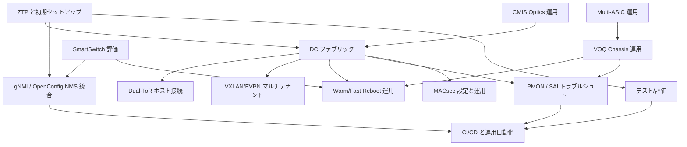

# 読み物章立て案（ユースケース軸）

- 作成日: 2026-05-10
- 対象: `docs/` 配下の既存 Markdown。`rg --files docs -g '*.md' | rg -v '/index\.md$'` では 498 件、`meta/restructure-plan.md` の整理対象では 455 通常ページ。
- 制約: 本文、frontmatter、新規 `docs/` ページ、`mkdocs.yml` は触らない。Phase B で `docs/topics/` 等に実装する前の章立て提案に限定する。
- 方針: 技術 area ではなく「こういうネットワークを組みたい / こういう運用をしたい」から読み始め、必要になった時点で HLD、CLI、CONFIG_DB、YANG、テスト計画へ降りる。
- マッピング件数: 本案では既存 498 件のうち 217 件をユースケース章に直接マッピングする。`meta/restructure-plan.md` の 455 通常ページを母数にすると 47.7% 相当。

## 章一覧

1. DC ファブリックを構築する
2. Dual-ToR でホスト接続を冗長化する
3. VXLAN/EVPN でマルチテナントを構成する
4. SmartSwitch を評価して NPU+DPU 運用へ進む
5. VOQ Chassis を bring-up して運用する
6. Multi-ASIC 装置を設計・運用する
7. gNMI / OpenConfig で NMS と統合する
8. ZTP と初期セットアップを標準化する
9. Warm/Fast Reboot を運用手順へ組み込む
10. PMON / SAI 失敗をトラブルシュートする
11. CMIS Optics と高帯域ポートを運用する
12. MACsec を設定し暗号化ポートを運用する
13. SONiC をテスト・評価環境で検証する
14. CI/CD と運用自動化を設計する

## ユースケース間の依存関係

## 1. DC ファブリックを構築する

### ユースケース説明

ネットワーク設計者と運用者が、T0/T1/T2 の Clos fabric を SONiC で構成し、BGP unnumbered、ECMP、BFD、ハッシュ制御、warm reboot を含めて、本番導入前の設計・設定・検証の読み順を得る。

### 構成ページ案

- 概要: T0/T1/T2、underlay BGP、ECMP、failure domain、運用ゴール。
- 設計: IPv6 link-local BGP、router-id、peer group、ECMP/weighted ECMP/fine grained ECMP、BFD、VRF の採否。
- 設定: `BGP_*`、`INTERFACE`、`LOOPBACK_INTERFACE`、`PORTCHANNEL`、`FG_NHG`、`STATIC_ROUTE` の CONFIG_DB 例と `config bgp` / `config interface`。
- 検証: `show bgp`、`show ip route`、BFD、hash、route install pending、warm reboot 前後の経路維持。
- 運用: BMP、BGP PIC、route install error、generic hash 変更、ECMP メンバー変化時の確認。
- 発展: SRv6/MPLS、class based forwarding、packet trimming、path tracing などの拡張機能。

### 統合する既存ページと境界

- 既存ページ: `docs/routing/ipv6-link-local-enhancements.md`, `docs/routing/bgp-router-id-explicitly-configured.md`, `docs/routing/sonic-frr-bgp-extended-unified-configuration-management-framework.md`, `docs/routing/bgp-prefix-independent-convergence-architecture-document.md`, `docs/routing/sonic-fine-grained-ecmp.md`, `docs/routing/sonic-weighted-ecmp.md`, `docs/routing/bfd-hw-offload.md`, `docs/routing/bfd-hw-offload-for-bgp-session.md`, `docs/routing/bmp-for-monitoring-sonic-bgp-info.md`, `docs/routing/bgp-route-install-error-handling.md`, `docs/architecture/sonic-generic-hash.md`, `docs/reference/cli/config-bgp.md`, `docs/reference/cli/show-bgp.md`, `docs/reference/config-db/bgp-neighbor.md`, `docs/reference/config-db/bgp-peer-group.md`, `docs/reference/config-db/bgp-globals.md`, `docs/reference/config-db/fg-nhg.md`, `docs/reference/config-db/portchannel.md`, `docs/reference/config-db/static-route.md`
- 新規執筆部分: T0/T1/T2 の具体的な読み物シナリオ、最小構成から冗長化までの設定順、障害時に見るコマンドの流れ、既存ページ間の判断基準。
- 想定ボリューム: 6 ページ、合計 35〜45KB。

## 2. Dual-ToR でホスト接続を冗長化する

### ユースケース説明

サーバ接続を冗長化したい DC 運用者が、active-standby と active-active の違い、linkmgrd、MuxOrch、mux cable、prefix-based neighbor、IPinIP tunnel を理解し、どちらの方式を採るべきか判断する。

### 構成ページ案

- 概要: Dual-ToR の目的、failure model、active-standby / active-active の比較。
- 設計: y-cable、mux state、link prober、route programming、tunnel DSCP remap、default route 連動。
- 設定: `MUX_CABLE`、peer switch、portchannel、BGP/route 設定、`config muxcable`。
- 検証: mux state、link prober、neighbor route、tunnel forwarding、failover / failback。
- 運用: linkmgrd と MuxOrch の状態確認、ICMP offload、トンネル QoS、warm reboot との相互作用。
- 発展: active-active 移行、prefix-based neighbor、multi-nexthop route ループ回避。

### 統合する既存ページと境界

- 既存ページ: `docs/overlay/active-standby-dual-tor.md`, `docs/overlay/active-active-dual-tor.md`, `docs/management/design-doc.md`, `docs/routing/default-route.md`, `docs/routing/multiple-nexthop-route-hld.md`, `docs/routing/prefix-based-mux-neighbors.md`, `docs/overlay/dscp-remapping-for-tunnel-traffic.md`, `docs/platform/icmp-hardware-offload.md`, `docs/reference/cli/config-muxcable.md`, `docs/reference/cli/show-muxcable.md`, `docs/reference/config-db/mux-cable.md`, `docs/reference/config-db/peer-switch.md`
- 新規執筆部分: active-active と active-standby の選定表、サーバ接続から ToR 障害までの時系列、設定例を 1 本のストーリーにまとめる部分。
- 想定ボリューム: 6 ページ、合計 35〜40KB。

## 3. VXLAN/EVPN でマルチテナントを構成する

### ユースケース説明

クラウド/仮想化基盤の設計者が、tenant VRF、VNI、VTEP、EVPN Type-2/Type-5、VNet、overlay ECMP を組み合わせ、L2/L3 tenant を拡張できる読み順を得る。

### 構成ページ案

- 概要: overlay/underlay 分離、tenant VRF、VTEP、VNI、EVPN route type。
- 設計: VXLAN tunnel map、VNet、VRF、Type-5 prefix advertisement、multihoming、local endpoint。
- 設定: `VXLAN_TUNNEL`、`VXLAN_TUNNEL_MAP`、`VNET`、`VRF`、BGP EVPN、route-map。
- 検証: VTEP reachability、EVPN route、tenant route、overlay ECMP、BFD 監視。
- 運用: tenant 追加、prefix 広告、DF election、inner packet hashing、QoS remap。
- 発展: NVGRE、DASH/SmartSwitch 連携、PBH による inner 5-tuple hash。

### 統合する既存ページと境界

- 既存ページ: `docs/overlay/vxlan-sonic.md`, `docs/routing/evpn-vxlan-hld.md`, `docs/routing/evpn-vxlan-multihoming.md`, `docs/routing/overlay-ecmp-with-bfd-monitoring.md`, `docs/routing/overlay-ecmp-enhancements.md`, `docs/overlay/vnet-local-endpoint-forwarding.md`, `docs/overlay/nvgre-tunnel-in-sonic.md`, `docs/architecture/sonic-policy-based-hashing.md`, `docs/routing/test-plan-for-inner-packet-hashing-in-ecmp.md`, `docs/reference/cli/config-vxlan.md`, `docs/reference/config-db/vxlan-tunnel.md`, `docs/reference/config-db/vxlan-tunnel-map.md`, `docs/reference/config-db/vnet.md`, `docs/reference/config-db/vrf.md`, `docs/reference/yang/sonic-vxlan.md`, `docs/reference/yang/sonic-vnet.md`
- 新規執筆部分: tenant 作成の E2E 手順、EVPN/VNet/VXLAN の用語対応、Type-5 をいつ使うか、既存 HLD の設定断片を運用手順へ再構成する部分。
- 想定ボリューム: 7 ページ、合計 45〜55KB。

## 4. SmartSwitch を評価して NPU+DPU 運用へ進む

### ユースケース説明

SmartSwitch の PoC 担当者が、NPU と DPU の責務、DPU overlay DB、HA、HAMgrD、gNMI feedback、DPU graceful shutdown、DPU 独立アップグレードを評価項目へ落とし込む。

### 構成ページ案

- 概要: SmartSwitch の構成要素、NPU/DPU 分担、DASH との関係。
- 設計: DB topology、DPU scope HA、HAMgrD actor、PMON、IP address assignment。
- 設定: DPU IP、HA policy、feedback channel、ENI forwarding、gNOI reboot/upgrade。
- 検証: DPU reachable、DB 同期、HA failover、DPU graceful shutdown、ENI forwarding。
- 運用: NPU/DPU のログ分離、PMON、upgrade、reboot order、feedback version_id。
- 発展: DASH KVM 評価、SONiC-DASH API、multi-DPU scale。

### 統合する既存ページと境界

- 既存ページ: `docs/architecture/smart-switch-database-design.md`, `docs/architecture/smartswitch-high-availability-high-level-design-dpu-scope-dpu-driven-setup.md`, `docs/architecture/smartswitch-high-availability-manager-daemon-hamgrd-design.md`, `docs/system/smart-switch-ip-address-assignment.md`, `docs/system/smart-switch-reboot-high-level-design.md`, `docs/system/independent-dpu-upgrade.md`, `docs/platform/smartswitch-dpu-graceful-shutdown.md`, `docs/platform/smartswitch-pmon-high-level-design.md`, `docs/management/smart-switch-gnmi-feedback-design-omit-in-toc.md`, `docs/overlay/smartswitch-eni-based-forwarding.md`, `docs/overlay/sonic-dash-hld.md`, `docs/overlay/dash-sonic-kvm.md`, `docs/acl-qos/dash-acl-tags.md`
- 新規執筆部分: SmartSwitch 評価チェックリスト、DPU 障害シナリオ、NPU から DPU を操作する運用境界、PoC から本番化への段階分け。
- 想定ボリューム: 7 ページ、合計 45〜55KB。

## 5. VOQ Chassis を bring-up して運用する

### ユースケース説明

シャーシ型 SONiC の導入担当者が、fabric port、system-port、line card provisioning、chassis DB、Reliable TSA、VoQ counter、BGP full mesh を読み解き、bring-up と運用に必要な順序を得る。

### 構成ページ案

- 概要: VOQ chassis の FSI/SSI、line card、supervisor、fabric ASIC、system-port。
- 設計: distributed forwarding、fabric port、recirculation port、LAG、BGP、Reliable TSA。
- 設定: chassis DB、fabric port、system LAG、BGP addpath、module provisioning。
- 検証: fabric link、system-port、BGP reachability、VoQ counter、TSA propagation。
- 運用: line card 追加、Everflow、platform monitor、Entity MIB、aggregate counter。
- 発展: single-ASIC VOQ fixed system、multi-ASIC warm reboot、scale test。

### 統合する既存ページと境界

- 既存ページ: `docs/platform/voq-sonic.md`, `docs/acl-qos/distributed-forwarding-in-a-virtual-output-queue-voq-architecture.md`, `docs/platform/fabric-port-support-on-sonic.md`, `docs/platform/recirculation-port-support-on-voq-chassis.md`, `docs/platform/automatic-module-provisioning-for-chassis.md`, `docs/routing/bgp-setup-for-voq-chassis.md`, `docs/routing/reliable-tsa.md`, `docs/switching/lag-on-distributed-voq-system.md`, `docs/platform/everflow-support-on-voq-chassis.md`, `docs/internals/aggregate-voq-counters-in-sonic.md`, `docs/system/platform-monitor-requirement-for-chassis-subsystem.md`, `docs/system/sonic-entity-mib-and-entity-sensor-mib-extension.md`, `docs/platform/single-asic-voq-fixed-system-sonic.md`
- 新規執筆部分: chassis bring-up の順序、line card/fabric/supervisor の責務整理、TSA と BGP の運用フロー、障害切り分けの入口。
- 想定ボリューム: 7 ページ、合計 45〜60KB。

## 6. Multi-ASIC 装置を設計・運用する

### ユースケース説明

multi-ASIC platform の開発者と運用者が、namespace、per-ASIC Redis/docker、global DB、CLI wrapper、single JSON/minigraph を理解し、単一 ASIC と同じ運用に見せるための設計判断を得る。

### 構成ページ案

- 概要: namespace、ASIC instance、global namespace、container topology。
- 設計: per-ASIC Redis、database_global、sonic-net、PMON、platform API、single JSON。
- 設定: namespace layer を含む config、minigraph / Golden Config、DB design。
- 検証: per-ASIC command、DB 接続、interface mapping、PMON sensor、warm reboot。
- 運用: CLI wrapper、per-ASIC docker、counter aggregation、health check。
- 発展: VOQ chassis、multi-ASIC warm reboot、multi namespace Redis。

### 統合する既存ページと境界

- 既存ページ: `docs/platform/1-sonic-on-multi-asic-platforms.md`, `docs/platform/db-design-for-multi-asic-scenarios.md`, `docs/platform/multi-asic-single-json-configuration-design.md`, `docs/internals/support-redis-databases-in-multiple-namespaces.md`, `docs/internals/support-multiple-user-defined-redis-database-instances.md`, `docs/system/platform-monitor-design-for-multi-asic-platforms.md`, `docs/system/multi-asic-warm-reboot.md`, `docs/platform/global-platform-specific-psuutil-class-instance.md`, `docs/internals/aggregate-voq-counters-in-sonic.md`, `docs/system/process-and-docker-stats-availability-via-telemetry-agent.md`
- 新規執筆部分: namespace を意識したコマンド実行の読み物、single JSON と minigraph の選択、運用者向けの「どの namespace を見るか」判断。
- 想定ボリューム: 6 ページ、合計 35〜45KB。

## 7. gNMI / OpenConfig で NMS と統合する

### ユースケース説明

NMS / controller 開発者が、SONiC Management Framework、gNMI server、OpenConfig transformer、subscribe、dial-out telemetry、master arbitration、Save-On-Set、gNOI をまとめて理解し、自動化基盤へ接続する。

### 構成ページ案

- 概要: CLI/CONFIG_DB/gNMI/RESTCONF の関係、NMS 統合で使う API。
- 設計: Management Framework、Translib、Transformer、SONiC YANG と OpenConfig の境界。
- 設定: gNMI server、TLS/認証、OpenConfig path、Save-On-Set、telemetry client。
- 検証: `gnmi_get` / `gnmi_set`、subscribe、dial-out、master arbitration。
- 運用: SetRequest 競合、config validation、YANG ordering、gNOI health/reboot/OS。
- 発展: SmartSwitch feedback、PINS/P4RT、CLI auto-generation。

### 統合する既存ページと境界

- 既存ページ: `docs/management/sonic-management-framework.md`, `docs/management/sonic-gnmi-server-interface-design.md`, `docs/management/gnmi-usage.md`, `docs/routing/gnmi-subscription-for-yang-data.md`, `docs/system/sonic-telemetry-in-dial-out-mode.md`, `docs/system/sonic-telemetry-in-dial-out-mode-2.md`, `docs/management/gnmi-master-arbitration-hld.md`, `docs/management/save-on-set-hld.md`, `docs/management/openconfig-support-for-ethernet-interfaces.md`, `docs/switching/openconfig-support-for-portchannel-aggregate-interface.md`, `docs/switching/add-support-for-vlan-interface-using-openconfig-yang.md`, `docs/management/sonic-config-update-validation-via-yang.md`, `docs/management/json-patch-ordering-using-yang-models.md`, `docs/management/gnoi-hld-for-healthz-api.md`, `docs/management/gnoi-hld-for-system-apis.md`, `docs/management/gnoi-hld-for-os-apis.md`, `docs/management/gnoi-hld-for-file-and-factory-reset-apis.md`, `docs/management/sonic-yang-model-guidelines.md`, `docs/reference/config-db/telemetry.md`
- 新規執筆部分: NMS の利用シナリオ別 path 選択、subscribe と polling の使い分け、master arbitration の実運用、既存 HLD から API 利用手順への変換。
- 想定ボリューム: 7 ページ、合計 50〜60KB。

## 8. ZTP と初期セットアップを標準化する

### ユースケース説明

量産展開する運用チームが、ZTP、minigraph/config_db.json、config reload、初期認証、TACACS、syslog、NTP、DNS、mgmt VRF、factory reset をまとめて、初回起動から管理下に入るまでを標準化する。

### 構成ページ案

- 概要: bare metal から管理下に入るまでのライフサイクル。
- 設計: DHCP option、ZTP plugin、config generation、AAA、syslog/NTP/DNS、mgmt VRF。
- 設定: `config_db.json`、`DEVICE_METADATA`、`MGMT_INTERFACE`、`TACPLUS_SERVER`、`SYSLOG_SERVER`、`NTP_SERVER`。
- 検証: ZTP state、config reload、login policy、remote auth、syslog/NTP reachability。
- 運用: reset-factory、default credential、password hardening、config rollback。
- 発展: gNOI factory reset、YANG validation、golden config pipeline。

### 統合する既存ページと境界

- 既存ページ: `docs/system/zero-touch-provisioning-ztp.md`, `docs/system/sonic-configuration-setup-service.md`, `docs/management/sonic-nos-configuration-methods.md`, `docs/management/config-reload-enhancement.md`, `docs/architecture/sonic-generic-configuration-update-and-rollback.md`, `docs/architecture/json-change-application.md`, `docs/architecture/reset-factory-design.md`, `docs/management/tacacs-authentication.md`, `docs/management/sonic-tacacs-improvement.md`, `docs/management/tacacs-passkey-encryption.md`, `docs/management/aaa-improvements.md`, `docs/system/sonic-syslog-source-ip.md`, `docs/system/sonic-network-time-protocol-ntp-client-configuration.md`, `docs/system/static-dns-configuration.md`, `docs/routing/sonic-management-vrf-design-document-201911-release.md`, `docs/architecture/pw-hardening-design.md`, `docs/management/default-credential-management-for-california-sb-327-conformance.md`, `docs/reference/cli/sonic-cfggen.md`, `docs/reference/cli/config-aaa.md`, `docs/reference/cli/config-syslog.md`, `docs/reference/config-db/device-metadata.md`, `docs/reference/config-db/mgmt-interface.md`, `docs/reference/config-db/tacplus-server.md`, `docs/reference/config-db/syslog-server.md`, `docs/reference/config-db/ntp-server.md`
- 新規執筆部分: 初期セットアップの標準ランブック、ZTP 失敗時の戻し方、認証・時刻・ログを最初に入れる理由、CONFIG_DB 断片の組み合わせ方。
- 想定ボリューム: 7 ページ、合計 45〜60KB。

## 9. Warm/Fast Reboot を運用手順へ組み込む

### ユースケース説明

運用者が、warm reboot / fast reboot / express reboot / warm restart を区別し、どのコンポーネントが何を保持し、どの検証を通してメンテナンス手順に入れるべきかを理解する。

### 構成ページ案

- 概要: reboot 種別、SLA、データプレーン断、適用場面。
- 設計: orchagent/syncd/SAI、view comparison、libsairedis idempotence、SWSS warm restart。
- 設定: warm restart enable、`config warm_restart`、reboot command、kdump。
- 検証: pre-check、neighbor/session 維持、LACP timeout、route consistency、post-check。
- 運用: CTL handling、failure rollback、multi-ASIC / VOQ / Dual-ToR での注意点。
- 発展: Warmboot Manager、fast reboot finalizer、express reboot。

### 統合する既存ページと境界

- 既存ページ: `docs/system/sonic-warm-reboot.md`, `docs/system/system-wide-warmboot.md`, `docs/system/what-are-the-development-phases-and-scope-for-warm-reboot.md`, `docs/system/sonic-swss-docker-warm-restart.md`, `docs/system/swss-docker-warm-restart-code-reference.md`, `docs/system/sonic-libsairedis-api-idempotence-support.md`, `docs/switching/view-switching-in-producerstatetable.md`, `docs/system/fast-reboot-flow-improvements-hld.md`, `docs/system/sonic-express-reboot-hld-spec.md`, `docs/system/warmboot-manager-hld.md`, `docs/system/multi-asic-warm-reboot.md`, `docs/switching/increasing-lacp-pdu-timeout-during-warm-reboot.md`, `docs/reference/cli/reboot-fast-warm.md`, `docs/reference/cli/config-warm_restart.md`, `docs/reference/config-db/kdump.md`
- 新規執筆部分: 種別ごとの選定表、保守作業に組み込む pre/post check、SAI view comparison を運用者向けに説明する部分。
- 想定ボリューム: 6 ページ、合計 40〜50KB。

## 10. PMON / SAI 失敗をトラブルシュートする

### ユースケース説明

障害対応者が、SAI failure、ASIC SDK health event、PMON、show techsupport、coredump、kdump、debug counter、CRM、system health を使い、原因切り分けと証跡取得を標準化する。

### 構成ページ案

- 概要: 障害時に見る層、PMON/platform/SAI/syncd/orchagent の役割。
- 設計: ERROR_DB、SAI status handling、ASIC SDK health event、dump trigger、auto techsupport。
- 設定: auto-techsupport、kdump、debug counter、CRM、logging、system health。
- 検証: SAI failure dump、coredump、show techsupport、health event、CRM threshold。
- 運用: 収集順、再現試験、rate limit、quota、ベンダー連携、discrepancy-found ページの扱い。
- 発展: liquid cooling, BMC, PCIe monitoring, storage/SSD health。

### 統合する既存ページと境界

- 既存ページ: `docs/platform/hld-for-handling-sai-failures.md`, `docs/platform/dump-on-sai-failure.md`, `docs/platform/handle-asic-sdk-health-event.md`, `docs/architecture/error-handling-framework-in-sonic.md`, `docs/architecture/debug-framework-in-sonic.md`, `docs/system/event-driven-techsupport-invocation-coredump-mgmt.md`, `docs/system/show-techsupport.md`, `docs/reference/cli/show-techsupport.md`, `docs/system/kdump.md`, `docs/system/kdump-remote-ssh.md`, `docs/system/sonic-logging-system-dumps-arch-spec.md`, `docs/system/sonic-system-health-monitor-high-level-design.md`, `docs/system/critical-resource-monitoring-in-sonic.md`, `docs/system/generic-sai-extension-critical-resource-monitoring-crm.md`, `docs/reference/config-db/auto-techsupport.md`, `docs/reference/config-db/debug-counter.md`, `docs/reference/config-db/crm.md`, `docs/platform/pcieinfo-design.md`, `docs/architecture/ssdhealth-design.md`, `docs/system/sonic-storage-monitoring-daemon-design.md`, `docs/platform/liquid-cooling-leakage-detection-in-sonic.md`
- 新規執筆部分: 障害調査のフローチャート、どのログ/DB/コマンドを何分以内に取るか、SAI と platform failure の切り分け。
- 想定ボリューム: 7 ページ、合計 50〜65KB。

## 11. CMIS Optics と高帯域ポートを運用する

### ユースケース説明

光モジュールと高速ポートの運用者が、CMIS/C-CMIS、ZR/ZR+、Custom SI、media settings、xcvrd、FEC/BER、dynamic gearbox tuning、1.6T port をまとめて理解し、ポート bring-up と障害対応を行う。

### 構成ページ案

- 概要: optics、CMIS、media settings、FEC、gearbox、port breakout の全体像。
- 設計: ZR/ZR+、Custom SI、host_tx_signal、media based settings、gearbox tuning。
- 設定: platform media JSON、port config、FEC、auto-neg、link training、breakout。
- 検証: xcvrd state、sfputil EEPROM、DOM sensor、FEC BER/FLR、fast link-up。
- 運用: optics 挿抜、ポート速度変更、SI 調整、EEPROM dump、thermal/power。
- 発展: 1.6T、LPO debug、dynamic port add/del。

### 統合する既存ページと境界

- 既存ページ: `docs/management/enhancement-of-cmis-module-management.md`, `docs/platform/cmis-and-c-cmis-support-for-zr.md`, `docs/platform/custom-si-settings-for-cmis-modules.md`, `docs/platform/media-based-port-settings-in-sonic.md`, `docs/platform/sonic-dynamic-gearbox-tuning-design-plan.md`, `docs/platform/1-6t-support-in-sonic.md`, `docs/platform/sonic-fast-link-up.md`, `docs/platform/sonic-port-fec-ber.md`, `docs/platform/fec-flr-support-in-sonic.md`, `docs/platform/sonic-sfp-refactoring.md`, `docs/platform/sfputil-add-the-ability-to-read-write-any-byte-from-eerpom-both-by-page-and-offs.md`, `docs/platform/sfputil-add-the-ability-to-read-write-any-byte-from-eerpom-both-by-page-and-offset.md`, `docs/system/transceiver-and-sensor-monitoring-hld.md`, `docs/system/dump-sfp-eeprom-page-data-in-show-techsupport-command.md`, `docs/architecture/sonic-port-auto-fec-design.md`, `docs/architecture/sonic-port-auto-negotiation-design.md`, `docs/architecture/sonic-port-link-training-design.md`, `docs/system/sonic-dynamic-port-breakout-feature-high-level-design.md`, `docs/reference/cli/show-interfaces.md`, `docs/reference/cli/show-platform.md`, `docs/reference/config-db/port.md`
- 新規執筆部分: optics bring-up の運用手順、media settings と port/FEC 設定の関係、モジュール障害時の証跡取得。
- 想定ボリューム: 7 ページ、合計 45〜60KB。

## 12. MACsec を設定し暗号化ポートを運用する

### ユースケース説明

セキュアな L2 接続を作りたい運用者が、MKA、PSK、MACsec manager/orch、Gearbox port の backend selection、FIPS SAI POST を理解し、ポート単位の暗号化を設定・監視する。

### 構成ページ案

- 概要: MACsec の目的、MKA、CAK/CKN、PSK、暗号化ポートの制約。
- 設計: wpa_supplicant、MACsecMgr、MACsecOrch、SAI、Gearbox PHY backend。
- 設定: MACsec profile、interface binding、PSK、gearbox port、FIPS POST。
- 検証: session establishment、SAK install、port counter、fail open/closed。
- 運用: key rotation、link flap、backend selection、FIPS mode。
- 発展: gNMI/OpenConfig 化、port access control との関係。

### 統合する既存ページと境界

- 既存ページ: `docs/switching/macsec-sonic-high-level-design-document.md`, `docs/switching/sonic-hld-deterministic-macsec-backend-selection-for-gearbox-ports.md`, `docs/switching/sonic-sai-post-support-for-macsec.md`, `docs/system/sonic-fips-deployment.md`, `docs/system/sonic-openssl-fips-140-3-hld.md`, `docs/acl-qos/port-access-control-in-sonic.md`, `docs/reference/config-db/interface.md`, `docs/reference/config-db/port.md`, `docs/reference/cli/config-interface.md`, `docs/reference/cli/show-interfaces.md`
- 新規執筆部分: 設定例と運用手順、Gearbox port で backend が分岐する時の説明、FIPS 要件との接続。
- 想定ボリューム: 5 ページ、合計 25〜35KB。

## 13. SONiC をテスト・評価環境で検証する

### ユースケース説明

評価者と開発者が、GNS3 VM、SONiC-VS、ALViS/KNE、PTF/sonic-mgmt テスト、Basic L2、VRF、ACL、sFlow などを使い、実機前に機能を検証する環境を作る。

### 構成ページ案

- 概要: 評価環境の選択肢、実機との差分、向くテスト/向かないテスト。
- 設計: SONiC-VS、GNS3、ALViS/KNE、PTF、testbed topology。
- 設定: VM image、libvirt/Qemu、GNS3 template、testbed inventory、config reload。
- 検証: L2、VRF、ACL、ECMP hashing、sFlow、DHCP、watermark。
- 運用: テストログ、再現性、discrepancy-found 追跡、CI への昇格。
- 発展: PINS/P4RT、DASH KVM、scale/performance test。

### 統合する既存ページと境界

- 既存ページ: `docs/architecture/sonic-on-gns3-vm.md`, `docs/architecture/steps-to-bring-up-sonic-vs.md`, `docs/architecture/alpine-high-level-design.md`, `docs/switching/sonic-basic-l2-mode-test-plan.md`, `docs/routing/vrf-vs-test-plan.md`, `docs/routing/vrf-feature-ansible-test-plan-omit-in-toc.md`, `docs/acl-qos/acl-ingress-egress-test-plan.md`, `docs/acl-qos/asymmetric-pfc-test-plan.md`, `docs/acl-qos/everflow-test-plan.md`, `docs/architecture/sflow-test-plan.md`, `docs/system/dataplane-telemetry-test-plan.md`, `docs/system/snmp-transceiver-monitoring-testbed-test-plan.md`, `docs/acl-qos/test-plan-for-align-watermark-flow-with-port-configuration.md`, `docs/management/pins-hld.md`, `docs/management/p4rt-application-hld.md`, `docs/management/p4rt-read-cache-hld.md`, `docs/management/packetio.md`
- 新規執筆部分: 評価目的別の環境選定、テスト計画ページを読む順番、VM と実機差分の注意点。
- 想定ボリューム: 6 ページ、合計 35〜45KB。

## 14. CI/CD と運用自動化を設計する

### ユースケース説明

プラットフォーム運用チームが、gNMI、Application Extension、SPM、CLI auto-generation、YANG validation、GCU、config rollback、package/OS upgrade を使い、設定変更と機能追加をパイプライン化する。

### 構成ページ案

- 概要: SONiC 運用自動化の対象、設定変更、拡張、アップグレード、検証。
- 設計: gNMI/RESTCONF、YANG validation、GCU/rollback、SPM、application extension。
- 設定: package metadata、extension guide、CLI generation、config patch、save-on-set。
- 検証: dry-run、YANG validation、config reload、rollback、telemetry based post-check。
- 運用: CI pipeline、change approval、feature flag、secure upgrade、versioning。
- 発展: P4RT/PINS、gNOI OS API、semantic versioning、container hardening。

### 統合する既存ページと境界

- 既存ページ: `docs/architecture/sonic-application-extension-infrastructure.md`, `docs/management/sonic-application-extension-guide.md`, `docs/reference/cli/sonic-package-manager.md`, `docs/management/sonic-cli-auto-generation-tool.md`, `docs/management/sonic-config-update-validation-via-yang.md`, `docs/management/json-patch-ordering-using-yang-models.md`, `docs/architecture/sonic-generic-configuration-update-and-rollback.md`, `docs/management/save-on-set-hld.md`, `docs/system/secure-upgrade.md`, `docs/system/sonic-os-sonic-docker-images-versioning.md`, `docs/system/sonic-container-hardening.md`, `docs/system/sonic-optional-feature-control-enhancement.md`, `docs/system/sonic-debian-upgrade-cadence.md`, `docs/management/gnoi-hld-for-os-apis.md`, `docs/management/pins-hld.md`, `docs/internals/why-need-health-check.md`
- 新規執筆部分: 変更パイプライン例、pre/post check の組み立て、拡張パッケージを本番運用へ入れる条件、Phase B の章横断テンプレート。
- 想定ボリューム: 6 ページ、合計 35〜45KB。

## Phase B の推奨着手順

1. ZTP と初期セットアップを標準化する
2. DC ファブリックを構築する
3. gNMI / OpenConfig で NMS と統合する
4. Warm/Fast Reboot を運用手順へ組み込む
5. PMON / SAI 失敗をトラブルシュートする
6. SONiC をテスト・評価環境で検証する
7. VXLAN/EVPN でマルチテナントを構成する
8. Dual-ToR でホスト接続を冗長化する
9. CMIS Optics と高帯域ポートを運用する
10. Multi-ASIC 装置を設計・運用する
11. VOQ Chassis を bring-up して運用する
12. SmartSwitch を評価して NPU+DPU 運用へ進む
13. MACsec を設定し暗号化ポートを運用する
14. CI/CD と運用自動化を設計する

この順序は、初期導入・基本ファブリック・管理 API・保守運用という共通土台を先に作り、その後に overlay、冗長ホスト接続、platform 特化、シャーシ/SmartSwitch、自動化へ広げるためのもの。

## Phase B 実装メモ

- `docs/topics/` を新設する場合、各章は 5〜8 ページの短い読み物として作る。既存 HLD の要約を丸写しせず、ユースケースの判断、設定順、検証順、失敗時の見方を新規執筆の中心に置く。
- 各ページ末尾には「設計背景」「設定リファレンス」「検証」「関連トラブルシュート」を固定見出しで置き、既存ページへ戻れるようにする。
- 章ごとの最初のページは、既存 area の index よりも具体的な作業ゴールを示す。例: 「T0 を BGP unnumbered で bring-up する」「Dual-ToR active-standby を検証する」。
- HLD-only / discrepancy-found のページはそのまま事実としてリンクし、Phase B では「コード確認済みではない」「仕様案として読む」などの注記を章側で扱う。
